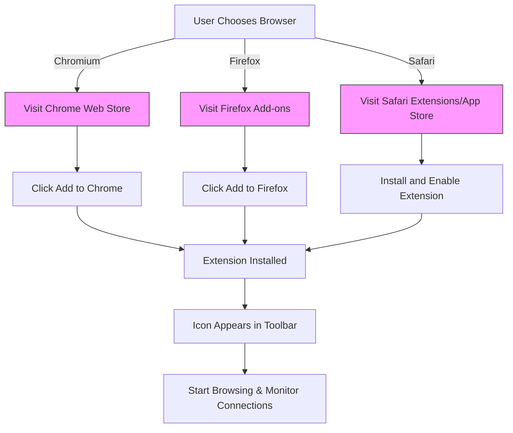

# Installing uBO Scope

This guide walks you through the straightforward process of installing **uBO Scope** — a privacy-focused extension that reveals all network connections your browser makes per tab. Follow the steps below to get uBO Scope up and running on your preferred browser: Chromium-based browsers (Google Chrome, Edge, etc.), Firefox, and Safari.

---

## 1. Prerequisites & System Requirements

Before installing uBO Scope, ensure your environment meets the following requirements:

- **Supported Browsers & Versions:**
  - Chromium browsers: version 122.0 or newer
  - Firefox: version 128.0 or newer
  - Safari: version 18.5 or newer
- **Operating System:** Linux, Windows, macOS — compatible with your chosen browser
- **Internet Access:** Required to download the extension from the trusted store

<Tip>
If you’re unsure of your browser version, check the browser menu under “About” to confirm compatibility.
</Tip>

## 2. Installing uBO Scope on Your Browser

Below are step-by-step instructions tailored to each supported browser. Choose your platform and follow the exact steps.

### For Chromium-Based Browsers (Google Chrome, Microsoft Edge, etc.)

1. Open your Chromium browser.
2. Visit the official uBO Scope page on the **Chrome Web Store**:

   [uBO Scope on Chrome Web Store](https://chromewebstore.google.com/detail/ubo-scope/bbdpgcaljkaaigfcomhidmneffjjjfgp)

3. Click **Add to Chrome** (or equivalent) to begin installation.
4. Confirm any permission prompts that appear.
5. After installing, the uBO Scope icon will appear near the browser’s address bar.

### For Mozilla Firefox

1. Open Firefox, preferably version 128.0 or above.
2. Navigate to the official uBO Scope page on the **Firefox Add-ons** site:

   [uBO Scope on Firefox Add-ons](https://addons.mozilla.org/firefox/addon/ubo-scope/)

3. Click **Add to Firefox** and permit required permissions.
4. Once installed, uBO Scope’s icon will appear in your toolbar.

### For Safari (macOS)

1. Ensure you are running Safari 18.5 or later.
2. Open Safari and access the **App Store** or the Safari Extensions section.
3. Search for **uBO Scope** and install the extension.
4. Enable the extension via Safari Preferences > Extensions.

<Warning>
Safari’s extension installation flow differs from other browsers and may require you to enable the extension manually after installing.
</Warning>

## 3. Verifying Installation

After installation, verify that uBO Scope is ready to use:

- Look for the uBO Scope icon in your browser’s toolbar.
- Click the icon; the extension popup should open, showing a **NO DATA** message initially (until network requests are monitored).
- Browse a website and observe the badge count incrementing to reflect distinct remote connections.

<Check>
If the popup doesn’t open or the badge doesn’t show any number after browsing, refer to troubleshooting tips or ensure you have proper permissions granted.
</Check>

## 4. Additional Installation Notes

- **Automatic Updates:** Installing from official stores ensures you receive automatic updates.
- **Manual Builds:** Developers or advanced users can build the extension manually; scripts like `tools/make-package.sh` and `tools/make-firefox.sh` assist in packaging the extension for respective platforms.
- **Permissions:** During installation, permissions requested include access to the active tab, storage, and webRequest API, which are essential for uBO Scope to monitor network connections.

## 5. Next Steps

Once installed, proceed to:

- Explore the extension’s popup UI to understand the connection count.
- Review the [Understanding the Popup & Badge](https://your-docs-link/getting-started/first-steps-usage/interpreting-the-popup) guide to interpret data effectively.
- Consult the [Troubleshooting Setup Issues](https://your-docs-link/getting-started/first-steps-usage/troubleshooting-setup) page if you encounter any problems.

---

## Troubleshooting Common Installation Issues

<AccordionGroup title="Troubleshooting uBO Scope Installation">
<Accordion title="uBO Scope icon does not appear after installation">
- Ensure you have installed the extension from the official trusted store.
- Check your browser’s extensions management page to confirm the extension is enabled.
- Restart your browser.
</Accordion>
<Accordion title="Permission Denied or Limited Permissions">
- Review permission prompts carefully and allow requested permissions.
- For Firefox, ensure you are not running in strict privacy modes that block extensions’ access.
</Accordion>
<Accordion title="Extension Popup shows 'NO DATA' indefinitely">
- This can occur if the extension does not detect network activity.
- Ensure you have visited some websites with active network connections.
- Check whether other content blockers or browser privacy settings may be restricting network request APIs.
</Accordion>
</AccordionGroup>

## Support & Feedback

If you experience issues not resolved by these steps, visit the [official repository](https://github.com/gorhill/uBO-Scope) to report bugs or seek help.

---

*You have successfully installed uBO Scope. Enjoy transparent insights into your browser’s network connections.*

---

# Quick Reference 

| Browser | Install Link |
|---------|--------------|
| Chromium (Chrome, Edge) | [Chrome Web Store](https://chromewebstore.google.com/detail/ubo-scope/bbdpgcaljkaaigfcomhidmneffjjjfgp) |
| Firefox | [Firefox Add-ons](https://addons.mozilla.org/firefox/addon/ubo-scope/) |
| Safari | Safari Extension Gallery (App Store) |

---

## Related Documentation

- [System Requirements](https://your-docs-link/getting-started/installation-setup/system-requirements)
- [Initial Configuration](https://your-docs-link/getting-started/installation-setup/initial-configuration)
- [Your First Run: What to Expect](https://your-docs-link/getting-started/first-steps-usage/first-run-overview)
- [Understanding the Popup & Badge](https://your-docs-link/getting-started/first-steps-usage/interpreting-the-popup)

---

## Visual Diagram of Installation Flow

