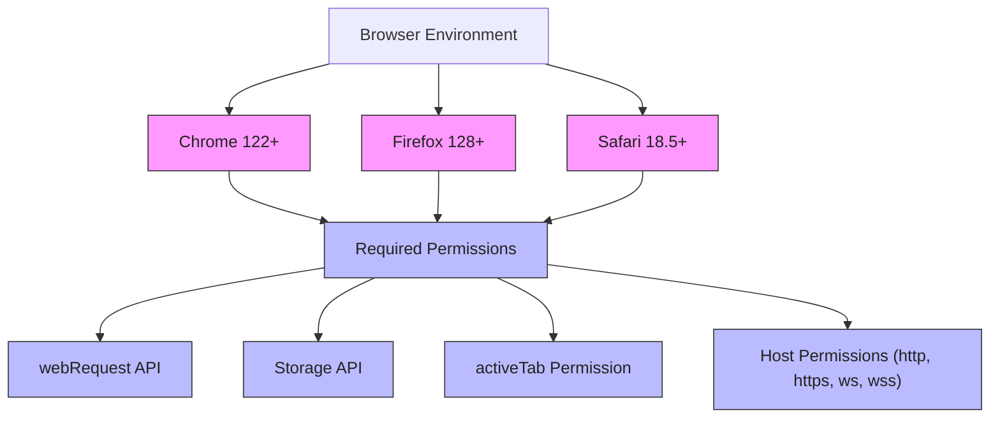

# Prerequisites & Supported Browsers

Ensure your environment meets the following requirements before installing and using uBO Scope. Preparing correctly guarantees the extension will function smoothly and accurately reveal all relevant third-party network connections in your browser.

---

## 1. Supported Browsers & Minimum Versions

uBO Scope is designed to work seamlessly with major browsers that support the `webRequest` API and Manifest Version 3 (MV3). Confirm your browser and version compatibility below:

| Browser   | Minimum Version | Notes |
|-----------|-----------------|-------|
| **Chrome** (and Chromium-based browsers) | 122.0 or later   | Minimum Chrome version enforced in manifest.json with a service worker background script |
| **Firefox**          | 128.0 or later   | Explicit minimum version for Firefox desktop and Android in manifest.json |
| **Safari**           | 18.5 or later    | Safari strict min version set in manifest.json |

> 📝 The extension expects a recent version of your browser to fully support network request monitoring under Manifest V3. Older versions may lack necessary APIs or permissions.

---

## 2. Required Permissions

To operate effectively, uBO Scope needs explicit permissions granted at installation, reflecting its monitoring nature:

- **webRequest**: To observe all network requests originating from web pages.
- **storage**: To persist session data and caching public suffix lists.
- **activeTab**: To query and correlate information for the active browser tab.

> ⚠️ Permissions like `webRequest` are powerful and potentially sensitive; uBO Scope strictly uses them to report network connection status only.

---

## 3. Network and Host Permissions

uBO Scope requires broad host permissions to capture network requests across typical web protocols and addresses:

- Supports monitoring requests over HTTP, HTTPS, WS, and WSS protocols.
- Host permissions defined broadly as:
  - `http://*/*`
  - `https://*/*`
  - `ws://*/*` (WebSocket)
  - `wss://*/*` (Secure WebSocket)

> ⚠️ Some minor differences exist per browser. For example, the Safari platform manifest limits monitoring to HTTP and HTTPS only, reflecting its platform constraints.

---

## 4. System Requirements & Environment

uBO Scope runs within your browser environment as an extension, so your system requirements largely depend on your browser. However, ensure:

- A supported operating system for your browser’s latest version (Windows 10/11, macOS Catalina+, recent Linux distros, supported Android versions for Firefox).
- Stable internet connection for installation and fetching updates.
- Sufficient disk space and memory for typical browser extensions (uBO Scope is lightweight).

There are no additional external dependencies or setup beyond installing the browser extension.

---

## 5. Preparing Your Browser for Installation

Before installing uBO Scope, take these preparatory steps to minimize conflicts and issues:

- Update your browser to meet or exceed the minimum version requirement listed above.
- Review existing content blockers or privacy tools you may have active, as these can affect network monitoring scope. uBO Scope works independently and can complement your setup.
- Check that your browser allows installing extensions from official stores:
  - **Chrome:** Chrome Web Store
  - **Firefox:** Firefox Add-ons
  - **Safari:** Safari Extensions Gallery or signed extensions

- Confirm that your browser has no restrictive policies preventing extensions from using necessary permissions, especially `webRequest`.

---

## 6. Common Pitfalls & Tips

- **Using an Unsupported Browser or Version:** The extension will not activate or may fail silently. Always update.
- **Missing Permissions:** If installation is blocked or the extension does not report network activity, revisit permissions approval.
- **Limited `webRequest` Visibility:** Some network traffic (e.g., DNS-level blocking outside browser context) is invisible to uBO Scope and not an error.
- **Browser-Specific Restrictions:** Particularly on Safari, certain advanced webRequest events or WebSocket tracking may be limited.

---

## 7. Verification after Installation

After installing uBO Scope, verify compatibility and function by:

1. Confirming the extension badge appears in your browser toolbar.
2. Browsing various websites and observing the badge count indicating distinct third-party remote servers.
3. Opening the extension popup to see detailed connection classifications: `allowed`, `stealth-blocked`, and `blocked`.

If these steps work as described, your browser meets all prerequisites.

---

## References & Next Steps

- For installation instructions: [Installing uBO Scope](../installation-setup/installation-instructions)
- For initial configuration and understanding permissions: [Initial Configuration](../installation-setup/initial-configuration)
- To learn about interpreting the badge count and popup data: [How uBO Scope Works](../../core-concepts-architecture/how-ubo-scope-works)

Visit the official GitHub repository for source code and latest updates: [uBO Scope GitHub Repository](https://github.com/gorhill/uBO-Scope)

---

<Tip>
Ensuring you use a supported browser and version with correct permissions will provide a reliable, transparent insight into your web browsing network connections through uBO Scope. Always consult this page before installation to avoid common setup issues.
</Tip>

---

### Summary Diagram: Supported Browsers and Permissions Overview

---

This diagram illustrates the supported browsers with their minimum required versions and the critical extension permissions that enable uBO Scope to monitor and report network connection activity effectively.

---
