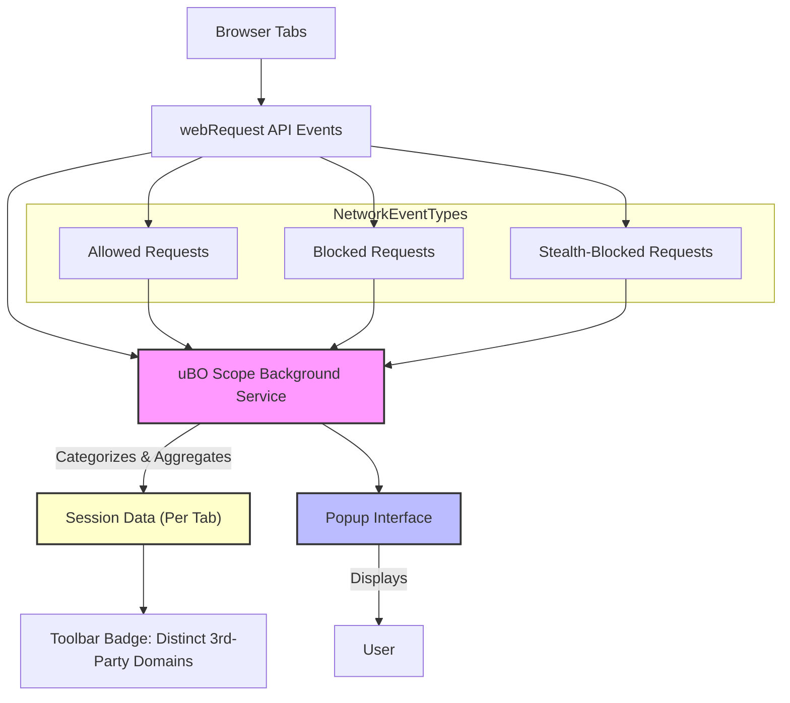

# What is uBO Scope?

Discover the core purpose and value proposition of uBO Scope. Understand how it measures third-party network connections in your browser and why this visibility is crucial—regardless of which content blocker you use.

---

## Introduction

uBO Scope is a lightweight browser extension designed to provide transparent insight into all remote server connections that your browser attempts or completes when loading webpages. Unlike traditional content blockers that focus on stopping unwanted requests, uBO Scope focuses on **measuring and revealing** those connections — whether they are blocked, allowed, or stealth-blocked.

By exposing the actual connections to third-party servers, uBO Scope empowers you with a clear, realistic view of your network exposure during browsing, helping you better understand privacy implications and the effectiveness of content blockers you might be using.

## Why Measure Third-Party Connections?

Webpages often interact with many external servers beyond the site you visit. These include Content Delivery Networks (CDNs), advertising servers, analytics platforms, social media widgets, and more.

Understanding precisely **which third-party servers your browser connects to, how often, and whether those connections are blocked or allowed**, is essential because:

- Many privacy concerns stem from third-party tracking and data collection via these external servers.
- Content blockers differ in their blocking approaches and coverage; raw block counts don’t tell the full story.
- Visibility into live network activity is key to assessing the actual effectiveness and outcomes of privacy tools.

### Core Value Proposition

- **Comprehensive Visibility:** uBO Scope reports all network requests made by webpages, regardless of which content blocker is active.
- **Accurate Counting:** The toolbar badge shows the number of distinct third-party remote servers your browser connected to — a key privacy metric.
- **Outcome Classification:** It clearly distinguishes between allowed connections, blocked connections, and stealth-blocked connections (redirected and hidden from usual API views).
- **Browser Compatibility:** Works in all major WebExtension-compatible browsers using the standard webRequest API.

## How uBO Scope Works (High-Level Overview)

uBO Scope hooks into the browser’s `webRequest` API to listen for network request events. Each request is categorized based on its outcome:

- **Allowed:** Requests that succeeded and were not blocked.
- **Blocked:** Requests that resulted in network errors or were explicitly blocked.
- **Stealth-Blocked:** Requests that were redirected or otherwise prevented without typical failure signals.

Using domain and hostname parsing (leveraging a Public Suffix List to accurately identify registrable domains), it aggregates request counts per domain, providing a clear summary of third-party exposure.

## Terminology Clarification

- **Hostname:** The full host part of a URL (e.g., `ads.example.com`).
- **Domain:** The registered domain name portion (e.g., `example.com`), determined by referring to the Public Suffix List.
- **Third-Party:** Any domain outside the main site’s domain.
- **Distinct Third Parties:** Unique domains connected to by network requests.

## Example User Experience

Upon installing and running uBO Scope, when you navigate to a webpage

1. The extension listens to all network requests from that tab.
2. For each network event (success, redirect, error), it records data about hostnames and domains.
3. The browser toolbar icon badge updates, reflecting the count of distinct third-party domains connected.
4. Clicking the toolbar icon opens a popup that categorizes domains observed as 'Allowed', 'Blocked', or 'Stealth-Blocked', with request counts.

This real-time feedback helps you visualize your network exposure instantly.

## Important Notes

- A **lower badge count is better**, indicating fewer distinct third-party server connections.
- Not all third-party servers are undesirable; CDNs and essential services naturally increase count.
- The extension tracks network requests observable through the browser's `webRequest` API, so very low-level or system-level activity outside browser visibility is not covered.

## How uBO Scope Differs From Other Content Blockers

Block counts alone can be misleading. A content blocker reporting a higher number of blocked requests does not necessarily mean it is more effective:

- It could indicate more connections reached the browser before being blocked.
- Stealth blocking techniques may prevent detection by typical web-based tests.

uBO Scope's value lies in revealing **distinct third-party endpoints actually contacted**, regardless of blocking strategy.

## Next Steps

To get started with uBO Scope, install the extension for your browser, then:

- Visit webpages normally and observe the badge count increasing as connections are made.
- Open the popup to explore allowed, stealth, and blocked domains.
- Use this insight to evaluate your content blockers or analyze your browsing privacy profile.

For detailed installation instructions, usage tips, and troubleshooting, see related documentation pages like:

- [Installing uBO Scope](./installing-ubo-scope)
- [Launching and Basic Configuration](./running-and-configuring)
- [Understanding the Popup: Domains and Connection Statuses](../../guides/network-insights-common-workflows/understanding-popup)

---

## References

- Public Suffix List: [http://publicsuffix.org/](http://publicsuffix.org/)
- uBO Scope Repository: [https://github.com/gorhill/uBO-Scope](https://github.com/gorhill/uBO-Scope)

---

## Summary Diagram: Core Data Flow in uBO Scope

