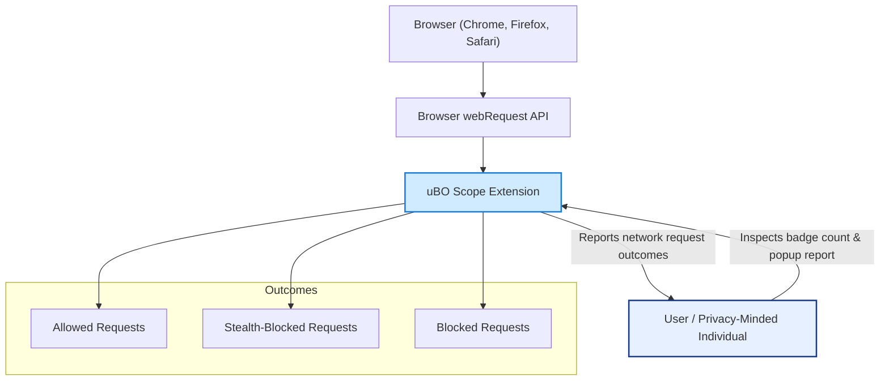

# What is uBO Scope?

uBO Scope is a lightweight browser extension designed to unveil all network connections—both attempted and successful—that web pages make to remote servers. It offers users a clear window into the web traffic their browsers generate, specifically focusing on the distinct third-party domains contacted during browsing sessions.

## Why Use uBO Scope?

In an increasingly complex web ecosystem, browsers often communicate with numerous third-party servers, some of which track user activity or serve ads. uBO Scope provides transparency by highlighting these connections, helping:  

- **Privacy-conscious users** understand and monitor third-party tracking.
- **Filter list maintainers** assess the effectiveness and reach of content blockers.
- **Curious users** get a simplified, trustworthy overview of network behavior without complex analytics.

<Check>
Remember: The badge on the browser toolbar reflects the number of distinct third-party domains your browser connected with during the current session. A lower number generally signifies fewer third-party connections, which is desirable for privacy.
</Check>

## Core Value Proposition

Unlike traditional ad blockers that focus on counting blocked requests, uBO Scope emphasizes the count of **allowed** third-party connections. This distinction is crucial because:

- A higher block count does not necessarily mean better blocking; it may indicate more attempted connections.
- What matters most is the number of distinct third-party servers your browser fetches resources from (allow count).

By using the browser's `webRequest` API, uBO Scope accurately reports network request outcomes regardless of underlying content-blocking mechanisms, DNS-level blocks, or stealth methods used by blockers.

## Who Benefits Most from uBO Scope?

- **Privacy-minded individuals** wanting visibility into invisible third-party connections.
- **Content blocker evaluators** needing an impartial measure of true network connections.
- **Filter list maintainers** who require data from devices or environments where developer tools are limited.
- **Users skeptical of "ad blocker test" webpages**, as this tool debunks many myths associated with these tests.

## How uBO Scope Works

1. uBO Scope leverages the browser's `webRequest` API to listen to all network requests initiated by the active tab.
2. It distinguishes requests into three categories:
   - **Allowed**: Network requests that completed successfully.
   - **Blocked**: Requests that failed due to blocking or errors.
   - **Stealth-blocked**: Requests that were redirected or modified stealthily by content blockers.
3. Data is aggregated per browsing session and per tab, tracking hostnames and domains.
4. The browser toolbar badge displays a real-time count of distinct allowed third-party domains.
5. A detailed popup interface breaks down connected domains by category, providing clarity and insight.

## Understanding the Network Connections

- The extension works with any browser that supports the `webRequest` API, including Chrome, Firefox, and Safari.
- It reports requests made over HTTP, HTTPS, WS, and WSS protocols.
- Network requests outside the reach of the `webRequest` API (e.g., certain prefetch scenarios) cannot be captured.

## Common Myths Addressed by uBO Scope

> _"This content blocker with a higher block count is better."_

uBO Scope clarifies that a higher block count may correlate with more third-party servers being contacted, thus allowing more connections despite blocking more requests.

> _"Ad blocker test web pages provide reliable blocker evaluations."_

uBO Scope reveals these tests are often unrealistic, enabling stealthy blockers to avoid detection. They do not reflect true web browsing conditions.

## Practical Scenario

Imagine visiting a news website. Without uBO Scope, you may not know how many unseen third-party servers the page contacts—advertisers, trackers, CDNs, etc. With uBO Scope installed and active, you immediately see the number of third-party domains contacted alongside a breakdown into allowed and blocked connections. This empowers you to make informed decisions about your browsing privacy.

## Summary

uBO Scope is a transparent, privacy-oriented companion that exposes the web's underlying network activities in a simple, reliable manner. It complements content blockers by focusing on meaningful network connection data rather than just block counts, thereby supporting better privacy awareness and content blocker evaluation.

---

## Practical Tips

- A low badge count means few distinct third-party connections—aim for this in your daily browsing.
- Use the popup interface to identify domains you trust or want to block.
- Remember that not all third-party servers are harmful; many serve legitimate purposes like content delivery.
- Keep uBO Scope updated to benefit from improvements aimed at filter list maintainers and privacy auditors.

## Next Steps

- Install uBO Scope on your preferred browser: [Installation on Chrome, Firefox, & Safari](/getting-started/introduction-and-installation/installation-instructions).
- After installation, [Configure uBO Scope](/getting-started/first-use-and-validation/configuring-extension) to align with your privacy needs.
- Run your first session and learn how to interpret the network connections via [Your First Successful Run](/getting-started/first-use-and-validation/first-successful-run).
- If you encounter issues, consult [Troubleshooting Common Setup Issues](/getting-started/first-use-and-validation/troubleshooting-and-support).

## Additional Resources

- [Core Features at a Glance](/overview/product-introduction/core-features-overview)
- [Who Should Use uBO Scope?](/overview/product-introduction/target-audience-and-scenarios)
- [Core Concepts & Terminology](/overview/how-it-works/core-concepts-terminology)
- [System Architecture & Data Flow](/overview/how-it-works/system-architecture-data-flow)
- [Integration and Ecosystem Fit](/overview/how-it-works/integration-ecosystem)

---

## Visualizing uBO Scope's Role

---

<Tip>
To truly understand your browsing privacy, focus on the number of distinct third-party domains your browser connects with — rather than just how many requests are blocked.
</Tip>

<Warning>
uBO Scope reports only network requests accessible via the browser's `webRequest` API. Some network activity may not be visible if the browser restricts API access.
</Warning>
