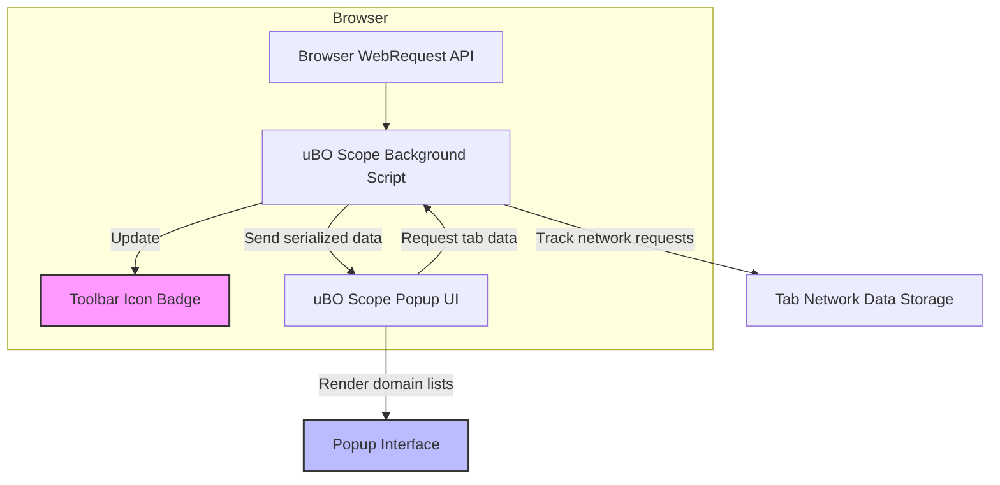

# What is uBO Scope?

Discover the core concept behind uBO Scope, a clear and focused browser extension designed to expose all the remote server connections your browser attempts or successfully makes while you browse. Whether or not you have content blockers enabled, uBO Scope empowers you to audit real network requests transparently — providing unparalleled insight into what’s happening behind the scenes on every webpage.

---

## 1. Understanding uBO Scope’s Purpose

uBO Scope is a companion extension that reveals each connection to remote servers initiated by your web browser for the active tab. It shows all network requests that are allowed, stealth-blocked, or fully blocked — giving you a complete picture beyond what traditional content blockers report.

### Why does this matter?
- **True transparency:** See exactly which third-party servers your browser connects to.
- **Independent auditing:** Verify content blocker behavior by cross-referencing actual network activity.
- **Myth busting:** Dispels misconceptions like “higher block counts mean stronger blocking,” by focusing on the number of distinct successful connections.

### Key features include:
- **Real-time badge count:** Displays the number of distinct third-party remote servers connected to by the current tab.
- **Popup overview:** A categorized breakdown into “not blocked,” “stealth-blocked,” and “blocked” domains.
- **Content blocker agnostic:** Tracks connections regardless of which blocking method is employed (browser extension, DNS, etc.), as long as the browser reports via the WebRequest API.

<Tip>
The badge count measures distinct servers _allowed_ connections — a **lower number means fewer third-party remote servers**, which is typically better for privacy.
</Tip>

---

## 2. How uBO Scope Works at a Glance

The extension listens to your browser's network requests using the WebRequest API. Every request’s outcome is categorized:

- **Allowed:** Requests that succeeded and resources loaded.
- **Blocked:** Requests that were explicitly blocked.
- **Stealth-blocked:** Requests redirected or otherwise stealthily prevented from loading — they don't appear as blocked but don’t reach the server either.

After gathering data, uBO Scope updates the toolbar icon badge with a count of unique remote servers connected and offers a popup interface showing all domains grouped by their outcome.

This makes it easy to answer questions like:

- How many third-party servers is this page actually connecting to?
- Which domains were stealth-blocked versus completely blocked?
- Are my content blockers working as expected?

---

## 3. Exploring uBO Scope’s Value

Beyond visibility, uBO Scope empowers several important use cases:

- **Validation of content blockers:** Look beyond block counts to understand actual third-party connections.
- **Network transparency audits:** Monitor total connections made by pages, helping in privacy assessments.
- **Filter list maintenance:** Detect stealth-blocking and other nuanced behaviors for advanced filtering.
- **Myth debunking:** Avoid reliance on misleading ad blocker test pages and block count metrics.

---

## 4. What You See in the Popup Interface

When you click the uBO Scope icon, the popup shows:

- The _current page’s hostname_ and domain, helping you confirm which tab you’re inspecting.
- **Domains connected:** A total count of distinct third-party domains.
- Domain lists separated into:
  - **Not blocked:** Domains where connections were successful.
  - **Stealth-blocked:** Domains where connections were prevented without visible blocking.
  - **Blocked:** Domains where connection attempts were explicitly blocked.

Each domain entry shows its hostname and the count of requests made.

<Tip>
This detailed breakdown helps you easily identify which third parties your browser is dialling out to — including those that content blockers stealthily prevent without obvious blockage.
</Tip>

---

## 5. Debunking Common Myths About Content Blockers Using uBO Scope

### Myth: A higher block count means better blocking.

Truth: A high number of blocks _can_ correlate with more connections made *and* blocked, but it doesn't guarantee fewer distinct remote servers contacted. uBO Scope’s count emphasizes distinct **allowed** third-party connections, which truly reflects what resources your browser fetched.

### Myth: Ad blocker test webpages reflect real blocker effectiveness.

Truth: These test pages are unrealistic and fail to reflect legitimate blocking scenarios. uBO Scope records actual network outcomes from real web browsing, making it a far more reliable tool.

---

## 6. Where to Go Next

- Visit the **[Installation Guide](/getting-started/introduction-and-installation/installation-guide)** to get uBO Scope up and running.
- Explore the **[Understanding the Popup Interface](/getting-started/first-run-and-validation/understanding-the-popup)** page for a hands-on walkthrough of the data displayed.
- Review **[Key Use Cases](/overview/product-intro/use-cases)** to see how uBO Scope fits your browsing and privacy workflows.

---

## 7. Troubleshooting and Tips

- If the badge count or popup data does not update correctly, ensure your browser supports the `webRequest` API and permissions are granted.
- uBO Scope requires access to network-level events—verify you have allowed permissions to all URL schemes (http, https, ws, wss).
- Keep in mind that some network requests made outside the browser’s scope (e.g., separate applications or browser features that do not report through WebRequest) will not appear.

---

## Appendix: uBO Scope Data Flow Overview

This flow highlights how the extension hooks into browser APIs to collect, process, and present data to you in realtime.

---

## References

- [uBO Scope GitHub Repository](https://github.com/gorhill/uBO-Scope)
- [uBO Scope Installation Guide](/getting-started/introduction-and-installation/installation-guide)
- [Understanding the Popup Interface](/getting-started/first-run-and-validation/understanding-the-popup)
- [Key Use Cases](/overview/product-intro/use-cases)

---