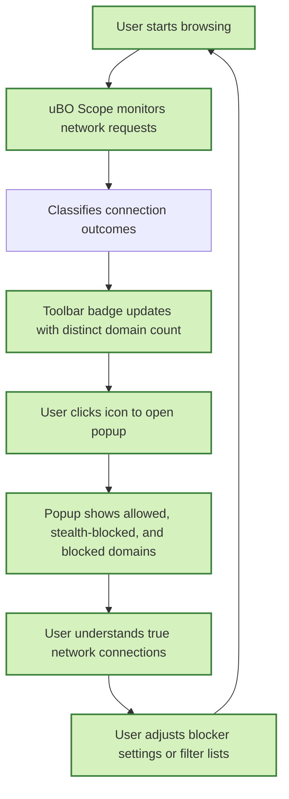

# What is uBO Scope?

uBO Scope is a lightweight browser extension designed to reveal **all actual network connections** that webpages attempt or successfully make to remote servers. Unlike typical content blockers that focus on filtering content, uBO Scope transparently reports the true network activity visible within your browser session, offering unrivaled insight into third-party connections—allowed, stealth-blocked, or outright blocked.

This tool is essential for privacy-conscious users and filter list maintainers who want a clear, objective view of the online connections happening behind the scenes while browsing. It provides factual data regardless of which content blocker or DNS-level filtering you use.

---

## Core Purpose and Unique Value

uBO Scope’s core mission is straightforward: to expose all remote server connections your browser initiates, providing a trustworthy gauge of your exposure to third-party servers. It does this by integrating directly with the browser’s native `webRequest` API, independently of any content blocking logic.

- **Complete transparency:** It reports all network requests that the browser knows about, including those that other blockers attempt to hide or filter.
- **Objective insight:** It counts **distinct third-party remote servers**, crucial for gauging actual privacy exposure.
- **Compatibility:** Works alongside any content blocker without interference, as it listens to network requests at the browser level.

## Why uBO Scope Matters to You

Many users rely on block counts or test sites to assess content blocker effectiveness, but these are often misleading. uBO Scope helps clarify this by showing the true number of distinct third-party connections:

- A **lower count** means fewer third-party connections (usually better for privacy).
- A **higher block count** does not always mean better blocking—it can indicate more allowed connections to other servers.

This transparency debunks common myths and offers real-time insights into the effectiveness of your filter lists and blockers.

## How uBO Scope Fits Into Your Workflow

- Upon installation, uBO Scope adds an icon to your browser toolbar with a badge showing the count of distinct third-party remote servers contacted in the current tab.
- Clicking the icon opens a **popup UI** that lists these connections grouped by their outcome:
  - **Allowed:** Connections allowed through.
  - **Stealth-blocked:** Connections blocked but detected stealthily by your blocker.
  - **Blocked:** Connections fully blocked.

This detailed breakdown empowers you to investigate which domains are communicating in your browsing session and make informed decisions about privacy and filtering.

## Practical Example Scenario

Imagine you visit a news website. Normally, your content blocker filters many ad-related or tracking requests. With uBO Scope, you can see exactly which third-party servers the page tried to connect to—including those that slipped through or were stealth-blocked—giving you a real picture of your privacy exposure for that session.

---

## Key Features at a Glance

- Displays the number of **distinct third-party domains** contacted by the current tab.
- Categorizes domains into **allowed**, **stealth-blocked**, and **blocked** for clear understanding.
- Provides Unicode support for internationalized domain names (IDNs), showing domains in readable form.
- Runs silently in the background, updating data in real time while you browse.
- Compatible with major browsers (Chromium, Firefox, Safari) and works alongside any other extension.

## Getting Started with uBO Scope

To begin benefiting from uBO Scope’s insights, follow these immediate next steps:

1. **Install uBO Scope** from your browser’s official extension store ([Chrome Web Store](https://chromewebstore.google.com/detail/ubo-scope/bbdpgcaljkaaigfcomhidmneffjjjfgp) | [Firefox Add-ons](https://addons.mozilla.org/firefox/addon/ubo-scope/)).
2. **Open a new tab** and browse any website.
3. **Click the uBO Scope toolbar icon** to open the popup and view detailed connection data for the active tab.

For detailed installation and configuration guidance, consult the related [Installing uBO Scope](../getting-started/introduction-and-setup/installation-instructions) and [Prerequisites & Supported Browsers](../getting-started/introduction-and-setup/prerequisites-and-supported-browsers) documentation.

---

## What uBO Scope Does NOT Do

- It is **not** a content blocker itself; it does not modify or block network traffic.
- It does **not provide detailed logs** of the exact requests beyond domain-level aggregation.
- It does **not detect or clean malware or phishing attempts;** it simply reports connection attempts.

Understanding these limits helps you use uBO Scope as a tool for clear network connection insight alongside your choice of blockers.

---

## Related Documentation and Next Steps

Once you understand what uBO Scope is and how it fits in your privacy toolkit, expand your knowledge by reviewing:

- [Who is uBO Scope for?](../overview/introduction/audience-usecases) — Discover the ideal users and detailed use cases.
- [Key Concepts and Terminology](../overview/core-concepts/key-concepts-terms) — Learn the technical terms and outcomes used throughout the UI and docs.
- [How uBO Scope Works: Technical Overview](../overview/core-concepts/technical-architecture) — For a deep dive into the extension’s architecture.
- [Reviewing Third-Party Connections with the Popup](../guides/getting-started-essentials/review-connections-popup) — Learn how to interpret popup data effectively.
- [Understanding and Interpreting the Toolbar Badge Count](../guides/getting-started-essentials/understanding-badge-count) — How to read and act on the badge indicator.

---

uBO Scope is your transparent companion to understand your browser’s real network footprint, ensuring privacy confidence and informed filter list tuning.

---

## Callout: Why It Matters

<Tip>
<u>Lowering your distinct third-party remote server count is one of the best ways to enhance your online privacy.</u> uBO Scope empowers you with accurate, unfiltered data to achieve that.
</Tip>

## Illustrative User Journey Diagram

This diagram depicts the continuous cycle of browsing, data collection, presentation, and user-informed action made possible by uBO Scope.

---

## Additional Resources

For advanced users and filter list maintainers, the extension source and detailed technical documentation are available at the official GitHub repository:

- [uBO Scope GitHub Repository](https://github.com/gorhill/uBO-Scope)

Explore more about real-world best practices and troubleshooting in the guides section.

---

**Welcome to a new level of network transparency with uBO Scope!**