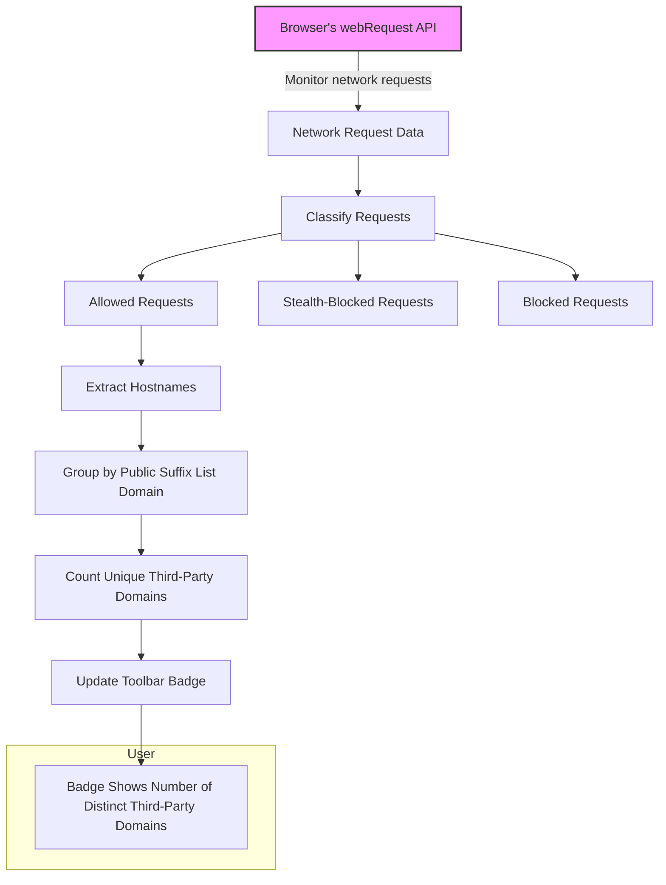

# Understanding Badge Counts and Reports

The uBO Scope extension's toolbar badge is a window into the complex network activity your browser undertakes on each webpage. It reveals the **number of unique third-party remote servers** contacted during browsing—providing clear, meaningful insights about your privacy exposure beyond simple block counts.

---

## 1. What the Badge Count Represents

The badge number on uBO Scope's toolbar icon shows the count of **distinct third-party domains** your browser has made requests to **and that were not blocked**. This count reflects the diversity of remote servers your browser communicated with for the current active tab.

- **Third-party servers** are domains different from the main website’s domain.
- Each unique third-party domain contacted is counted once, regardless of how many individual requests were sent.
- The badge only reports connections **allowed or succeeded**, not simply “blocked” requests.

This means the badge count is about the breadth of third-party connections, not the volume of blocked or allowed resources.

<Check>
A lower badge count is more desirable—it typically means fewer distinct third-party connections, reducing your data exposure.
</Check>

---

## 2. Why the Badge Count Matters

Many users mistakenly equate a higher block count shown by an ad blocker with better privacy. uBO Scope clarifies this misconception by focusing on the actual number of distinct third-party servers your browser contacts.

### Key user insights:

- **Lower unique connections imply fewer third-party trackers or domains loaded.**
- A blocker with a high block count might still allow connections to many domains, resulting in more data exposure.
- The badge count reveals connections regardless of the content blocker's reported blocked requests, making it a more accurate privacy metric.

<Info>
Content blockers can mask network activity in different ways, but uBO Scope taps directly into the browser’s network requests to report what really happens.
</Info>

---

## 3. How uBO Scope Collects and Classifies Data

uBO Scope uses the browser’s `webRequest` API to monitor network requests made by webpages. It classifies requests into three categories:

- **Allowed (Not Blocked):** Requests that successfully reached a third-party server.
- **Stealth-Blocked:** Requests internally redirected or stealthily blocked.
- **Blocked:** Requests that failed (error or explicitly blocked).

Only connections in the Allowed category contribute to the badge count.

<Note>
The extension relies on network requests visible to the browser’s `webRequest` API. Requests made outside of this scope (e.g., DNS-level blocking) will not appear in reports.
</Note>

---

## 4. Third-Party Domain Determination

To deliver an accurate badge count, uBO Scope groups requested hostnames using the **Public Suffix List (PSL)**. This ensures that requests to different subdomains of the same root domain count as a single entity.

- For example, requests to `cdn.example.com` and `images.example.com` both count as one unique domain: `example.com`.

This approach avoids inflating counts due to numerous subdomains belonging to the same organization.

---

## 5. Common Misinterpretations Addressed

### Myth 1: "More Blocks = Better Privacy"

A high block count can be misleading if it corresponds to more third-party domains being contacted overall.

**Insight:** The true privacy indicator is fewer unique third-party servers, not just counts of blocked requests.

### Myth 2: "Ad Blocker Test Pages Give Reliable Scores"

Test pages often artificially generate network requests not representative of real-world browsing.

**Insight:** uBO Scope's real-time monitoring from live browsing provides authentic network activity data.

---

## 6. Using the Badge Count in Practice

1. **Install the extension and browse as usual.**
2. **Observe the badge count per tab:**
   - A low number (e.g., 0–2) usually means minimal third-party connections.
   - A high number signals many unique network connections.
3. **Click the toolbar icon to open the popup panel:**
   - See detailed listings of allowed, stealth-blocked, and blocked domains.

This transparency helps you understand which third parties your browser contacts and adjust your privacy tools accordingly.

---

## 7. Practical Tips & Best Practices

- Use uBO Scope alongside your content blocker to validate actual network exposures.
- Regularly review badge counts for significant spikes, which can indicate unusual or unexpected third-party connections.
- Remember that some third-party connections (like CDNs) are necessary for website performance and are not inherently a privacy risk.

<Warning>
If you see high badge counts on well-known, reputable sites, consider adjusting your privacy settings or investigating specific domains further.
</Warning>

---

## 8. Troubleshooting Badge Count Issues

- **Badge count shows no number or zero:**
  - Make sure the extension is installed and enabled.
  - The badge count only appears on pages with network activity.
- **Counts seem inconsistent:**
  - Some sites dynamically load resources after initial load, affecting counts.
  - Switching tabs or reloading can refresh the count.
- **Blocking extensions not reflected in badge:**
  - uBO Scope monitors all requests the browser sees, regardless of blocker status.

---

## 9. Related Resources

- [What is uBO Scope?](/getting-started/introduction-overview/what-is-ubo-scope) — Learn about uBO Scope’s purpose and core concepts.
- [Who Should Use This Extension?](/getting-started/introduction-overview/who-should-use) — Understand who benefits most from badge counts.
- [Core Terminology Explained](/overview/architecture-core-concepts/core-terminology) — Key terms to interpret badge and popup data correctly.
- [Integration with Content Blockers & Browsers](/overview/integration-context/ecosystem-integration) — How uBO Scope fits with your current blocking setup.

---

<u>Explore these guides to deepen your understanding and make the most of uBO Scope’s privacy insights.</u>

---

## Diagram: How the Badge Count is Determined

---

## Summary

The toolbar badge is your direct insight into the number of unique third-party servers your browser contacts for each tab. It offers a far more reliable privacy indicator than block counts from content blockers, helping you spot broad third-party network activity quickly. Understanding this count empowers you to manage your web exposure effectively with verifiable data.

---