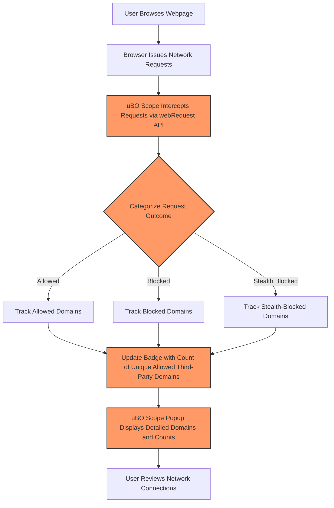

# What is uBO Scope?

uBO Scope is a lightweight browser extension designed to provide transparent visibility into all network connections your browser makes to remote third-party servers. Unlike conventional content blockers that only indicate whether a request was blocked or allowed, uBO Scope reveals every attempted, successful, or blocked connection — delivering unmatched insight into your browser's real-world network activity.

---

## Why uBO Scope Exists

Webpages frequently load resources not only from their own domain but also from multiple external sources. These third-party servers can impact your privacy, security, and browsing experience. uBO Scope helps you discover exactly which third-party servers your browser connects to, showing:

- **Allowed connections:** Resources successfully fetched from remote servers.
- **Blocked connections:** Attempts stopped by content blockers.
- **Stealth-blocked connections:** Connections covertly blocked to prevent detection.

By monitoring all these network requests at the browser level via the `webRequest` API, uBO Scope gives a definitive picture of your web activity — independent of content blockers or DNS filters.

## Core Value and Benefits

- **Reveal hidden connections:** Understand the full extent of your browser’s third-party network activity, with no blind spots.
- **Measure distinct third-party servers:** The toolbar badge counts unique third-party domains connected, helping you gauge real privacy exposure.
- **Debunk misconceptions about blocking:** Useful to see that a high block count does not always correlate with better blocking, as hidden connections might remain.
- **Aid filter maintainers and privacy enthusiasts:** Provides raw data for advanced analysis and informed tuning of content-blocking filters.

## Who Should Use uBO Scope?

- **Privacy-conscious users** wanting to verify what third-party servers their browser actually talks with
- **Filter list maintainers** aiming to validate their filters’ real-world impact
- **Researchers and security analysts** studying network behaviors of webpages
- **Users skeptical of misleading "ad blocker test" sites** who want a transparent, factual view of network requests

## How uBO Scope Works at a Glance

1. It listens to all browser network activity using the `webRequest` API.
2. It resolves domain names using the Public Suffix List for accurate grouping.
3. It categorizes requests as allowed, blocked, or stealth-blocked based on browser events.
4. It counts distinct third-party domains for display in a sleek popup and badge.

## Practical Example

When you visit a website, many connections are made:

- The main site domain
- CDN servers hosting scripts or stylesheets
- Analytics services
- Ad networks (if not blocked)

uBO Scope tracks each unique third-party domain your browser attempts to connect to and displays them clearly in its popup. This helps you quickly see if any unexpected or suspicious connections occur.

---

## Common Misconceptions Addressed

### Myth 1: "A higher block count means a better content blocker"

- A higher block count may mean more network traffic overall, not necessarily better blocking.
- uBO Scope focuses on unique third-party servers successfully reached.

### Myth 2: "Ad blocker test pages provide reliable results"

- Such test pages often use contrived scenarios undetectable or unrealistic for extension blockers.
- Real-world network behavior insights from uBO Scope offer trustworthy data.

## In Summary

uBO Scope empowers you with actionable insights about the remote servers your browser interacts with. Its transparent reporting helps you monitor, evaluate, and improve your privacy and content-blocking setup — turning network invisibility into clarity.

---

## See Also

- [Why Use uBO Scope?](/overview/product-introduction/value-proposition) — Understand the measurement philosophy and benefits.
- [Target Audience & Use Cases](/overview/product-introduction/target-audience-use-cases) — Explore who benefits most and how.
- [Install and Set Up uBO Scope](/guides/getting-started-guides/installation-setup) — Get started installing and using the extension.

---

## Additional Resources

- Official repository: [uBO Scope GitHub](https://github.com/gorhill/uBO-Scope)
- Public Suffix List: Used internally for accurate domain grouping - [publicsuffix.org](http://publicsuffix.org/)

---

## Visualizing uBO Scope's Role

---

<Tip>
Understanding what uBO Scope shows helps you correctly interpret your network exposure and improves your control over your browsing privacy.
</Tip>

<Note>
Because uBO Scope relies on the browser’s webRequest API, some network requests made outside this API’s scope (such as native platform API calls) cannot be tracked.
</Note>
