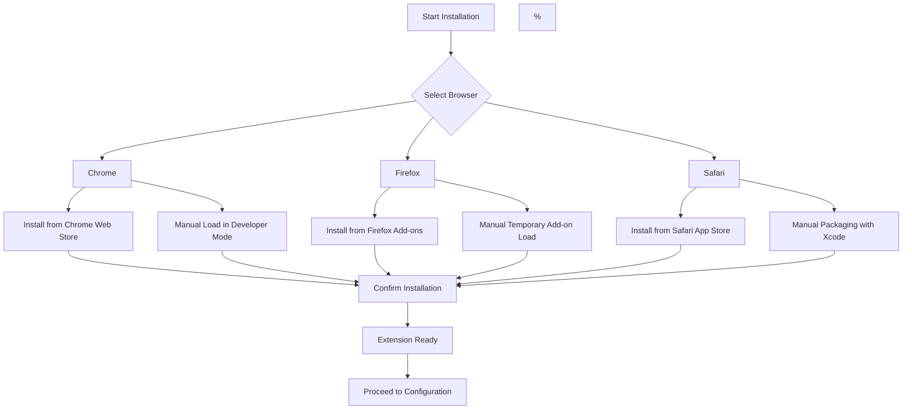

# Installation Guide for uBO Scope

Welcome to the uBO Scope Installation Guide. This page provides clear, step-by-step instructions to help you install uBO Scope quickly and easily on your preferred browser — Chrome, Firefox, or Safari. Along with streamlined direct-install options, you'll find guidance for manual or alternative installation methods to ensure you can get started without delay.

---

## 1. Supported Browsers & Requirements

Before installing, confirm your browser meets the minimum requirements:

- **Google Chrome / Chromium**: Version 122 or higher
- **Mozilla Firefox**: Version 128 or higher
- **Safari**: Version 18.5 or higher

<u>Note:</u> uBO Scope requires permissions to monitor web requests (`webRequest` API) and store local data to function properly.

---

## 2. Installation Instructions

The recommended method is to install directly from your browser’s official extension store. Follow the instructions below for your browser:

### Google Chrome / Chromium

1. Visit the [Chrome Web Store uBO Scope page](https://chromewebstore.google.com/detail/ubo-scope/bbdpgcaljkaaigfcomhidmneffjjjfgp).
2. Click **Add to Chrome**.
3. Confirm by clicking **Add extension** in the popup.
4. Once installed, the uBO Scope icon will appear next to your address bar.

### Mozilla Firefox

1. Navigate to the [Firefox Add-ons uBO Scope page](https://addons.mozilla.org/firefox/addon/ubo-scope/).
2. Click **Add to Firefox**.
3. Accept the permission prompts by clicking **Add**.
4. The uBO Scope extension icon will be visible in the toolbar.

### Safari

1. Open the [uBO Scope Safari page on the Mac App Store](https://apps.apple.com/app/ubo-scope/idYOUR_SAFARI_APP_ID) (Note: Replace with the actual link if applicable).
2. Click **Get** and authenticate with your Apple ID to download.
3. After installation, enable the extension in Safari under **Preferences > Extensions**.
4. The uBO Scope icon will become available in your Safari toolbar.

---

## 3. Alternative & Manual Installation Methods

If you prefer or require a manual installation, such as for development, testing, or if the store versions are not accessible, follow the corresponding method for your browser.

### Chrome / Chromium — Manual Load

1. Download the source code from the [uBO Scope GitHub Repository](https://github.com/gorhill/uBO-Scope).
2. Extract the package to a convenient folder.
3. Open Chrome and go to `chrome://extensions/`.
4. Enable **Developer mode** in the upper right.
5. Click **Load unpacked** and select the extracted folder with the extension files.
6. Confirm that the extension appears in your extension list with no errors.

### Firefox — Manual Load

1. Clone or download the source code from [GitHub](https://github.com/gorhill/uBO-Scope).
2. Extract the files.
3. Open Firefox and go to `about:debugging#/runtime/this-firefox`.
4. Click **Load Temporary Add-on...**.
5. Select the `manifest.json` file inside the extension directory.
6. The extension will load temporarily until Firefox is restarted.

### Safari — Development Mode (Manual Packaging)

Due to Apple's restrictions, installing an extension manually involves packaging and signing through Xcode.

1. Download the source code.
2. Open the Safari Web Extensions project in Xcode.
3. Build and run the extension to install it locally.
4. For distribution, you must sign and package the extension per Apple's guidelines.

<Tip>
Manual installation methods are intended for advanced users or developers. For everyday use, always prefer installing from official extension stores to ensure security and automatic updates.
</Tip>

---

## 4. Verifying Your Installation

After installation, confirm uBO Scope is active and ready:

1. Look for the uBO Scope icon (a magnifying glass over the uBO logo) adjacent to your browser’s address bar or toolbar.
2. Click the icon to open the popup and check for any displayed data — it may show "NO DATA" initially if no websites have been monitored yet.
3. Visit a website with known third-party content, then click the icon again to see live connection data and a badge count indicating distinct third-party domains connected.

<Check>
If the extension icon is missing or inactive, revisit the installation steps or consult the troubleshooting guide.
</Check>

---

## 5. Next Steps After Installation

With uBO Scope installed:

- Proceed to the [Initial Configuration Guide](/getting-started/introduction-setup/configuration) to personalize how uBO Scope operates.
- Review [Your First Session](/getting-started/first-steps-validation/first-usage) to learn how to interpret uBO Scope’s network analysis.
- If you encounter issues, consult [Troubleshooting Common Issues](/getting-started/first-steps-validation/troubleshooting).

---

## 6. Frequently Asked Questions

<AccordionGroup title="Common Installation Questions">
<Accordion title="Can I use uBO Scope on browsers other than Chrome, Firefox, or Safari?">
Currently, uBO Scope officially supports and is tested on Chrome (Chromium), Firefox, and Safari. Other browsers may not support required APIs or have no official versions of the extension.
</Accordion>
<Accordion title="Why do I see no data immediately after installing uBO Scope?">
The extension only records network activity when browsing web pages. It needs you to visit one or more sites to gather and then display connection data.
</Accordion>
<Accordion title="How do I update uBO Scope?">
If installed from the official extension stores, updates are automatic. For manual installs, you must repeat the installation process with the latest version.
</Accordion>
</AccordionGroup>

---

## 7. Troubleshooting Installation

If you encounter issues, try the following steps:

- **Extension Does Not Appear**: 
  - Confirm your browser version meets minimum requirements.
  - Restart the browser and check again.
  - Verify security or antivirus software is not blocking the extension.

- **Installation Fails or Hangs**:
  - Clear your browser cache.
  - Try installing in a clean browser profile or incognito mode (with extensions enabled).

- **Permissions Not Granted**:
  - Check that you accepted all requested permissions during installation.
  - For manual loads, some permissions might not apply until proper installation.

- **Manual Installation Errors**:
  - Ensure the correct folder is selected (should contain `manifest.json`).
  - Review console logs in the browser extension debug area for detailed errors.

If problems persist, report the issue with detailed steps on the [GitHub Issues page](https://github.com/gorhill/uBO-Scope/issues).

---

## 8. Summary Diagram of Installation Paths

---

You are now equipped to install uBO Scope and start monitoring your browser’s network connections instantly. Enjoy heightened transparency and control!

---

*For more detailed usage and configuration, visit the [Getting Started section](../getting-started/introduction-setup/) and explore guides on your first session and common troubleshooting.*

<Source url="https://github.com/gorhill/uBO-Scope" paths={[{path:"README.md",range:"1-56"},{path:"platform/chromium/manifest.json",range:"1-45"},{path:"platform/firefox/manifest.json",range:"1-53"},{path:"platform/safari/manifest.json",range:"1-47"}]} />