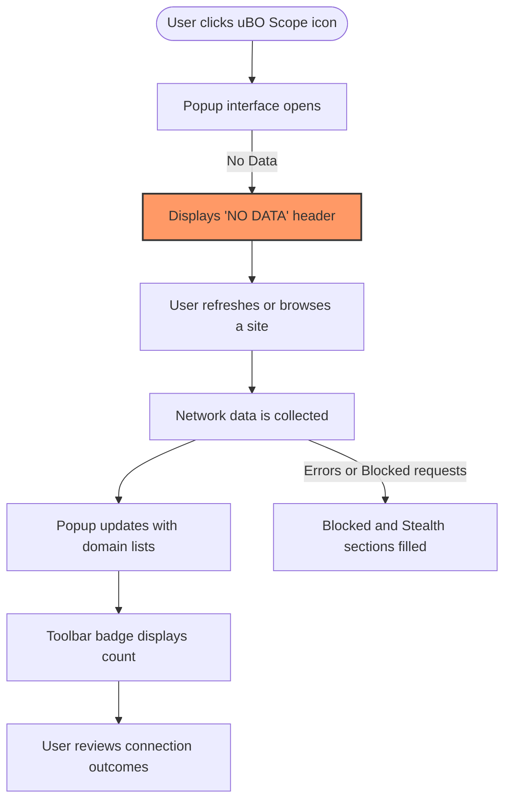

# First Launch & Quick Overview

Welcome to uBO Scope! This guide walks you through your first interaction with the extension’s popup interface, explains the badge count on the toolbar icon, and introduces the main panel showing domain connections. You will learn what to look for to confirm uBO Scope is actively monitoring network traffic and understand how to interpret the data it presents.

---

## 1. Understanding the uBO Scope Popup Interface

The popup interface is your real-time window into the third-party connections your browser is attempting or successfully making while browsing. This interface is accessible by clicking the uBO Scope icon in your browser toolbar.

### Key Interface Elements

- **Tab Hostname Header**: Shows the current page's hostname broken down into two parts:
  - The subdomain (if any), shown in the first span.
  - The main registered domain, shown in the second span.
  - If no data is available yet, the interface displays `NO DATA`.

- **Domains Connected Summary**: A count displaying how many unique third-party domains were connected to during the current tab session.

- **Connection Outcome Sections**:
  The popup divides observed domains into three categories, each with its own section:
  - **Not Blocked (Allowed)**: Domains where connections were successful.
  - **Stealth-Blocked**: Domains that were silently redirected or otherwise stealthily blocked.
  - **Blocked**: Domains where network requests were explicitly blocked.

Each section lists connected domains along with a count badge showing how many connection attempts were made.

### How Domains Are Displayed

- Domains are presented in a list under each outcome section.
- The domain names are decoded with Unicode support (Punycode conversion) for clarity.
- Each domain row shows the domain name and the number of connection attempts.

<Tip>
Make sure you refresh or interact with the webpage after opening uBO Scope to see up-to-date connection details.
</Tip>

---

## 2. Toolbar Badge Count Explained

The badge displayed over the uBO Scope icon represents the **number of distinct third-party domains** connected to in the current tab. This number reflects realistic exposure to external domains, regardless of whether connections were successful or blocked.

- A **lower count** indicates fewer third-party connections, generally a better privacy indicator.
- The badge updates automatically as you browse and uBO Scope tracks active domains.

<Note>
The count includes only distinct third-party domains, not the number of connections or blocked requests.
</Note>

---

## 3. Navigating the Main Domains and Connections Panel

When you open the popup, uBO Scope displays detailed information about connections made by the webpage in the active tab:

### Step-by-Step Walkthrough

<Steps>
<Step title="Open the uBO Scope Popup">
Locate and click the uBO Scope icon in your browser toolbar to open the popup.
</Step>
<Step title="Observe the Header">
At the top, confirm you see the correct domain corresponding to the active tab.

- The subdomain (if present) is separated from the main domain.
- If you see 'NO DATA', browsing activity or page load might not be complete.
</Step>
<Step title="Review the Domains Connected Count">
Check the summary count labeled 'domains connected'. This number should reflect the number of unique third-party domains uBO Scope detected during the current tab session.
</Step>
<Step title="Examine Outcome Sections">
Scroll down to see three distinct areas:

- **Not Blocked**: Domains where network connections succeeded.
- **Stealth-Blocked**: Domains silently redirected or blocked in a subtle way.
- **Blocked**: Domains that were explicitly prevented.

Each domain entry lists the connection count.
</Step>
</Steps>

---

## 4. Confirming uBO Scope is Active

To confirm that uBO Scope is actively monitoring your browsing session:

1. **Check the Toolbar Badge:** It should show a numeric value reflecting connected third-party domains. No badge or a blank badge means no data yet.
2. **Open the Popup:** Verify the popup lists domains under the three outcome sections, especially seeing recent connections when loading well-known websites.
3. **Interact with Pages:** Navigate to different pages or refresh tabs, then reopen the popup and observe updates in the domains lists and badge count.

<Warning>
If the badge never updates or the popup always shows 'NO DATA', ensure the extension has the required permissions and is enabled in your browser. Refer to installation and configuration guides if needed.
</Warning>

---

## 5. Tips and Best Practices

- **Regularly Check the Popup:** Keep track of which third-party domains your browser connects to in real-time.
- **Interpret Counts Meaningfully:** A high block count badge is not necessarily good; focus on the number of distinct connected domains.
- **Use Alongside uBlock Origin:** uBO Scope complements content blockers by revealing actual network exposure.
- **Unicode Domains:** Domain names are displayed with Unicode decoded, so internationalized domain names are easy to read.

---

## 6. Troubleshooting Common Issues

<AccordionGroup title="Popup and Badge Issues">
<Accordion title="Popup Shows 'NO DATA' or Empty" >
- Make sure you have activated or granted necessary permissions during installation.
- Try refreshing the active tab or navigating to a different site.
- Confirm uBO Scope is enabled in your extensions list.
</Accordion>
<Accordion title="Toolbar Badge Count Not Updating" >
- Restart your browser to reload the extension.
- Check for conflicts with other privacy extensions.
- Ensure your browser version supports the required APIs (minimum Chrome 122, Firefox 128, Safari 18.5).
</Accordion>
<Accordion title="Domains Not Displayed Accurately" >
- uBO Scope relies on browser webRequest API; some network activity outside this scope won’t be reported.
- Complex redirects may appear under stealth-blocked; this is expected behavior.
</Accordion>
</AccordionGroup>

---

## 7. Next Steps

After confirming uBO Scope is active and exploring the popup interface, continue your journey with these recommended actions:

- Review the [Interpreting the Toolbar Badge Count](../core-workflows/interpreting-badge-counts.md) guide to deepen your understanding of what the badge numbers mean.
- Explore [Navigating the Popup UI](../getting-started/navigating-the-popup.md) to learn advanced details about using the popup interface.
- If you encounter setup issues, consult [Troubleshooting Common Setup Issues](../../getting-started/making-first-use/troubleshooting-install.md).

---

For more general background, revisit the [What is uBO Scope?](../../overview/introduction-core-concepts/what-is-ubo-scope.md) page to understand the extension’s purpose and design principles.

---

## Summary Diagram: User Flow on First Launch

---

<uBO Scope’s first launch experience provides immediate visibility into your browsing exposure, empowering you right from the start. Use the popup and badge as your quick diagnostic tools for monitoring network connections effectively.>

---