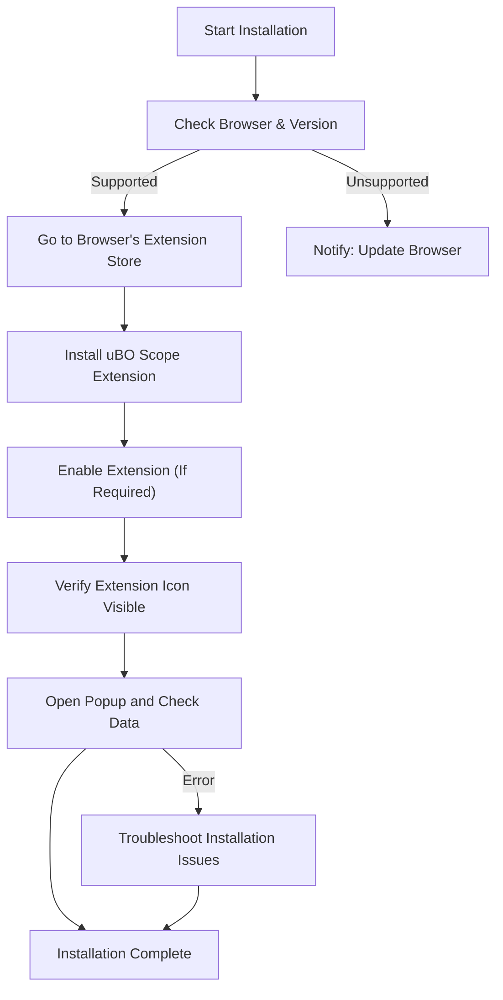

# Installation Guide for uBO Scope

Welcome to the uBO Scope Installation Guide. This document provides a clear, step-by-step walkthrough to get uBO Scope installed quickly on your preferred browser platform—**Chrome (Chromium-based browsers), Firefox, or Safari**. By following these instructions tailored for each browser, you will have uBO Scope running confidently in minutes.

---

## 1. Prerequisites & System Requirements

- **Supported Browsers and Versions:**
  - **Chrome and Chromium-based browsers:** Version 122.0 or later
  - **Firefox:** Version 128.0 or later
  - **Safari:** Version 18.5 or later

- **Permissions Required:** uBO Scope requires permissions to monitor web requests and interact with active tabs, including:
  - `webRequest` permission: to observe network activity
  - `activeTab` permission: to access current active tab data
  - `storage` permission: for saving extension data locally

- **Network Access:** No special firewall rules are necessary as uBO Scope operates entirely within the browser environment.

- **Accounts or Sign-In:** None required. uBO Scope is a standalone browser extension.

<Check>
Confirm your browser version meets the minimum requirement before proceeding.
</Check>

---

## 2. Installation Instructions

Follow the instructions specific to your browser below to install uBO Scope. Each method takes you directly to the official and verified extension store for a secure installation.

### 2.1 Installation on Chrome (Chromium-based Browsers)

1. Open your Chromium-based browser (Chrome, Edge, Brave, etc.).
2. Navigate to the official uBO Scope page on the Chrome Web Store:

   [Install uBO Scope for Chrome](https://chromewebstore.google.com/detail/ubo-scope/bbdpgcaljkaaigfcomhidmneffjjjfgp)

3. Click **Add to Chrome** (or equivalent) to begin installation.
4. Confirm the installation when prompted.

### 2.2 Installation on Firefox

1. Open Firefox browser.
2. Visit the uBO Scope extension page on Firefox Add-ons:

   [Install uBO Scope for Firefox](https://addons.mozilla.org/firefox/addon/ubo-scope/)

3. Click **Add to Firefox**.
4. Approve any permission dialogs to finalize installing.

### 2.3 Installation on Safari

1. Open Safari browser (version 18.5 or later).
2. Visit the Mac App Store or Safari Extensions Gallery (depending on your version) and search for “uBO Scope” or use the developer’s site for official install guidance.
3. Install the extension and enable it in Safari’s Extensions preferences.

<Note>
Due to Safari's extension system, installation may require approval in **Safari Preferences > Extensions** after download.
</Note>

---

## 3. Verification of Successful Installation

After installation, verify that uBO Scope is successfully added and ready to use.

### 3.1 Confirm Extension Icon

- Locate the uBO Scope icon in your browser toolbar. It looks like the uBO Scope logo.
- The icon should be visible and clickable.

### 3.2 Confirm Permissions

- Clicking the icon should open the uBO Scope popup interface.
- No error messages should appear regarding permissions.

### 3.3 Validate Basic Operation

- Visit any webpage.
- Click the uBO Scope icon.
- The popup will display connection details such as domain counts and connection status.

<Tip>
A low badge number on the icon indicates fewer distinct third-party server connections, which is generally more desirable.
</Tip>

---

## 4. Post-Installation: Next Steps

- Review the [First Use & Configuration Guide](/getting-started/onboard-intro-basics/first-use-and-configuration) to customize and understand your uBO Scope experience.
- Explore the [Validating Installation & Operation Guide](/getting-started/onboard-intro-basics/quick-validation) for thorough checks.
- If you encounter issues, consult the [Troubleshooting Setup Issues]( /getting-started/onboard-intro-basics/troubleshooting-setup) documentation.

---

## 5. Troubleshooting Common Installation Issues

<AccordionGroup title="Troubleshooting Common Installation Issues">
<Accordion title="Extension Icon Not Visible After Installation">
If you cannot see uBO Scope’s icon:
- Ensure your browser version meets minimum requirements.
- Check your browser’s extensions or add-ons menu to verify the extension is enabled.
- Restart your browser.
- For Safari users, ensure you enable the extension in Safari Preferences > Extensions.
</Accordion>
<Accordion title="Permissions Dialog Not Appearing or Cannot Grant Permissions">
- Permissions are essential for uBO Scope’s operation; deny permissions prevent functionality.
- Try reinstalling the extension.
- Clear your browser cache or profile if the problem persists.
</Accordion>
<Accordion title="Popup Does Not Show Data or Shows 'NO DATA'">
- Ensure you have an active web page open.
- Reload the page and click the extension icon again.
- Verify no conflicting extensions block webRequest APIs.
- Check browser console for errors if comfortable.
</Accordion>
</AccordionGroup>

---

## 6. Additional Resources

- Official uBO Scope GitHub: https://github.com/gorhill/uBO-Scope
- Chrome Web Store: https://chromewebstore.google.com/detail/ubo-scope/bbdpgcaljkaaigfcomhidmneffjjjfgp
- Firefox Add-ons: https://addons.mozilla.org/firefox/addon/ubo-scope/

---

## Summary Diagram: Installation Workflow

This diagram shows the sequential flow that users follow to complete the installation, from checking their browser compatibility to verification.

---

You are now fully equipped to install uBO Scope on your preferred browser. Enjoy transparent insights into your network connections!
