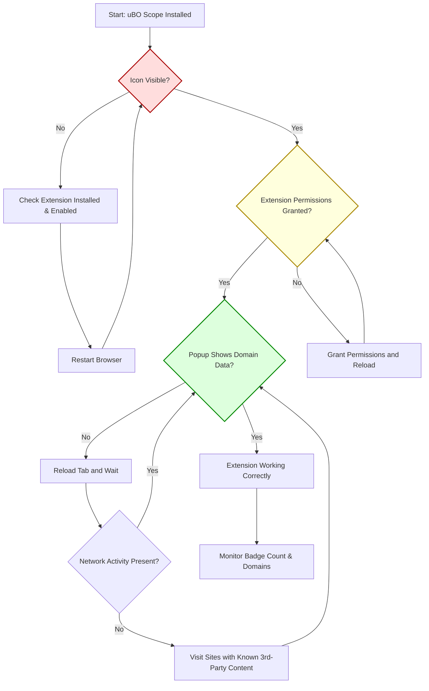

# Troubleshooting Setup Issues

This guide addresses common problems you may encounter during the installation or first use of uBO Scope, helping you resolve key issues quickly and avoid frustration. Whether you face missing icons, unexpected permission prompts, or missing domain data in the popup, this document provides clear, practical solutions and next steps.

---

## 1. Missing or Incorrect Toolbar Icon

If you do not see the uBO Scope extension icon in your browser’s toolbar or if the icon appears blank or incorrect, take these steps:

### Steps to Resolve

- **Confirm installation:** Check your browser's extensions/add-ons page to verify uBO Scope is installed and enabled.
- **Restart the browser:** Close and reopen your browser to reload all extensions.
- **Check browser compatibility:** Ensure your browser version meets the minimum requirements outlined in [Prerequisites & Supported Browsers](https://your-doc-site/getting-started/onboard-intro-basics/requirements-and-supported-platforms).
- **Review extension icon permissions:** Some browsers allow hiding extensions in the toolbar; check your toolbar customization settings to ensure the uBO Scope icon is visible.

### Additional Tips

- In Chromium-based browsers, verify you used the Chrome Web Store link to install the official release.
- When side-loading or developer-installing, ensure the icon files (`img/browsericons/logo16.png`, etc.) are intact.

<Warning>
If the icon remains missing after these steps, try reinstalling the extension. Persistent issues may be caused by browser-specific quirks or conflicts with other extensions.
</Warning>

---

## 2. Permission Prompts and Access Issues

During or after installation, your browser might prompt you for permissions or you might find uBO Scope is not reporting data correctly due to insufficient permissions.

### Understanding Permissions

uBO Scope needs the following permissions:

- **Active Tab:** To access the current tab's URL and network activity.
- **Storage:** To save session data for ongoing monitoring.
- **WebRequest:** To observe network requests for remote server connections.

These permissions are required for uBO Scope to function correctly and cannot be skipped.

### Resolving Permission Issues

- **Accept permission requests:** When prompted by your browser during installation or first use, always grant the requested permissions.
- **Manually check permissions:** In your browser’s extension settings, confirm the permissions are enabled for uBO Scope.
- **Browser profiles:** Ensure you are using a browser profile in which uBO Scope is installed and active with the correct permissions.

<Tip>
If you experience unexpected permission prompts after updates or browser restarts, it may indicate the extension needs reauthorization. Reinstalling the extension can help reset permission states.
</Tip>

---

## 3. No Domain Information Displayed in the Popup

When opening the uBO Scope popup, if you see "NO DATA" or no domains listed, it suggests that the extension is not capturing data from the current tab.

### Troubleshooting Steps

- **Reload the tab:** Sometimes network data is only gathered after reload.
- **Switch tabs:** uBO Scope captures network connections only for the active tab in the current window.
- **Check extension status:** Confirm uBO Scope is enabled and has permission to access the tab.
- **Wait a moment:** Initial loading may delay data display — the popup shows a loading state until data is ready.
- **Browser restart:** Restart your browser to reset any temporary glitches affecting data capture.

### Verify Network Activity Detection

- Visit a website you know has third-party content (e.g., a news site).
- Open the uBO Scope popup and check if the domains under “not blocked”, “stealth-blocked”, or “blocked” update.

<Note>
If domain information remains missing consistently, it may be due to browser privacy settings or blocking policies preventing uBO Scope from receiving network data. Refer to [Integration & Browser Compatibility](https://your-doc-site/overview/architecture-features-quickstart/integration-browser-support) for specific guidance.
</Note>

---

## 4. Handling Specific Common Issues

### 4.1 Badge Count Does Not Reflect Expected Numbers

- Badge shows blank or zero despite network activity.
- This can occur if the tab has no third-party connections or if uBO Scope has not yet processed network events.

**Fix:** Reload the page and wait a few seconds; confirm by opening the popup.

### 4.2 Stealth-Blocked Section is Empty

- Some sites use techniques that uBO Scope detects as stealth blocking.
- If this section is empty, it may just mean your browsing sessions don’t currently exhibit stealth blocking.

### 4.3 Extension Popup Looks Broken or Unstyled

- This could be a transient loading or browser caching problem.

**Fix:** Reload the popup by closing and reopening it; restart the browser if needed.

---

## 5. Practical Next Steps

- Always install uBO Scope from the official browser stores listed in the [Installation Guide](https://your-doc-site/getting-started/onboard-intro-basics/install-uboscope).
- Review your browser’s extension settings to ensure nothing is blocking the extension.
- Familiarize yourself with the [First Use & Configuration](https://your-doc-site/getting-started/onboard-intro-basics/first-use-and-configuration) guide to properly interpret data and adjust permissions.
- Use the [Validating Installation & Operation](https://your-doc-site/getting-started/onboard-intro-basics/quick-validation) page to confirm active network monitoring.
- If issues persist, consider visiting the [System Architecture Overview](https://your-doc-site/overview/architecture-features-quickstart/system-architecture-overview) to understand how the extension interacts with your browser.

---

## 6. Where to Get Help

- Official GitHub repository issues page for bug reports and community support: [https://github.com/gorhill/uBO-Scope](https://github.com/gorhill/uBO-Scope)
- Browser support forums for specific permission or compatibility questions.
- Refer to related documentation in this site for comprehensive guidance.

---

By following these clear troubleshooting steps, you will resolve most common setup issues swiftly and ensure uBO Scope delivers its full value in monitoring third-party network connections with transparency and accuracy.

---

# Summary Diagram of Troubleshooting Flow

---

# Additional Resource Links

- [Prerequisites & Supported Browsers](https://your-doc-site/getting-started/onboard-intro-basics/requirements-and-supported-platforms)
- [Installation Guide](https://your-doc-site/getting-started/onboard-intro-basics/install-uboscope)
- [First Use & Configuration](https://your-doc-site/getting-started/onboard-intro-basics/first-use-and-configuration)
- [Validating Installation & Operation](https://your-doc-site/getting-started/onboard-intro-basics/quick-validation)
- [System Architecture Overview](https://your-doc-site/overview/architecture-features-quickstart/system-architecture-overview)
- [Official GitHub Repository](https://github.com/gorhill/uBO-Scope)

---

If you continue facing issues, consult these guides in sequence to ensure the installation is correct and your extension environment is properly configured for optimal operation with uBO Scope.

