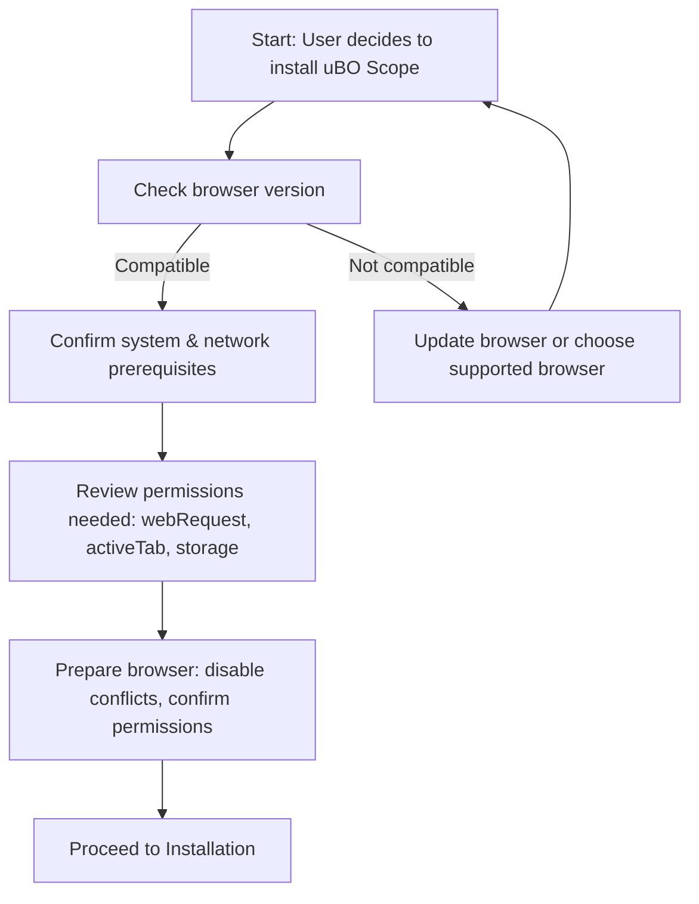

# System Requirements & Prerequisites

Ensure your environment meets all requirements before installing and using uBO Scope. This careful preparation guarantees smooth operation and accurate connection monitoring.

---

## 1. Supported Browsers & Versions

uBO Scope is designed to work as a browser extension on major browsers that support the WebExtensions API and the necessary webRequest permissions.

- **Chromium-based browsers (Google Chrome, Edge, Brave, etc.)**
  - Minimum Chrome version: **122.0**
  - Supports `webRequest` API including websocket monitoring.

- **Mozilla Firefox**
  - Minimum Firefox version: **128.0**
  - Supports `webRequest` API including websocket monitoring.

- **Safari**
  - Minimum Safari version: **18.5**
  - Supports required permissions but no websocket request monitoring (due to platform limitations).

> Confirm your browser version meets these minimums by:
> - Navigating to `chrome://version` for Chromium
> - Navigating to `about:support` in Firefox
> - Checking 'About Safari' in the Safari menu

---

## 2. System Requirements

uBO Scope is lightweight and has minimal system demands but verify the following to ensure performance:

- **Operating System**: Compatible with Windows, macOS, Linux for desktop browsers
- **Memory and CPU**: Standard desktop/laptop resources sufficient; no heavy resource usage
- **Storage**: Minimal disk space required for extension installation and local storage

No special hardware or software is required beyond a supported browser.

---

## 3. Required Permissions

uBO Scope relies on the following browser permissions to monitor network connections accurately:

- **webRequest** 
  - To observe network requests including allowed, blocked, and redirected connections
- **activeTab** 
  - To operate on the currently active browser tab for contextual data collection
- **storage** 
  - To store session data and public suffix lists necessary for domain processing
- **host permissions**
  - Access to all `http://*/*`, `https://*/*` URLs (and websocket URLs for Chromium and Firefox)

> Without these permissions, uBO Scope cannot track connections or update its UI correctly.

---

## 4. Network & Connectivity Requirements

- **Internet Access:** Required initially to fetch the Public Suffix List (PSL) from the remote source, if not cached locally.
- **WebRequest API Support:** Your browser must correctly implement the `webRequest` API, including event listeners for redirects, errors, and responses.

> **Note:** Some browser privacy settings, extensions, or enterprise policies might restrict access to the webRequest API or block third-party connections, affecting uBO Scope’s data collection.

---

## 5. Accounts or Credentials

uBO Scope does not require any account, login, or credentials. It functions entirely as a local privacy and network transparency tool.

---

## 6. Preparing Your Browser Environment

Before proceeding to installation:

1. **Disable Conflicting Extensions Temporarily**
   - Some extensions may interfere with webRequest monitoring or block uBO Scope’s permissions.

2. **Allow Permissions When Prompted**
   - Upon installing uBO Scope, ensure you grant all requested permissions for full monitoring.

3. **Ensure Browser Updates**
   - Use up-to-date versions to guarantee API compatibility.

4. **Verify Session & Local Storage Availability**
   - Browsers must support local and session storage for data persistence during use.

---

## 7. Platform-Specific Notes

| Platform | Notes |
|----------|--------|
| Chromium | Supports webRequest fully, including websocket monitoring via `wss://` URLs. Requires minimum Chrome version 122. |
| Firefox  | Fully supports webRequest and websocket monitoring; ensure minimum version 128. |
| Safari   | Limited support: does not monitor websocket requests; strict minimum version 18.5. |

---

## 8. Troubleshooting Before Installation

- If your browser is below the minimum version, update it before installing uBO Scope.
- Confirm no restrictive enterprise policies or browser settings block required APIs.

<Tip>
If unsure about your browser’s compatibility with `webRequest` API, refer to your browser’s official developer documentation or test installation of uBO Scope and verify if the extension initializes without permission errors.
</Tip>

---

## 9. Next Steps

After verifying these requirements, proceed to the **Installation on Supported Browsers** guide to install uBO Scope and begin monitoring your tab connections.

---

# Additional Resources

- [Installation on Supported Browsers](/getting-started/onboarding/install-browsers): How to install the extension across browsers.
- [Launching uBO Scope for the First Time](/getting-started/onboarding/first-launch): Initial usage and UI overview.
- [Feature Overview & Quickstart](/overview/architecture-core-concepts/feature-overview): Explore core features and user value.

---

# Summary Diagram: User Setup Flow

This flow emphasizes preparation steps for smooth installation and operation.

---