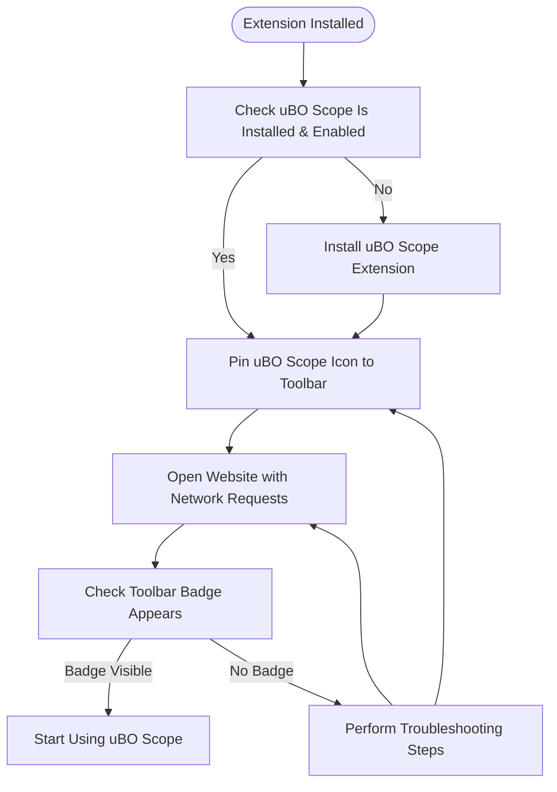

# First Launch and Extension Activation

This guide walks you through the essential initial steps after installing uBO Scope. You'll activate the extension, ensure the toolbar icon is visible (pinned), and verify the badge display so you can start tracking network requests immediately.

---

## 1. Confirm uBO Scope Installation

Before activation, verify that the extension is properly installed in your browser.

- **Chrome/Chromium-based Browsers:**
  1. Open the Extensions page by navigating to `chrome://extensions/`.
  2. Look for `uBO Scope` in the list. Ensure it is enabled.

- **Firefox:**
  1. Navigate to `about:addons`.
  2. Check under Extensions for `uBO Scope` and confirm it is enabled.

- **Safari:**
  1. Open Safari Preferences.
  2. Go to the Extensions tab and verify `uBO Scope` is listed and checked.

<Tip>
Having the extension installed and enabled is a prerequisite before attempting to activate or use uBO Scope.
</Tip>

---

## 2. Activating the Extension Post-Install

uBO Scope activates automatically once installed, but to ensure it functions fully, it's important to have its icon visible on your browser toolbar.

### Why Activation Matters

Activating by pinning the icon guarantees quick access to the extension's popup and confirms it's actively monitoring network requests.

### How to Activate (Pin the Icon)

#### Chrome / Chromium:

1. Look for the puzzle piece icon (Extensions) near the address bar.
2. Click it to open the extensions menu.
3. Find **uBO Scope** in the list.
4. Click the pin icon next to uBO Scope to pin it to the toolbar.

#### Firefox:

1. Click the three horizontal lines (menu) icon in the right corner of the toolbar.
2. Select **Manage Toolbar** or **Customize Toolbar**.
3. Locate **uBO Scope** in the list.
4. Drag and drop or click the pin option to make it visible in the toolbar.

#### Safari:

1. Right-click (or Control+click) the toolbar area.
2. Choose **Customize Toolbar...**
3. Drag the uBO Scope icon onto the toolbar.
4. Click **Done** when finished.

<Note>
If you do not pin the uBO Scope icon, it may still run in the background but you won't see the badge count or be able to open the popup interface easily.
</Note>

---

## 3. Verifying the Badge Appearance

The badge is a key indicator showing the number of distinct third-party remote servers connected by the current tab.

### What to Expect

- The badge number on the toolbar icon represents connected domains.
- A lower count signifies fewer third-party connections, which is generally better from a privacy standpoint.

### Steps to Verify Badge

1. Open any website that makes network requests to various third-party domains (e.g., popular news sites, or known content-heavy pages).
2. Observe the uBO Scope icon in the toolbar.
3. Confirm a numeric badge appears indicating domain count.
4. Click the icon to open the popup and see detailed outcome categories: **not blocked**, **stealth-blocked**, and **blocked** domains.

<Tip>
If the badge doesn't display or remains blank, try reloading the page or opening a new tab. This can trigger network request capturing.
</Tip>

---

## 4. Troubleshooting Activation Issues

If the badge does not appear or the extension seems inactive, try the following:

- **Check Permissions:**
  - Ensure your browser version is supported and meets minimum requirements (Chrome 122+, Firefox 128+, Safari 18.5+).
  - Verify that uBO Scope has permissions to access webRequest and activeTab.

- **Refresh the Page or Open New Tabs:**
  - Network requests are captured dynamically. Sometimes new tabs are required before the extension starts showing data.

- **Re-pin the Icon:**
  - Sometimes unpinning and pinning the icon again resets the badge.

- **Restart the Browser:**
  - A fresh browser restart often resolves transient extension activation issues.

<Warning>
uBO Scope relies on the browser's webRequest API. If this API is restricted or modified by other extensions or browser settings, uBO Scope may not function fully.
</Warning>

---

## 5. What Happens Next?

Once the extension is activated and the badge is visible, uBO Scope begins tracking network requests per tab. You can:

- Click the badge icon to open the popup panel showing live distinct domain counts.
- Monitor third-party connections live as you browse.
- Use this insight to evaluate content blockers or privacy settings.

For detailed guidance on interpreting the popup panel and understanding domain categories, see [Interpreting the Popup Panel](../guides/getting-started/understanding-popup).

---

## Summary

| Step | Action |
|-------|--------------|
| 1 | Confirm extension installation and enablement |
| 2 | Pin the uBO Scope icon to your browser toolbar |
| 3 | Open a web page and verify the badge count appears |
| 4 | Troubleshoot if the badge does not appear |
| 5 | Use the popup to start exploring network activity |

---

## Additional Resources

- [Installing uBO Scope](./installation-instructions) – Step-by-step installation guide
- [Prerequisites and System Requirements](./prerequisites-and-requirements) – Confirm browser and environment support
- [Understanding the Popup Panel](../../guides/getting-started/understanding-popup) – Learn to read connection reports
- [Troubleshooting Common Issues](../first-use-and-validation/troubleshooting-common-issues) – Resolve activation and usage issues

---

If you need further help, visit the project homepage: [uBO Scope GitHub](https://github.com/gorhill/uBO-Scope)

---

### Visual Summary: Activation Flow

---

This completes the essential initial setup to start leveraging uBO Scope for real-time network request visibility.

Thank you for choosing uBO Scope to enhance your browsing insight and privacy awareness.