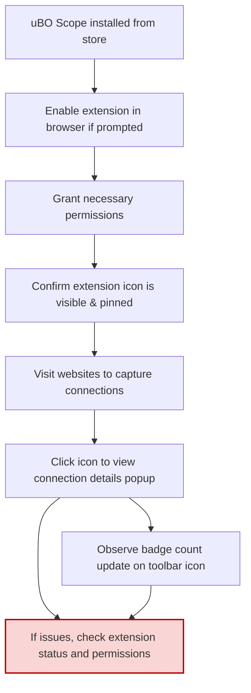

# First Launch & Configuration

Welcome to uBO Scope! This guide will walk you through what to expect the first time you run the extension, how to enable it, set necessary permissions if prompted, and confirm that the extension is active and ready on your browser toolbar.

---

## 1. Enable the Extension After Installation

After installing uBO Scope from your preferred browser store (e.g., Chrome Web Store, Firefox Add-ons), your browser might ask you to enable the extension explicitly.

- **How to enable:**
  1. Open your browser's extension/add-ons page.
      - Chrome: `chrome://extensions/`
      - Firefox: `about:addons`
      - Safari: Safari menu > Preferences > Extensions
  2. Locate uBO Scope in the list.
  3. Toggle the switch to enable it if not already enabled.

> <Check> Ensuring the extension is enabled is critical as it will not function otherwise.

## 2. Grant Permissions if Prompted

When running uBO Scope for the first time, your browser may request permissions related to network access and tab activity. These permissions are essential for the extension to capture and report network requests accurately.

- **Typical permissions requested:**
  - Access to current active tab.
  - Web Request monitoring permissions.
  - Storage access for saving session data.

- **Accept or Allow these permissions:**
  - If a permissions dialog appears, click **Allow** or **Accept**.
  - Without these permissions, uBO Scope cannot capture network activities.

<Tip>
If you accidentally deny permissions, you can grant them later by visiting your browser’s extension settings and updating permissions for uBO Scope.
</Tip>

## 3. Confirm the Extension Icon is Visible and Active

After enabling uBO Scope, ensure its icon appears on your browser toolbar:

- The icon typically shows a badge number indicating the count of distinct third-party domains connected.
- Click the icon to open the popup interface and see real-time connection details for your current tab.

### How to pin or unhide the extension icon:
- **Chrome/Chromium:**
  1. Click on the puzzle piece icon (Extensions menu) on the toolbar.
  2. Find uBO Scope in the list.
  3. Click the pin icon to keep it visible on the toolbar.
- **Firefox:**
  1. Right-click the toolbar and choose "Customize Toolbar."
  2. Drag the uBO Scope icon to your desired location.
- **Safari:** The icon should appear in the toolbar once enabled, no pinning required.

## 4. First Time Running: What You Will See

Once active and granted the needed permissions, uBO Scope starts monitoring and reporting:

- The toolbar badge will show a numeric count representing the number of distinct third-party remote domains connected by the current active tab.
- Clicking the icon opens a popup display that categorizes connected domains into three groups:
  - **Not blocked:** Domains with allowed network requests.
  - **Stealth-blocked:** Domains with network connections blocked transparently.
  - **Blocked:** Domains with network requests explicitly blocked.

> <Note> On the very first launch, if no browsing activity has occurred, the popup may display 'NO DATA' until you navigate to a website and network requests are recorded.

## 5. Troubleshooting Common First Run Issues

<AccordionGroup title="Common Issues and Solutions on First Launch">
<Accordion title="Extension Icon Does Not Appear">
- Ensure the extension is enabled in the browser's extension management page.
- Pin or move the icon to the toolbar using your browser's UI.
- Restart your browser if the icon still fails to appear.
</Accordion>
<Accordion title="Permissions Were Denied by Mistake">
- Go back to the extension's permission settings.
- Re-enable or grant missing permissions.
- Reopen the active tab to trigger monitoring.
</Accordion>
<Accordion title="Popup Shows 'NO DATA' After Browsing">
- Confirm you have visited a website since installing.
- The extension begins collecting data only for active tabs visited *after* installation.
- Try reloading the page or opening a different tab.
</Accordion>
</AccordionGroup>

## 6. Verifying uBO Scope Is Working Correctly

Perform a simple check to ensure uBO Scope is operational:

1. Open a new tab and visit a popular website (e.g., https://example.com).
2. Click the uBO Scope extension icon.
3. Verify you see a list of domains connected categorized into allowed, stealth-blocked, or blocked.
4. Confirm the toolbar badge updates with a number reflecting the count of third-party domains.

If these indicators are visible and updating in real time as you browse, uBO Scope is configured and working correctly.

## 7. Next Steps

Congratulations—your uBO Scope extension is now fully configured! To maximize its usefulness:

- Explore [Quickstart: See uBO Scope in Action](https://your-doc-site/getting-started/usage-validation-troubleshooting/quickstart-usage) to familiarize yourself with monitoring real browsing sessions.
- Learn how to interpret badge counts in [Making Sense of Badge Counts and Domain Listings](https://your-doc-site/guides/getting-started/understanding-badge).
- If you encounter issues, consult [Troubleshooting Common Installation Issues](https://your-doc-site/getting-started/usage-validation-troubleshooting/troubleshooting-install).

---

## Summary Diagram of First Launch Flow

---