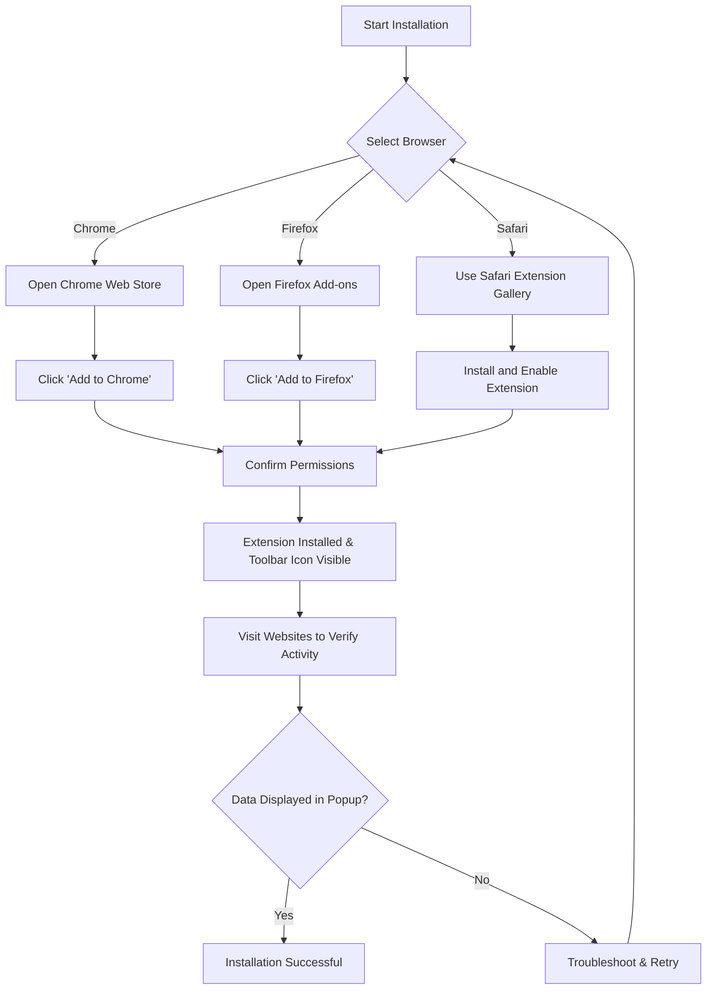

# Installing uBO Scope

Welcome to the installation guide for **uBO Scope**, a specialized browser extension that reveals all attempted and successful connections to remote servers during your web browsing sessions. This page will walk you through the step-by-step process for installing uBO Scope on your preferred browser—Chrome, Firefox, and Safari—including manual installation options.

---

## 1. Prerequisites Before Installation

Before installing uBO Scope, ensure your system meets the following requirements to enable smooth installation and operation:

- **Supported Browsers and Versions**:
  - **Chrome (Chromium-based)**: Version 122.0 or higher
  - **Firefox**: Version 128.0 or higher
  - **Safari**: Version 18.5 or higher
- **Permissions Needed**:
  - `webRequest` API access to observe network traffic
  - `activeTab` and `storage` permissions for extension functionality
- **Network Access**: The extension needs internet access to properly fetch updates like the public suffix list.

If you need the specific browser version or permissions details, refer to the respective manifest files for Chrome, Firefox, and Safari:

- [Chromium manifest.json](https://github.com/gorhill/uBO-Scope/blob/main/platform/chromium/manifest.json)
- [Firefox manifest.json](https://github.com/gorhill/uBO-Scope/blob/main/platform/firefox/manifest.json)
- [Safari manifest.json](https://github.com/gorhill/uBO-Scope/blob/main/platform/safari/manifest.json)

<Check>
Make sure your browser is updated to the minimum required version listed above to avoid installation failures or runtime issues.
</Check>

---

## 2. Installation Instructions

Follow the instructions below for your browser to install uBO Scope.

### 2.1 Installing on Google Chrome

1. Open the Chrome Web Store using this link:

   [uBO Scope on Chrome Web Store](https://chromewebstore.google.com/detail/ubo-scope/bbdpgcaljkaaigfcomhidmneffjjjfgp)

2. Click **Add to Chrome**.
3. Confirm the permissions prompt by clicking **Add extension**.
4. Once installed, a uBO Scope icon will appear in your toolbar.

#### Manual Installation (For Developers or Testing)

If you prefer manual installation or need to install a local build:

1. Download or build the extension files.
2. Open `chrome://extensions` in Chrome.
3. Enable **Developer mode** (toggle in top right).
4. Click **Load unpacked** and select the `build/uBO-Scope.chromium` directory.
5. The extension will load and appear in your toolbar.

<Warning>
Manual installation requires familiarity with browser developer settings. Use with caution.
</Warning>

---

### 2.2 Installing on Mozilla Firefox

1. Visit the Firefox Add-ons site:

   [uBO Scope on Firefox Add-ons](https://addons.mozilla.org/firefox/addon/ubo-scope/)

2. Click **Add to Firefox**.
3. Approve requested permissions in the prompt by selecting **Add**.
4. After installation, the icon will appear in the Firefox toolbar.

#### Manual Installation

1. Obtain the extension files, typically the `build/uBO-Scope.firefox` directory.
2. Open `about:debugging#/runtime/this-firefox`.
3. Click **Load Temporary Add-on**.
4. Select the `manifest.json` file inside the build directory.

Note that temporary add-ons must be reloaded after browser restarts.

---

### 2.3 Installing on Safari

Safari requires slightly different steps due to its extension system:

1. Open the **App Store** or Safari Extensions Gallery.
2. Search for **uBO Scope** or download the packaged extension if available.
3. Alternatively, if you have the extension package, install it through Safari’s Extensions preferences:
   - Open Safari > Preferences > Extensions
   - Click **+** or **Install** and select the `.safariextz` file or the appropriate build folder
4. Ensure that uBO Scope is enabled in Safari’s Extension preferences.

<Info>
Safari extensions require macOS Big Sur 11.3 or later to support the WebExtension manifest format.
</Info>

---

## 3. Verifying Installation

Once installed, verify uBO Scope is working correctly:

1. Look for the **uBO Scope icon** in your browser toolbar.
2. Click the icon to open the popup panel.
3. The panel should display "NO DATA" initially if no page has been loaded yet.
4. Navigate to any website; the icon badge should update to show the distinct third-party remote servers detected.
5. Click the icon again to see connection details such as allowed, stealth-blocked, and blocked third-party domains.

<Check>
If the badge remains blank or the popup shows no data after browsing several sites, retry browser restart and verify permissions.
</Check>

---

## 4. Troubleshooting Common Installation Issues

<AccordionGroup title="Installation Troubleshooting Tips">
<Accordion title="Extension Not Appearing in Toolbar">
- Ensure the extension is enabled in your browser’s extension manager.
- Look for hidden icons; Chrome and Firefox may hide new extensions by default.
- Restart the browser after installation.
</Accordion>
<Accordion title="Installation Failed or Permissions Denied">
- Confirm your browser version meets minimum requirements.
- Double-check that you accepted all requested permissions.
- On managed or enterprise devices, some policies may block installation.
</Accordion>
<Accordion title="Manual Installation Issues">
- Verify that you selected the correct directory or manifest file.
- For Chrome, ensure Developer mode is enabled.
- For Firefox, note that temporary addons deactivate on restart.
</Accordion>
</AccordionGroup>

If problems persist, consult the [Troubleshooting Installation & Setup Issues](https://example.com/getting-started/first-run-validation/troubleshooting-setup) page in the documentation for detailed guidance.

---

## 5. Next Steps After Installation

- Visit the [Configuration & Initial Setup](https://example.com/getting-started/setup-installation/configuration-setup) guide to customize uBO Scope to your preferences.
- Explore [First Successful Use](https://example.com/getting-started/first-run-validation/first-use) to learn how to interpret uBO Scope’s data.
- Review the [What Is uBO Scope?](https://example.com/overview/intro-basics/what-is-ubo-scope) page for core concepts and how the extension fits into your privacy workflow.

Congratulations! You are now ready to start using uBO Scope to gain transparent insights into third-party connections during your browsing experience.

---

## References

- [uBO Scope on Chrome Web Store](https://chromewebstore.google.com/detail/ubo-scope/bbdpgcaljkaaigfcomhidmneffjjjfgp)
- [uBO Scope on Firefox Add-ons](https://addons.mozilla.org/firefox/addon/ubo-scope/)
- [uBO Scope source repository](https://github.com/gorhill/uBO-Scope)
- [Browser-specific manifest files](#2-prerequisites-before-installation)

---

## Visual Summary: Installation Flow

---