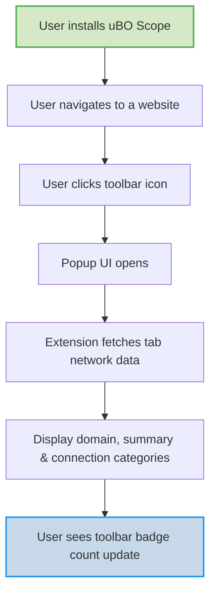

# First Run & Quick Validation

Welcome to your first experience with uBO Scope! This guide walks you through opening the extension, viewing your initial domain connection report, and understanding the badge count displayed on your browser toolbar. By the end of this guide, you will confirm that uBO Scope is actively capturing data from your browsing activities and providing meaningful insights.

---

## 1. Open the uBO Scope Extension

Your journey begins now that you have uBO Scope installed and configured. Follow these steps to open the extension and access its data:

1. **Locate the uBO Scope icon in your browser toolbar.**
   - The icon looks like the extension’s logo (colored shield).
2. **Click on the icon to open the popup UI.**
   - This popup is the main interface showing connection information per active tab.
   - Upon clicking, uBO Scope will fetch and display connection data specifically related to the current active webpage.

<Tip>
If the popup appears blank or shows “NO DATA,” make sure:
- You have navigated to a website (not a blank tab or internal browser page).
- The extension has the necessary permissions granted (refer to the Configuration & Setup page).
- The browser supports the extension APIs used by uBO Scope (see Prerequisites & System Requirements).
</Tip>

## 2. View Your First Domain Connection Report

Once the popup loads, you’ll see the domain information and a categorized report of network connections:

- **Domain Header:** Displays the current tab’s hostname and domain.
  - The full hostname (including subdomains) is shown on the left.
  - The registered domain portion is shown on the right.
- **Summary Section:** Shows the total number of distinct domains your current page connected to.
- **Connection Categories:** Divided into three groups:
  1. **Not Blocked:** Domains to which connections were allowed.
  2. **Stealth Blocked:** Domains whose connections were blocked stealthily, possibly by other content blockers.
  3. **Blocked:** Domains whose connections uBO Scope explicitly blocked.

Each section lists domains along with the number of connections (requests) made.

### What You See Represented

```plaintext
[domain.example.com]     registered domain
Domains connected: 12

NOT BLOCKED
- cdn.example.net      7
- analytics.foo.com    3

STEALTH BLOCKED
- tracking.badtracker.com   2

BLOCKED
- ads.adnetwork.com     5
```

These counts reflect network requests observed for your current active tab.

### How This Helps

- Quickly understand which third-party servers your visited page communicates with.
- Identify trackers or advertisers that might be blocked (red sections).
- Gain transparency about the breadth of network activity happening behind the scenes.

## 3. Interpret the Toolbar Badge Count

In the browser toolbar, uBO Scope’s icon displays a numeric badge—this number represents the **count of distinct third-party remote servers connected by the current tab**.

- A **lower number is better** as it means fewer third-party connections.
- The badge count updates dynamically as you browse different websites.

### Important Badge Insights

- **Count Meaning:** The badge count reflects distinct remote domains contacted — including allowed and blocked connections unless they were stealth-blocked.
- **Why It Matters:** Seeing many third parties might indicate extensive resource loading or potential privacy risks.

<Tip>
Remember, not all third-party domains are bad. Many legitimate websites rely on CDN networks and useful services that do not compromise privacy.
</Tip>

## 4. Confirm Data Capture is Active

To ensure uBO Scope is capturing data from the very first use, confirm the following:

- Opening the popup shows domain information related to the active tab.
- The summary count shows a reasonable number correlating with the visited site.
- The badges in each category contain meaningful domain names and request counts.
- The toolbar badge count updates as you switch tabs or reload pages.

If all these behaviors occur, your extension is set up and fully operational.

## 5. Troubleshooting Your First Run

<Accordion title="Popup Shows 'NO DATA' or Empty" >
- Confirm you navigated to a public website and the tab is active.
- Reload the webpage and reopen the popup.
- Check that the uBO Scope extension has permissions enabled in the browser settings.
- Verify browser compatibility per the supported versions in Prerequisites & System Requirements.
</Accordion>

<Accordion title="Toolbar Badge Does Not Update" >
- Switch to other tabs and reload pages to prompt badge update.
- Restart the browser and try again.
- Ensure no conflicting extensions impact webRequest APIs.
</Accordion>

<Accordion title="Domain Names Appear as Punycode or Encoded" >
- This is normal for internationalized domain names (IDNs).
- The popup converts these to Unicode display for readability.
</Accordion>

## 6. What to Try Next

After verifying your first run and data capture, explore further:

- Visit various websites to observe how connections change.
- Learn about the meaning of connection categories and outcomes in the Key Concepts & Terminology page.
- Understand installation and permissions in case you need to review setup steps.
- Dive deeper into the popup UI insights with the guide on Exploring the Popup.

---

### Example Quick Test Walkthrough

1. Install uBO Scope (refer to Installation Instructions).
2. Navigate to example.com or a news website.
3. Click the uBO Scope toolbar icon.
4. Observe the hostname and domain appear at the top.
5. See the count of connected domains in the summary.
6. Review not blocked, stealth blocked, and blocked sections.
7. Verify the toolbar badge number matches the number of third-party domains contacted.
8. Switch to a different tab and repeat to notice dynamic updates.

<Tip>
Keep this page handy during your first sessions with uBO Scope to consistently confirm the extension's performance and correct data reporting.
</Tip>

---

For more setup details, visit the [Configuration & Setup](../setup-introduction/extension-configuration-setup) and [Installation Instructions](../setup-introduction/installation-instructions) pages.

To better understand the categories and terms used here, see the [Core Terminology](../../overview/architecture-and-core-concepts/core-terminology) documentation.

If issues persist, consult [Troubleshooting Common Setup Issues](../setup-introduction/troubleshooting-common-issues).


---

## Visual Summary



---

_Last updated: 2024-06_

---