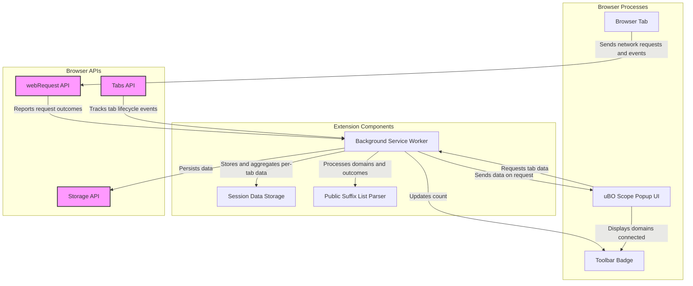

# What is uBO Scope?

uBO Scope is a specialized browser extension designed to transparently reveal all network requests a webpage attempts to make, whether those requests succeed or are blocked. Its mission is to provide you clear insights into **every remote server your browser interacts with**—helping you evaluate how content blockers are performing, dispel common misunderstandings about block counts, and ultimately enhance your online privacy and security.

---

## Why uBO Scope Exists: Revealing the Hidden Network Activity

Modern webpages load content from many different domains, often including numerous third-party servers. While content blockers partially shield you from unwanted connections, they don’t always give a complete or clear picture of what happens behind the scenes. uBO Scope fills this gap by:

- Tracking **exactly which remote third-party servers your browser attempts to contact** for each browser tab.
- Classifying these connections into "allowed", "blocked", or "stealth-blocked" outcomes.
- Showing a **real-time count of distinct third-party domains connected to**, which is a reliable indicator of privacy exposure.

This helps you understand not just what your blocker claims to block, but what actually reaches your browser.

---

## How uBO Scope Works

uBO Scope leverages browser APIs to monitor network requests at a low level, independent of which content blocker you use (or even if you use one at all). It:

- Uses `webRequest` listeners to capture all network requests made by webpages.
- Records the outcome of each request—success, failure, or redirect—including those blocked stealthily.
- Aggregates this data per browser tab and displays:
  - A **badge count** representing the number of unique third-party remote domains connected.
  - A **popup panel** that breaks down third-party connections by outcome categories: _not blocked_, _stealth-blocked_, and _blocked_.

The badge count helps you quickly assess how much your browser is exposed to third-party connections on any tab.

---

## Key Features You Will Appreciate

- **Per-Tab Visibility:** uBO Scope monitors and reports connections distinctly for each active browser tab.

- **Outcome Classification:** Connections are grouped as "allowed" (not blocked), "blocked", and "stealth-blocked"—those blocked by content blockers designed to avoid detection.

- **Domain-Level Reporting:** The extension aggregates data primarily at the domain level (e.g., example.com), which is more meaningful for understanding privacy exposure than counting individual requests.

- **Block Count Myth Busting:** uBO Scope helps you see why judging content blockers by block counts is misleading, focusing instead on actual unique domains connected.

- **Cross-Browser Support:** Compatible with Chromium-based browsers, Firefox, and Safari, maintaining consistent functionality across platforms.

---

## Real-World Scenarios: Why uBO Scope Matters to You

Consider these common situations where uBO Scope adds value:

- When comparing different blockers, you can confirm which tool actually reduces your exposure to third-party domains rather than just reporting high block counts.

- If a webpage claims to block thousands of ads, uBO Scope shows you if that corresponds to fewer distinct network connections or if many third parties are still loaded.

- For filter list maintainers and privacy researchers, uBO Scope provides an independent source of unbiased network request data.

- When trying to audit your browsing privacy, the extension reveals connections that other tools might miss.

---

## What the Badge Count Means

The badge on the uBO Scope toolbar icon shows the number of distinct **third-party remote domains** your current tab has connected to. This count reflects:

- Only third-party domains, i.e., servers different from the main domain of the tab.
- Domains from which at least one network request succeeded.

A **lower badge count indicates better privacy**, as it means fewer distinct remote servers have been contacted.

---

## Understanding the Popup Panel

Clicking the badge icon opens the uBO Scope popup, showing detailed data about the current tab's network activity:

- **Tab Hostname:** The top-level domain of the current page.
- **Domains Connected:** The total number of third-party domains contacted.
- **Categories:** A breakdown into three sections:
  - **Not Blocked**: Third-party domains with successful network connections.
  - **Stealth-Blocked**: Domains blocked but in a way intended to avoid detection by the webpage.
  - **Blocked**: Domains blocked outright.

Each section lists individual domains with the number of network requests made.

---

## Common Misconceptions Clarified by uBO Scope

- **"Higher block counts mean better blocking":** uBO Scope shows that a higher number of blocked requests can correlate with more overall network connections, implying less effective blocking.

- **"Ad blocker test webpages are reliable":** Such sites simulate unrealistic scenarios. uBO Scope measures real-world network activity in your browser, giving accurate data.

---

## Summary

uBO Scope empowers you with clear visibility into your browser’s network activity, helping you assess third-party connections accurately and improve your privacy posture. It’s the tool to trust when you want to verify how well your content blockers perform or when you seek to truly understand the breadth of remote server interactions your browser makes.

---

## Next Steps

To get started with using uBO Scope:

- Visit the [Installation Guide](/guides/getting-started/install-setup) to set up the extension.
- After installation, review the [Understanding the Popup and Badge](/getting-started/getting-going/exploring-popup) page to interpret its output.
- Explore [Why uBO Scope Matters](../../overview/introduction-group/why-it-matters) to deepen your understanding of its benefits.

---

## Additional Resources

- [High-Level System Architecture](../../overview/architecture-group/system-architecture) – Learn about how uBO Scope is structured internally.
- [Core Concepts & Terminology](../../overview/architecture-group/core-concepts-terminology) – Understand the key terms for interpreting data.
- [Quick Feature Overview](../../overview/architecture-group/feature-overview) – Explore features and practical tips.

---

For detailed technical information, visit the project repository: [uBO-Scope on GitHub](https://github.com/gorhill/uBO-Scope).

<Check>
Remember: The badge count indicates distinct third-party domains contacted, not the number of blocked requests. Use uBO Scope to see the full picture of your browser’s network exposure.
</Check>

---

## Troubleshooting

If you notice no data or unexpected badge counts:

- Confirm the extension has proper permissions to access webRequest data.
- Ensure your browser version meets the minimum requirements (e.g., Chrome 122+, Firefox 128+).
- Reload or restart your browser if data is not updating.
- Consult the [Troubleshooting Common Issues](/getting-started/getting-going/troubleshooting-setup) page for additional help.

---

## How You Benefit

Using uBO Scope clarifies the opaque nature of web connections, enabling confident decisions about your browsing privacy. It moves you beyond guesswork or misleading blockers metrics, giving you clear, actionable insights in real time.

---

# Visual Overview (Mermaid Diagram)

This diagram showcases the interaction between browser tabs, browser APIs, and the uBO Scope extension components to monitor and display network connections per tab.

---

---

# License & Source

uBO Scope is an open-source project authored by Raymond Hill, licensed under GPLv3+. Visit the official [GitHub repository](https://github.com/gorhill/uBO-Scope) for source code, updates, and community contributions.

---