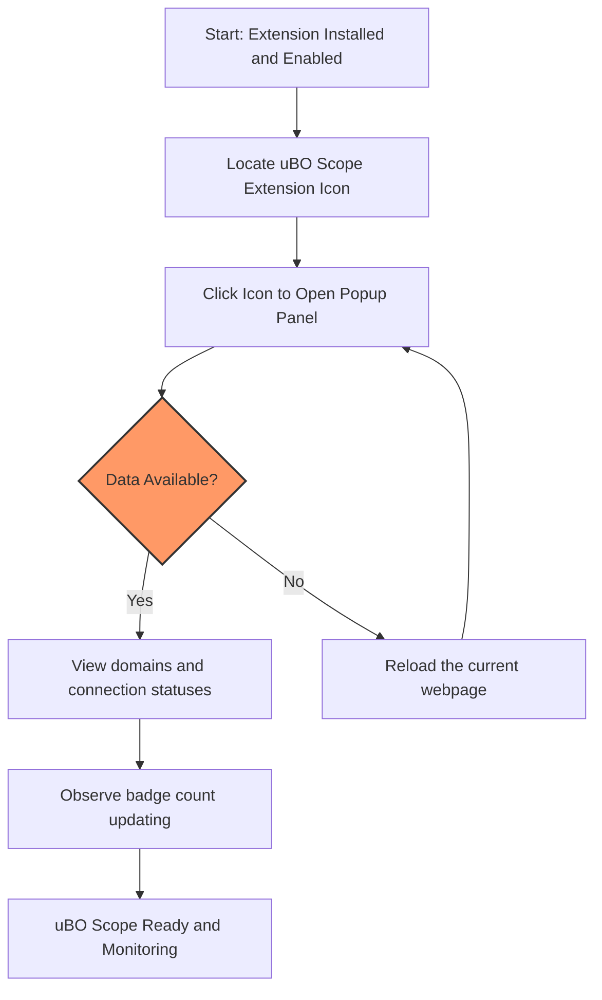

# First Launch and Verifying Installation

Welcome to your first interaction with **uBO Scope**. This guide walks you through launching the extension for the first time, locating the extension icon, accessing the popup panel, and understanding the badge counter. By the end, you will confidently know that uBO Scope is actively monitoring your network connections.

---

## 1. Locate the uBO Scope Extension Icon

Once the extension is installed, you should see its icon on your browser's toolbar. This icon serves as your gateway to uBO Scope’s real-time network monitoring information.

### How to find the icon:

- **Chromium-based browsers (Chrome, Edge, etc.):** Look next to the address bar for an icon labeled 'uBO Scope' (a distinct shield icon).
- **Firefox:** The icon is typically near the address bar or within the overflow menu if not pinned.
- **Safari:** The extension icon appears in the Safari toolbar.

<Tip>
If you don’t see the icon immediately, check your browser’s extensions menu and pin uBO Scope to your toolbar for quick access.
</Tip>

---

## 2. Open the Popup Panel

Click the uBO Scope icon to open the popup panel. This panel dynamically summarizes the connections your active tab makes to remote servers.

### What to expect on first launch:

- The popup panel will display the hostname of the current tab.
- Sections titled **not blocked**, **stealth-blocked**, and **blocked** will show connection states.
- You will initially see placeholder or zero counts if no network activity has been recorded yet.

<Tip>
If the popup shows 'NO DATA', it usually means uBO Scope has not yet recorded any network requests from the active tab; try reloading the page to trigger network activity.
</Tip>

---

## 3. Understand the Badge Counter

The badge count on the uBO Scope toolbar icon indicates the number of unique third-party remote servers your current tab has connected to and allowed.

### Key points about the badge:

- **Lower is better:** A smaller badge count means fewer third-party connections.
- It updates dynamically as you navigate or load new pages.
- If the badge is empty, no allowed third-party connections have been observed.

<Info>
The number represents distinct remote third-party domains; legitimate low-count connections are often legitimate services like CDNs.
</Info>

---

## 4. Verify uBO Scope is Monitoring Connections

Follow these steps to confirm that uBO Scope is actively tracking network events:

<Steps>
<Step title="Reload the Current Webpage">
Click the refresh button on your browser to reload the page you are viewing. This triggers new network requests.
</Step>
<Step title="Open the uBO Scope Popup Panel">
Click the extension icon and observe changes in the connection counts in the popup sections.
</Step>
<Step title="Check the Badge Count">
Look at the badge on the extension icon updating to show the number of distinct third-party domains connected.
</Step>
<Step title="Interpret the Data">
You should now see domains under the **not blocked**, **stealth-blocked**, or **blocked** categories, reflecting actual network outcomes.
</Step>
</Steps>

<Tip>
If you see no changes after reload, try visiting another website to generate network activity.
</Tip>

---

## 5. Troubleshooting Common First-Run Issues

<AccordionGroup title="Troubleshooting First Launch">
<Accordion title="The uBO Scope Icon Does Not Appear">
- Confirm the extension was installed successfully.
- Check your browser’s extension management page and enable or pin the extension.
- Restart your browser if necessary.
</Accordion>
<Accordion title="Popup Displays 'NO DATA' After Reload">
- Make sure you have navigated to a webpage that actually makes network requests.
- Confirm that your browser supports the required permissions (webRequest API access).
- Disable other extensions temporarily to rule out conflicts.
</Accordion>
<Accordion title="Badge Count Remains Zero or Empty">
- The site you are visiting may have minimal or no third-party connections.
- Try visiting more complex pages with rich content such as news sites or web apps.
- Verify that uBO Scope has storage permission enabled.
</Accordion>
</AccordionGroup>

---

## 6. Next Steps

- After confirming uBO Scope is working, familiarize yourself with the detailed [Exploring the Popup Panel](getting-started/configuration-and-validation/understanding-popup.md) to interpret connection data.
- Proceed to [Basic Configuration and Settings](getting-started/configuration-and-validation/basic-configuration.md) to customize your experience.
- For troubleshooting deeper issues, refer to [Quick Validation & Troubleshooting](getting-started/configuration-and-validation/quick-validation.md).

---

## Summary

By locating the extension icon, opening the popup panel, and observing the badge count, you confirm that uBO Scope is actively monitoring your browser’s network connections. This first launch validation is crucial to ensure the extension functions as intended and provides you with transparent insights from the start.

---

## References

- [What is uBO Scope?](/overview/product-intro/what-is-ubo-scope)
- [Installing uBO Scope](/getting-started/setup-overview/installing.md)
- [Popup UI Quick Tour](/overview/feature-overview/popup-ui-quicklook.md)
- [Basic Configuration and Settings](/getting-started/configuration-and-validation/basic-configuration.md)
- [Troubleshooting & FAQ](/getting-started/configuration-and-validation/quick-validation.md)

---

## Visual Aid: User Flow for First Launch

This flow helps you visualize the simple, effective steps to get started and validate uBO Scope’s operation immediately after installation.

---

<Check>
If you encounter issues beyond this guide, consult the [Troubleshooting section](getting-started/configuration-and-validation/quick-validation.md) or reach out to the community support channels linked in the main project repository.
</Check>
