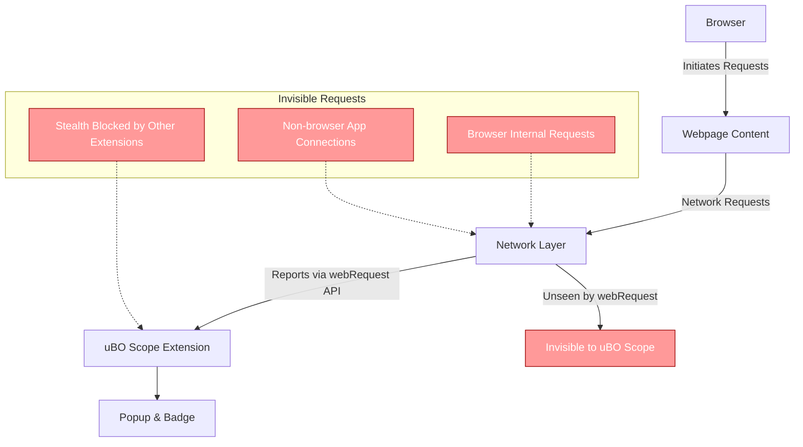

# Known Limitations of uBO Scope

Understanding the capabilities and inherent constraints of uBO Scope is essential for setting accurate expectations and interpreting the extension’s data correctly. This page explains the key limitations related to browser and extension APIs, focusing primarily on the reliance on the `webRequest` API, and identifies which network connections uBO Scope can or cannot detect.

---

## 1. Reliance on the Browser’s `webRequest` API

uBO Scope's core functionality depends directly on the browser's `webRequest` API. This API enables the extension to listen to and record network requests initiated by web pages. However, this reliance introduces several fundamental restrictions:

- **Visibility Limited to `webRequest` Coverage**: Only network requests observable via `webRequest` can be reported. If the browser or platform hides certain requests from `webRequest`, uBO Scope will not detect them.

- **Dependency on Browser Support and Permissions**: The extension requires explicit `webRequest` permissions and host access (`http://*/*` and `https://*/*`), as specified in the manifest files. Without these permissions, the extension cannot monitor network activity.

- **Variability Between Browsers**: Browser implementations of `webRequest` vary slightly, leading to different levels of visibility. For example, Chromium, Firefox, and Safari support `webRequest` with some differences in what requests are exposed.

<Tip>
Always ensure you are using a supported, up-to-date browser version which fully supports the `webRequest` API and grants uBO Scope the necessary permissions to maximize network request visibility.
</Tip>

## 2. Types of Connections That Can Be Detected

uBO Scope successfully detects and reports on network requests made via protocols supported by `webRequest`:

- **HTTP and HTTPS requests:** All standard web page resource connections.
- **WebSocket (ws/wss) requests:** Provided the browser exposes these through `webRequest` (note the Firefox and Chromium manifests request permissions for `wss://` and `ws://`).

These requests are generally associated with the main web page context or iframe frames and appear as network requests the browser processes.

## 3. Types of Network Activity Not Detectable

Due to browser API limitations, uBO Scope cannot detect certain connections or network activities:

- **Network requests made outside the `webRequest` API scope:**
  - Some browser internal requests, service worker-initiated fetches, or requests made by native browser components are not visible.
  - Requests resulting from DNS-level blocking or DNS rewrites, where the browser does not report the request at the network layer.

- **Requests blocked stealthily by content blockers:**
  - Extensions or security tools that block requests before they reach `webRequest` listeners prevent uBO Scope from seeing those requests.

- **Other protocols unsupported by the `webRequest` API:**
  - For example, FTP or other legacy protocols not handled by modern browsers.

- **Requests from other applications or system services:**
  - Only connections initiated by the browser that cause `webRequest` events are visible. External apps’ connections are not monitored.

<Warning>
Keep in mind that a zero or low badge count does not guarantee absence of network requests at a system level; it only reflects requests observable through the browser’s `webRequest` API.
</Warning>

## 4. Impact of Limitations on Badge Counts and Reporting

Because uBO Scope only tracks network requests observable via `webRequest`, the badge count reflects:

- **Distinct 3rd-party remote servers for which a connection was attempted or succeeded and reported by the browser.**

This means some 3rd-party connections may not appear if blocked before `webRequest` sees them or initiated outside the browser’s normal request pipeline.

## 5. Practical Implications for Users

- You can **rely on uBO Scope to audit most web page-initiated network connections visible via the browser’s APIs.**

- Use uBO Scope to gain a **realistic view of third-party domains accessed during your browsing**, but understand that some low-level or stealthy connections might be missing.

- Avoid relying on **invisible or stealth-blocked requests as a failure of uBO Scope; these reflect browser or blocker-level constraints, not a malfunction of the extension.**

## 6. Summary of Known Limitations

| Limitation | Explanation | Effect |
|-------------------------|-----------------------------------------------------------|---------------------------------------------------|
| Dependence on `webRequest` API | Only requests exposed through this API can be detected | Some network requests may be invisible to uBO Scope |
| Browser Variability | Different browsers may expose different requests to extensions | Visibility inconsistencies across browsers |
| Stealth Blocking by Other Content Blockers | Some blockers prevent requests from reaching `webRequest` listeners | Underreporting of blocked connections in uBO Scope |
| Non-Web Protocols | Protocols outside http(s) or ws(s) are not monitored | Missing connections for unsupported protocols |
| Requests Outside Browser Context | Native apps or system services’ connections are not tracked | Limited to browser-originated network traffic |

## 7. Troubleshooting and Mitigation

If you suspect uBO Scope is missing network requests:

1. **Verify Extension Permissions:** Confirm `webRequest`, `activeTab`, `storage`, and appropriate host access permissions are granted (see [First Launch & Permissions](../setup-installation/first-launch-setup)).

2. **Use Supported Browsers:** Confirm you are running uBO Scope on supported browsers and versions ([Supported Browsers & Prerequisites](../setup-installation/supported-browsers-prereqs)).

3. **Check for Conflicting Blockers:** Some stealth blockers may interfere with uBO Scope’s ability to observe requests.

4. **Reload the Page:** Network requests are captured as they happen, so reloading triggers new recordings.

5. **Understand API Limitations:** Know some browser internal or stealthy requests cannot be captured.

## 8. Additional Resources

- [How uBO Scope Works](../../overview/architecture-core-concepts/system-architecture) — Understand the internal processing of network requests.
- [Understanding Toolbar Badge Counts](../../guides/core-workflows/understanding-badge-counts) — Learn what badge numbers truly represent.
- [Installation Issues & Permissions](../../getting-started/troubleshooting/troubleshooting-install) — Resolve permission and installation problems that affect functionality.

---

## Appendix: Manifest Permission Differences by Browser

| Browser | Requested Network Permissions |
|---------|-------------------------------|
| Chromium | `webRequest` with `http://*/*`, `https://*/*`, `ws://*/*`, `wss://*/*` |
| Firefox | `webRequest` with `http://*/*`, `https://*/*`, `ws://*/*`, `wss://*/*` |
| Safari | `webRequest` with `http://*/*`, `https://*/*` (No explicit ws/wss permissions) |

This impacts detection granularity, especially for WebSocket connections.

---

## Visual Summary of Connection Visibility

This diagram shows the boundary of what uBO Scope can detect (solid arrows) versus what is invisible or blocked (dotted arrows).

---

<u>For a deeper technical understanding and practical guidance on making the most of uBO Scope despite these limitations, refer to related guides on architecture, badge interpretation, and troubleshooting.</u>

---

_Last updated: 2024_