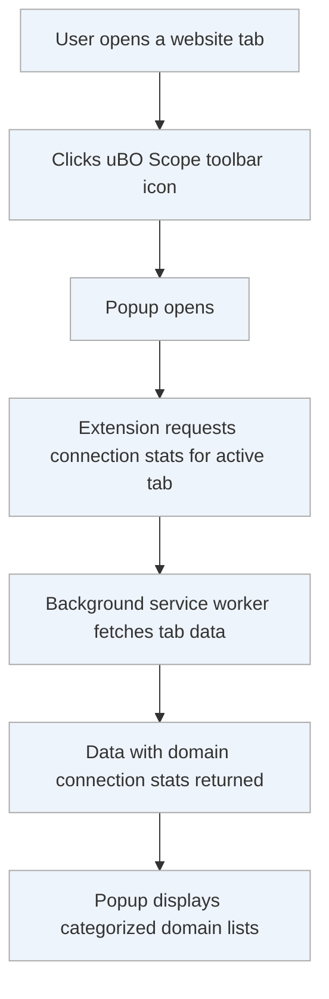

# Your First Usage: Viewing Remote Connections

Welcome to your first hands-on experience with **uBO Scope**. This guide walks you through viewing real-time connection statistics for an active website using the extension’s popup interface. You will learn how to interpret the badge count on the toolbar icon, understand what it represents, and how to explore the detailed connection data categorized by their outcome.

---

## 1. Understanding the Toolbar Badge

After installing and activating uBO Scope (refer to the [First Launch & Extension Activation](../installation-setup/first-launch-setup) guide), you will notice a badge number on the extension's toolbar icon. This badge number is:

- **The count of distinct third-party remote domains that the current browser tab connected to successfully.**

A lower number on this badge signifies fewer third-party connections, which generally correlates with better privacy and less exposure to external trackers.

> **Important:** The count only includes domains for which a connection was actually attempted or successfully made, not those blocked or stealth blocked.

## 2. Opening the Popup Interface

The popup gives a categorized breakdown of these connections, making it easier to analyze:

### Steps to open the popup:

1. **Navigate to the active browser tab with a webpage loaded.**
2. **Click the uBO Scope icon** on the toolbar.
3. The popup window appears, presenting connection statistics segmented into three sections:
    - _Not Blocked_
    - _Stealth-Blocked_
    - _Blocked_

## 3. Interpreting the Popup Panels

The popup presents:

- **Summary:** At the top, it shows the total number of distinct third-party domains connected on this tab.
- **Not Blocked:** Domains with connections that succeeded.
- **Stealth-Blocked:** Domains where connections were prevented indirectly, such as through redirects or stealth filtering.
- **Blocked:** Domains whose network requests failed due to blocking.

### What to look for:

- Each domain is accompanied by a numeric badge indicating how many requests were made to that domain.
- Click insights:
  - Domains listed under _Not Blocked_ are actively contacted by the website.
  - Domains in _Blocked_ show where the extension or other blockers stopped connections.
  - _Stealth-Blocked_ domains indicate intercepted connections via stealth techniques often used by advanced blockers.

## 4. Detailed Example Walkthrough

Imagine you are browsing a news website. Opening the uBO Scope popup reveals:

- **Summary:** 10 domains connected.
- **Not Blocked:** Example `cdn.news-site.com` (25 requests), `analytics.partner.com` (3 requests).
- **Stealth-Blocked:** `trackers.adservice.com` (5 requests).
- **Blocked:** `ads.network.com` (7 requests).

This lets you directly observe which third parties are involved and their connection outcomes.

## 5. Practical Tips and Best Practices

- **Refresh the popup** to update data if you navigate to a new website or reload the current tab.
- **Use the popup during active browsing** to monitor connection changes in real-time.
- **Consult the badge count** as a quick privacy metric per tab. Investigate higher counts to understand potential privacy risks.
- **Understand that some third-party domains are necessary**, such as Content Delivery Networks (CDNs), and are not inherently harmful.

## 6. Common Pitfalls

- The badge count does **not** include connections made on other tabs.
- If the popup displays 'NO DATA', ensure:
  - The current tab has finished loading.
  - uBO Scope is enabled and not disabled or blocked by another extension.
  - Your browser supports required APIs (`webRequest`).

<Tip>
If you see unexpected high counts or connections, try disabling other extensions temporarily to isolate behaviors.
</Tip>

## 7. Troubleshooting Popup Access Issues

<AccordionGroup title="Troubleshooting Steps for Viewing Connections">
<Accordion title="Popup shows no connection data or 'NO DATA'">
- Reload the current browser tab and try opening the popup again.
- Verify that uBO Scope is enabled in your browser’s extensions page.
- Check your browser version and compatibility ([see system requirements](../../installation-setup/system-requirements)).
</Accordion>
<Accordion title="Badge number does not update">
- Close and reopen the tab to refresh network connection monitoring.
- Restart the browser if badge counts freeze.
- Confirm no conflicting content blockers disable webRequest API.
</Accordion>
</AccordionGroup>

## 8. How It Fits Into Your uBO Scope Journey

This page complements:

- [Understanding the Toolbar Badge](../../guides/getting-started-with-ubo-scope/understanding-the-badge)
- [Interpreting Domain Connection Statistics](../../guides/analyzing-connections-and-practical-scenarios/interpreting-domain-connection-stats)
- [First Launch & Extension Activation](../../getting-started/installation-setup/first-launch-setup)

Together, these form a seamless path from installation to insightful usage.

---

## Code Example: Viewing the Popup Data Programmatically

While most users do not need to script, here is an insight into how the popup gathers data for a tab:

```javascript
// Retrieve active tab info and request connection data for that tab
(async () => {
    const [tab] = await browser.tabs.query({ active: true, currentWindow: true });
    if (!tab) return;

    const responseStr = await browser.runtime.sendMessage({ what: 'getTabData', tabId: tab.id });
    const tabData = deserialize(responseStr);  // Deserialize protobuf-like data
    console.log(tabData);
    // tabData contains allowed, blocked, and stealth domain breakdowns
})();
```

This reflects the internal mechanism behind the popup display.

---

## Summary Diagram: User Flow When Viewing Remote Connections



---

For further exploration, refer to [Interpreting Domain Connection Statistics](../analyzing-connections-and-practical-scenarios/interpreting-domain-connection-stats) for deep dives into connection outcomes and filtering implications.


---

<Check>Ensure your browser is updated to the minimum supported version to guarantee full functionality of uBO Scope’s popup and connection tracking features.</Check>

---

# Congratulations! You are now equipped to effectively view and interpret remote connections with uBO Scope, gaining real-time insights to enhance your privacy awareness during browsing.

---

## Additional Resources

- [Installation & Setup Guides](../../installation-setup/)
- [Understanding Core Terminology](../../introduction-core-concepts/core-concepts-terminology)
- [Troubleshooting Common Setup Problems](../../getting-started/using-extension/common-issues)


---

*This page is part of the Getting Started section, designed to get you hands-on with your first meaningful inspection of the extension’s data.*