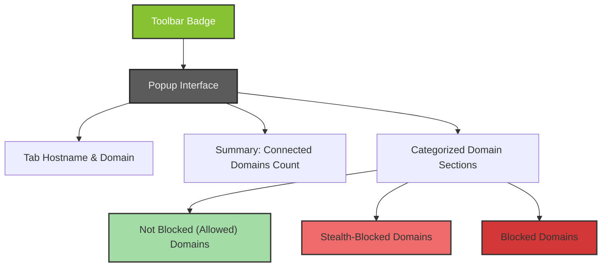

# Understanding the Badge & Popup

Discover how to effectively read and interpret the uBO Scope browser extension’s toolbar badge and popup interface. This guide walks you through understanding the badge count, differentiating allowed, blocked, and stealth domains, and leveraging this data to gain deeper insights into your webpage privacy and network activity.

---

## 1. Overview of the Badge and Popup

The uBO Scope extension provides real-time visibility into the network connections a webpage attempts and establishes with third-party remote servers. Two main user interfaces summarize this information:

- **Toolbar Badge:** Displays a numeric count on the extension icon indicating the number of distinct third-party domains allowed by the current tab.
- **Popup Interface:** A detailed panel accessible by clicking the extension icon, showing categorized domains connected by the webpage.

### What the Badge Represents

- The badge count shows the number of **distinct allowed third-party remote servers** for the active tab.
- A **lower count is better**, reflecting fewer third-party connections, which generally implies better privacy.
- It counts domains from which resources were successfully fetched (allowed), excluding blocked or stealth-blocked domains.

### The Popup Panel

The popup breaks down all remote server connections into three clear categories:

| Section         | Description                                                |
|-----------------|------------------------------------------------------------|
| **Not Blocked** | Domains with successful, allowed network connections       |
| **Stealth-Blocked** | Domains whose requests were silently blocked or redirected |
| **Blocked**     | Domains with requests explicitly blocked by the content blocker |

Each section lists domains along with a badge showing the number of requests observed to or from that domain.

---

## 2. Detailed Breakdown of Popup Sections

### a. Tab Hostname and Domain Display

At the top of the popup, you will see two pieces of information:

- **Subdomain part:** If the hostname has a subdomain, it is shown in a lighter, less prominent font.
- **Tab Domain:** The primary domain of the tab currently inspected.

This helps identify the webpage’s origin and its relationship to connected domains.

### b. Summary Section

- Displays the total **number of distinct connected domains** (both allowed and blocked) for the current tab.
- This total helps gauge the breadth of network activity tied to the page.

### c. Not Blocked Section

- Lists all domains for which connections were successful and allowed by the content blocker.
- Each line shows the domain and a count of the number of successful requests.
- Generally, you want this list to be short, meaning fewer third-party connections.

### d. Stealth-Blocked Section

- Shows domains that were silently blocked or redirected—these are connections hidden from normal network inspection but detected by uBO Scope.
- Such stealth blocking is often used to prevent tracking without breaking webpage functionality.

### e. Blocked Section

- Lists domains explicitly blocked by the content blocker.
- These connections were attempted but prevented from loading.
- Investigate these to understand what content is being filtered.

---

## 3. How to Use the Badge and Popup Data

### Step 1: Observe the Badge Count

- After navigating to any webpage, look at the extension badge on your browser toolbar.
- The number indicates how many distinct third-party domains were allowed.
- A badge showing zero or a low number means fewer third-party connections.

### Step 2: Open the Popup for Details

1. Click the uBO Scope icon on the browser toolbar.
2. The popup will load and display the current tab’s domain at the top.
3. Review the **Summary** to see the total number of connected domains.
4. Browse through each section — Allowed, Stealth-Blocked, and Blocked — to understand network dynamics.

### Step 3: Interpret and Analyze

- Domains in **Not Blocked** are those you should monitor closely if you aim for network privacy.
- Investigate **Stealth-Blocked** to verify what the extension silently intercepts.
- Review **Blocked** domains to confirm your content blocker’s effectiveness.

<Tip>
The popup uses punycode decoding, so internationalized domain names (IDNs) appear in a readable format.
</Tip>

---

## 4. Practical Tips and Best Practices

- **Regularly check the badge count** when browsing privacy-sensitive sites to monitor your exposure to third-party connections.
- Use the popup data when you want to assess the impact of your content blocker configurations.
- Look out for unexpected allowed domains — these may represent tracking or ad providers.
- Compare stealth-blocked and blocked lists to understand the difference between silent and explicit blocking.
- Remember, not all third-party connections are bad — some are necessary for site functionality.

---

## 5. Common Questions and Troubleshooting

<AccordionGroup title="Troubleshooting Common Popup Issues">
<Accordion title="Why does the badge show no count or disappear?">
If the active tab has no third-party connections or the tab details are not yet available, the badge will be empty. Navigate to a website with network activity, or reload the tab to refresh data.
</Accordion>
<Accordion title="Popup shows NO DATA for the current tab">
This occurs when no network data has been recorded for the active tab, possibly due to a new tab or the webpage blocking requests outside the extension's monitoring scope. Try reloading the page or navigating to a different website.
</Accordion>
<Accordion title="Why are some domains in stealth-blocked, not blocked or allowed?">
Stealth-blocked domains represent network requests that are redirected or silently blocked by filters. These do not appear as explicit blocks to webpages but are detected by the extension's monitoring.
</Accordion>
<Accordion title="The popup looks broken or incomplete">
Try refreshing the popup by closing and reopening it. Ensure your browser is up to date and the extension version is current. Clearing session data or restarting the browser may also help.
</Accordion>
</AccordionGroup>

---

## 6. Summary

Understanding the badge and popup is crucial for harnessing uBO Scope’s full privacy insights. Use the badge as a quick, at-a-glance metric to assess third-party exposure, then dive into the popup’s categorized domains for a nuanced view of network behavior. This empowers you to evaluate how content blockers affect your browsing and where connections are being allowed, blocked, or stealthily intercepted.

---

## 7. Additional Resources

- [Core Concepts & Terminology](/overview/introduction-and-core-concepts/core-concepts-terminology) — Definitions of allowed, blocked, and stealth connections.
- [How uBO Scope Works](/overview/product-architecture-and-workflows/how-ubo-scope-works) — Deeper dive into extension operation and data collection.
- [Run Your First Check](/getting-started/using-ubo-scope/run-first-check) — How to validate your installation and see uBO Scope in action.
- [Integration with Content Blockers](/overview/product-architecture-and-workflows/integration-with-content-blockers) — Understanding how uBO Scope works alongside other blockers.

---

## 8. Visual Overview (Popup Layout)

---

By following this guide, you will confidently interpret the uBO Scope badge and popup, gaining actionable insight into your browsing privacy and network connections.
