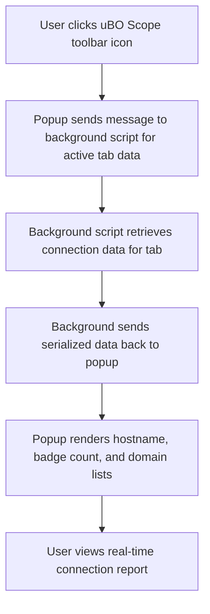

# First Run and Quick Start with uBO Scope

Welcome to uBO Scope! This guide walks you through what happens when you launch the extension for the first time, explains the layout of the popup window, and shows you how to immediately see which remote servers your current browser tab is contacting.

---

## 1. Launching the Extension for the First Time

### Step 1: Click the uBO Scope Toolbar Icon

- In your browser toolbar, locate the uBO Scope icon (a shield icon labeled "uBO Scope").
- Click the icon to open the extension popup.

<Tip>
The toolbar icon badge shows the number of distinct third-party remote servers your current tab has successfully connected to. A lower badge count means fewer third-party connections.
</Tip>

### Step 2: Understand What the Popup Does

- On click, the extension queries its background script for data about the active tab.
- It retrieves information about remote server connections categorized as:
  - **Not Blocked:** connections allowed by your content blockers or none.
  - **Stealth-Blocked:** connections that were silently redirected or stealthily blocked.
  - **Blocked:** connections that failed or were explicitly blocked.

- These categories help you get a transparent view of what online resources the webpage has accessed.

---

## 2. Popup Layout Overview

The popup interface provides a clear, immediate snapshot of your active tab's network activity:

### Header: Tab Hostname

- Shows the domain and subdomain of the current tab.
- If the hostname differs from the domain, both portions are shown separately for clarity.

### Summary Section

- Displays the total count of connected remote domains for the current tab.

### Domain Outcome Sections

- **Not Blocked:** Lists third-party domains to which connections succeeded.
- **Stealth-Blocked:** Shows domains where requests were redirected or silently blocked.
- **Blocked:** Lists domains for which connections failed or were actively blocked.

Each domain entry includes:
- The domain name (converted to Unicode for internationalized names).
- The count of connections made or attempted to that domain.

### Domain Row Template

- Each domain is rendered as a row with the domain name and a badge showing how many connection instances occurred.

---

## 3. How to See Remote Servers Connected by Your Current Tab

### Step 1: Open the Popup

- Click the uBO Scope icon.
- The popup loads and displays information about connections from the active tab.

### Step 2: Review the Domain Lists

- Browse each section (Not Blocked, Stealth-Blocked, Blocked) to analyze third-party activity.
- Use the counts to identify heavily contacted domains.

<Tip>
Keep in mind that many legitimate websites load resources from a few well-known CDNs (Content Delivery Networks). Seeing a few domains in the "Not Blocked" section is expected.
</Tip>

### Step 3: Understand the Badge Count Correlation

- The number on the toolbar badge corresponds exactly to the count of distinct third-party domains listed under the "Not Blocked" section.
- A lower badge number generally indicates reduced third-party exposure.

---

## 4. Additional Tips for Your First Experience

- **No Configuration Needed:** uBO Scope works immediately after installation — no configuration is required to start seeing data.
- **Active Tab Focus:** The popup always shows data about the currently active tab. Switch tabs and reopen the popup to refresh data for the new tab.
- **Popup Updates on Demand:** The extension updates connection data in near real-time thanks to background listeners monitoring network requests.

## 5. Troubleshooting Common First Run Issues

<AccordionGroup title="Troubleshooting Tips for First Run">
<Accordion title="Popup Shows 'NO DATA' or No Domains">
This indicates no network data has been collected for the current tab yet.

**Solution:** Refresh the webpage and then reopen the popup. If data still doesn't appear, check that the website is actively loading network resources.
</Accordion>
<Accordion title="Badge Count Does Not Update">
The badge relies on real-time network data.

**Solution:** Refresh the current tab and wait a moment. Some browsers may delay badge updates.

If the problem persists, restart the browser.
</Accordion>
<Accordion title="Unexpected High Number of Remote Domains">
Large badge counts often reflect real webpage behavior.

**Note:** Some pages load many third-party resources (ads, trackers, CDNs).

**Tip:** Use the popup domain lists to identify these domains and decide if this matches your browsing expectations.
</Accordion>
</AccordionGroup>

---

## 6. What Happens Behind the Scenes (High-Level User Flow)

For those curious about the user experience flow:

This seamless flow means you get an accurate snapshot immediately after clicking.

---

## 7. Next Steps After Your First Run

- Explore the [Interpreting the Badge Count and Popup Breakdown](https://docs.example.com/guides/core-workflows/interpreting-badge-and-popup) guide to learn how to analyze the data deeply.
- Visit [Basic Configuration](https://docs.example.com/getting_started/installation_and_setup/basic_configuration) if you want to tailor how uBO Scope behaves.
- Check [Troubleshooting Common Issues](https://docs.example.com/getting_started/validation_and_support/troubleshooting_common_issues) if you encounter problems.

<Tip>
To get the most from uBO Scope, revisit these guides regularly as you install the extension on new devices or analyze different websites.
</Tip>

---

## References

- Installation instructions: [Installing uBO Scope](https://docs.example.com/getting_started/installation_and_setup/installing_ubo_scope)
- Architecture overview: [How uBO Scope Works](https://docs.example.com/overview/architecture-concepts/highlevel-architecture)
- Use cases and integrations: [When and How to Use uBO Scope](https://docs.example.com/overview/usecases-integrations/typical-usecases)

---

With this quick start, you'll immediately see the landscape of remote connections your browser tab makes — empowering you to monitor third-party activity effectively from day one.