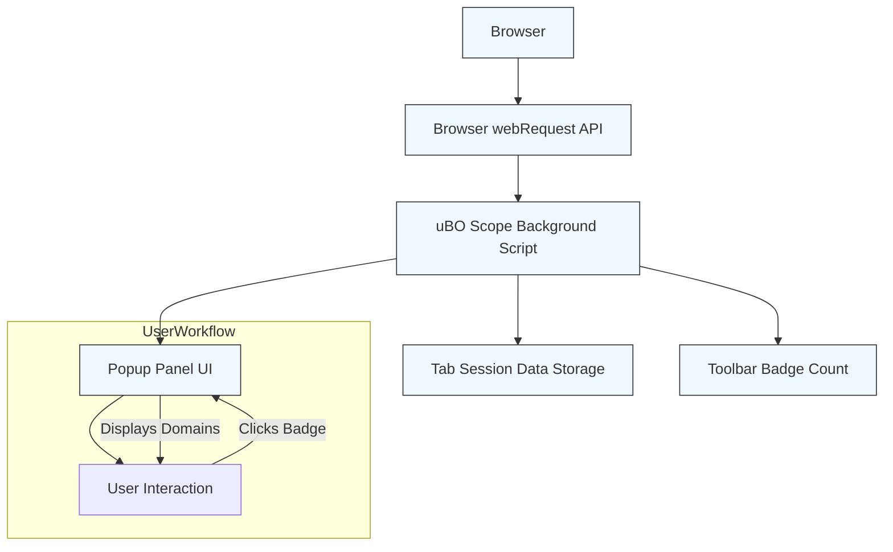

# What is uBO Scope?

uBO Scope is a straightforward browser extension designed to provide you with clear, comprehensive visibility into all remote server connections your browser attempts or successfully establishes while you browse the web. Its core function is to reveal every distinct third-party server connection — whether allowed, stealth-blocked, or outright blocked — giving you actionable insights into your network exposure regardless of your current content blocker configuration.

---

## Core Purpose and Value

While many content blockers focus on blocking unwanted content, uBO Scope’s mission is transparency and measurement. It tracks all network requests made by webpages through the browser's `webRequest` API and reports on their outcome. This is invaluable for privacy-conscious users and filter list maintainers seeking to understand exactly which external servers are contacted during browsing sessions.

### What You See & How

- **Toolbar Badge Count:** Displays the number of distinct third-party remote servers connected to — a lower count corresponds to fewer external connections, an indicator of tighter privacy and blocking.
- **Popup Panel:** When clicking the extension icon, a detailed popup breaks down these connections into three categories:
  - **Not Blocked (Allowed):** Connections made without obstruction.
  - **Stealth-Blocked:** Connections intercepted stealthily without being outright reported as blocked, often by methods that hide block activity from webpages.
  - **Blocked:** Connections the browser or content blocker explicitly blocked.

This categorization helps you quickly assess the efficiency of your blockers and the network footprint of the page.

<Tip>
Keep in mind: Not all third-party connections are harmful. Content delivery networks (CDNs) and other essential services often appear here. uBO Scope helps differentiate the actual network surface your browser touches.
</Tip>

---

## How uBO Scope Operates

uBO Scope taps into the browser's `webRequest` API, listening to network events such as redirects, errors, and successes for every HTTP, HTTPS, and WebSocket request your browser makes. It collects data per tab session, normalizes hostnames into domains using the Public Suffix List (PSL), and summarizes the data for display.

The extension is blocker-agnostic: it reports what happens regardless of your content blocker setup — whether you use uBlock Origin, another blocker, or none at all — as long as those requests pass through the browser's `webRequest` API.

This unbiased measurement means you see the true network activity from your browser’s perspective.

---

## Breaking Myths: The Truth About Block Counts

### Myth 1: Higher Block Count Means Better Blocking

A common misconception is that seeing a higher badge count for blocked requests indicates a more effective blocker. uBO Scope disproves this by revealing that a high block count can occur when your browser attempts connections to many third-party servers, which inherently increases exposure risk.

What ultimately matters is the number of distinct third-party connections allowed (not blocked). A lower allowed count signals fewer external data leaks and a more efficient blocking setup.

### Myth 2: "Ad Blocker Test" Pages Reflect Real-World Blocking

Fake test websites claiming to benchmark content blockers often issue unrealistic requests unseen on real websites. Because some blockers stealthily block connections, these pages can’t correctly detect blocking and give misleading results.

uBO Scope bypasses these issues by directly monitoring the browser’s network requests rather than relying on webpage detection.

---

## Who Benefits From uBO Scope?

- **Privacy Enthusiasts:** Gain unparalleled transparency into every third-party connection your browser engages with.
- **Filter List Maintainers & Blocker Developers:** Use precise connection data to refine filters and measure impact.
- **Users on Devices with Limited Tools:** On restricted platforms, uBO Scope offers insights traditionally only available via advanced developer tools.

This independence from blockers and DNS configurations ensures it works universally on supported browsers.

---

## Understanding the Data Presentation

When you open uBO Scope’s popup panel, you’ll see at a glance:

- The total number of connected domains.
- Domains grouped by outcome category: Allowed, Stealth-Blocked, and Blocked.
- Count badges next to each domain indicating how many connections occurred.

Each hostname is normalized to a domain to reduce complexity and aid recognition.

### Example Flow

1. Visit a webpage.
2. Network requests fire — uBO Scope records these asynchronously.
3. The toolbar badge updates with the count of distinct domains connected to.
4. Clicking the toolbar icon opens the popup showing detailed domain outcome breakdowns.

<Info>
You can trust the badge and popup data as accurate reflections of your browser’s network activity because uBO Scope listens directly to the browser's event API, unaffected by external reporting or page scripts.
</Info>

---

## Practical Tips to Get the Most from uBO Scope

- **Use in conjunction with your blocker:** See exactly what connections are blocked or allowed without guessing.
- **Monitor stealth blocking:** Identify when your blockers prevent connections silently.
- **Analyze network exposure per tab:** Quickly isolate sites that generate many third-party connections.
- **Share data with filter maintainers:** Help improve list accuracy and coverage.

---

## Troubleshooting and Common Questions

- If the popup always shows "NO DATA," refresh the current tab or open a new one — uBO Scope's data is per tab session.
- Badge count might reset after browser restart since session data is maintained in-memory or via session storage.
- Some network requests made outside the browser’s `webRequest` scope (e.g., native apps, browser internals) are not captured.

For advanced troubleshooting, consult the background script and its event handling logic in the code repository.

---

## Diagram: How uBO Scope Monitors Network Connections

---

## Learn More

Explore other parts of the documentation to deepen your understanding and maximize uBO Scope’s potential:

- [Why Use uBO Scope?](https://yourdocs/overview/intro-value/value-proposition)
- [How uBO Scope Works](https://yourdocs/overview/architecture-concepts/highlevel-architecture)
- [Core Concepts & Terminology](https://yourdocs/overview/architecture-concepts/key-terminology)
- [Typical Use Cases](https://yourdocs/overview/usecases-integrations/typical-usecases)

Visit the [GitHub repository](https://github.com/gorhill/uBO-Scope) for source code, updates, and community support.

---

Experience transparency and control over your browser’s network activity with uBO Scope — your window into every connection that matters.