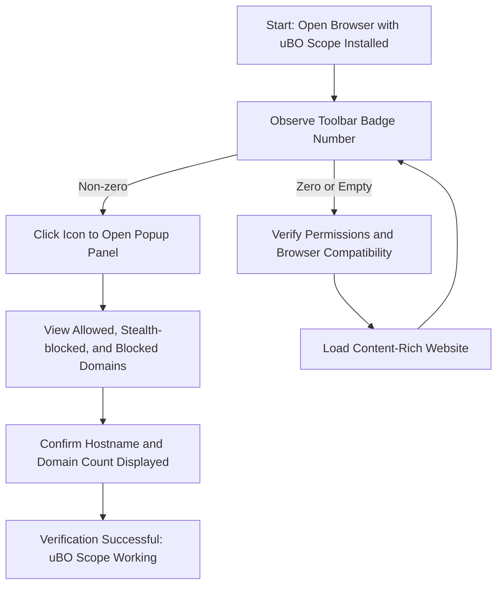

# Verifying Functionality of uBO Scope

Once you've installed uBO Scope, confirming that it works correctly is your next essential step. This guide will walk you through the process of verifying the extension’s operation by checking the toolbar badge, interacting with the popup panel, and understanding the expected output during a simple browsing test.

---

## 1. Initial Verification of Toolbar Badge

The toolbar badge is your first visual indicator that uBO Scope is active and monitoring network activity.

### Steps:

1. **Locate the uBO Scope icon** in your browser’s toolbar.
   - The icon matches the extension’s logo (see installation guides for visuals).
2. **Observe the badge number:**
   - It shows the count of distinct third-party remote servers connected by the active tab.
   - A badge with a number (e.g., “3”) means uBO Scope is detecting and tracking connections.
   - If the badge is empty, it means either no third-party connections were detected yet or tracking hasn't started.

### What to Expect:
- The badge dynamically updates as you navigate through sites.
- A lower badge number indicates fewer distinct remote server connections.

<Note>
The badge count reflects the number of unique third-party domains successfully connected to, not the number of blocked requests.
</Note>

---

## 2. Opening and Using the Popup Panel

The popup panel provides a detailed breakdown of your active tab's network connections, categorized by outcome.

### Steps:

1. **Click the uBO Scope toolbar icon.**
2. The popup window appears showing:
   - The active tab’s hostname and domain in the header.
   - A summary count labeled 'domains connected' representing all distinct connected domains.
   - Three sections listing domains by outcome:
     - **Not blocked (Allowed):** Domains with successful connections.
     - **Stealth-blocked:** Domains where connections were internally redirected or stealthily blocked.
     - **Blocked:** Domains where connections failed due to content blocking or errors.
3. **Review the details:**
   - Each section enumerates domains with counts of requests.
   - Hovering or clicking domain entries is not supported in this version; it serves as a straightforward connection report.

### Expected Panel Output:
- The hostname header displays the URL of the active tab.
- Summary count updates to reflect the number of unique connected third-party domains.
- Domains listed are transliterated for readability (supports internationalized domains).

<Tip>
To refresh the popup data, simply close and reopen the panel on the current active tab after some browsing activity.
</Tip>

---

## 3. Performing a Simple Test Browsing Session

To ensure uBO Scope is functioning properly, conduct a simple test by browsing a common website.

### Test Flow:

1. **Open a new browser tab and navigate to a popular news site or content-rich webpage.**
2. **Wait a few seconds to allow resources and third-party connections to load.**
3. **Observe the uBO Scope badge number increasing, indicating detected connections.**
4. **Open the popup and verify that the domain sections display a list of connected domains split by their outcome categories.**

### Interpreting Results:
- Expect several domains under **Allowed**; typical for CDNs, analytics, or content hosts.
- Stealth-blocked and Blocked domains may be empty or contain entries depending on your content blocker configuration.

<Warning>
If you see no change in the badge or no domains listed, verify that uBO Scope has all necessary permissions and your browser supports the required `webRequest` APIs, as some browsers or versions may limit such access.
</Warning>

---

## 4. Troubleshooting Verification Issues

If verification does not yield expected outcomes, consider these common scenarios:

- **Permission Restrictions:**
  - Confirm that your browser version meets the minimum requirements.
  - Make sure permissions for `webRequest`, `storage`, and `activeTab` are granted to uBO Scope.

- **Popup Shows "NO DATA":**
  - Try switching tabs or reloading the page.
  - Close and reopen the popup.

- **Toolbar Badge Remains Empty:**
  - Browse sites that make third-party resource requests (simple static sites without such connections won't trigger updates).
  - Disable other extensions temporarily that might interfere with webRequest events.

- **Check Browser Support:**
  - uBO Scope requires browsers supporting Manifest v3, especially the `webRequest` API.
  - Verify you are running a supported browser and version (e.g., Chrome 122+, Firefox 128+, Safari 18.5+).

---

## 5. Understanding Success Indicators

You can confidently conclude uBO Scope is working when:

- The toolbar badge shows a non-zero count after loading a page with external resources.
- The popup lists domains categorized as allowed, stealth-blocked, or blocked.
- The displayed hostname matches your current active tab.

This confirms the extension is actively tracking network requests and reflecting them in real time.

---

## 6. Next Steps

After verifying functionality, explore the following to maximize your use of uBO Scope:

- **Understanding the Badge and Popup:** Learn how to interpret different connection outcomes and domain groupings.
- **Core Workflows:** Investigate guides on revealing remote connections for deeper insights.
- **Troubleshooting Common Issues:** If unexpected behavior arises during usage.

Refer to the [First Run and Quick Start](../getting_started/installation_and_setup/first_run_and_quick_start.md) and [Interpreting the Badge and Popup Breakdown](../../guides/core-workflows/interpreting-badge-and-popup.md) pages for detailed walkthroughs.

---

## 7. Additional Resources

- **Official GitHub Repository:** [uBO-Scope GitHub](https://github.com/gorhill/uBO-Scope)
- **Browser Permissions and API Details:** Review the manifest files for permission context.
- **Public Suffix List:** uBO Scope uses this list to correctly normalize domain names.

---

# Visualizing the Verification Workflow

---

# Summary

This page guides users through confirming uBO Scope's core visibility feature, using the toolbar badge and popup panel to view tracked third-party connections live. You learn how to perform a simple browsing test to trigger reporting, interpret outputs, and take corrective action if expected results do not appear.

Clear success criteria and troubleshooting cues empower users to validate that the extension operates accurately within supported browsers.

---