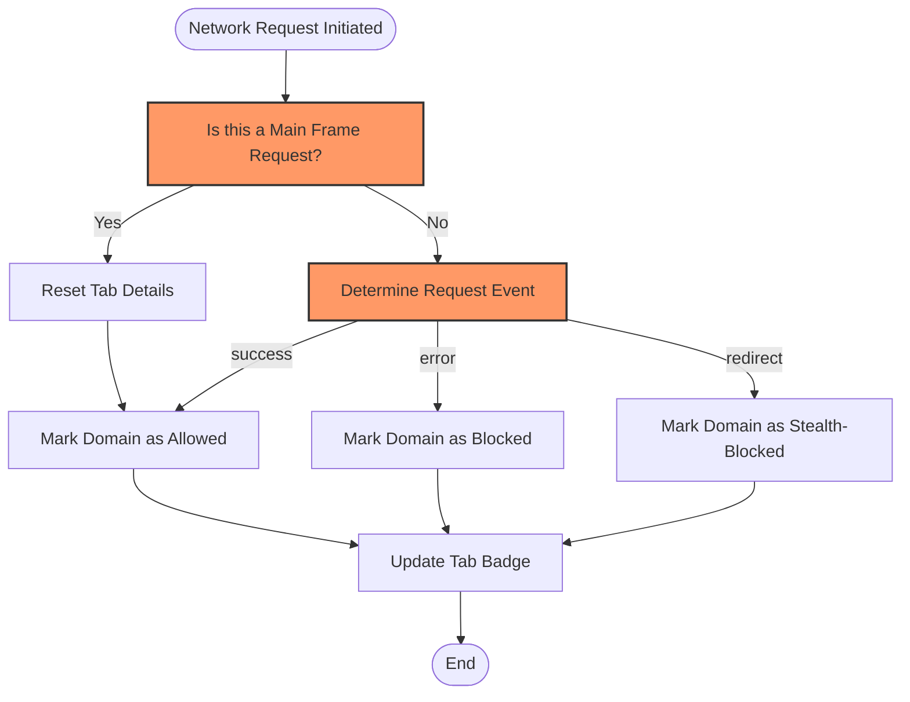

# Interpreting Allowed, Blocked, and Stealth Outcomes

Understanding the meaning behind each network request outcome is critical for using uBO Scope effectively. This guide demystifies how uBO Scope classifies network requests into **allowed**, **blocked**, and **stealth-blocked** categories, helping you assess both your browser’s actual connections and the effectiveness of your content blockers.

---

## 1. Understanding Network Request Outcomes

uBO Scope listens to your browser’s network requests and categorizes each based on what ultimately happened to that connection attempt. These categories reflect whether resources from remote servers were loaded, silently blocked, or potentially modified without direct indication.

### Allowed (Not Blocked)
- **What it means:** The network request successfully reached the remote server and the resource was loaded.
- **Why it matters:** Allowed domains represent the third-party servers your browser actually connected to and fetched content from.
- **How uBO Scope identifies it:** Requests with successful HTTP responses or WebSocket connections reported by the browser's `webRequest.onResponseStarted` event without errors.

### Blocked
- **What it means:** The network request was outright blocked before reaching the remote server.
- **Why it matters:** Blocked domains indicate servers that the content blocker prevented your browser from contacting.
- **How uBO Scope identifies it:** Requests that encountered network errors or cancellations, reported through the `webRequest.onErrorOccurred` event.

### Stealth-Blocked
- **What it means:** These requests appear as redirects or silently modified connections that effectively prevent the intended resource from loading but do so without clear, direct blocking signals.
- **Why it matters:** Stealth blocking is commonly used by advanced content blockers to avoid detection or webpage breakage, making such requests less visible to ordinary network monitors.
- **How uBO Scope identifies it:** Requests caught during redirects that do not finalize with a successful connection, often detected by intercepting `webRequest.onBeforeRedirect` events followed by network failures.

---

## 2. Using This Knowledge to Evaluate Content Blockers

### Why Categorization Matters
The number of connections **not** blocked (allowed) is the true measure of privacy exposure, not simply the number of requests blocked.

- A content blocker that reports more blocked requests but allows connections to many distinct third-party domains might be less effective.
- A lower count of allowed domains usually means fewer third-party servers received your data.

### Examples of Practical Use
- **Assessing privacy exposure:** If the allowed category shows a high count of domains such as tracking or advertising servers, you can infer your blocker is not fully effective.
- **Debugging blocker performance:** Seeing domains in the stealth-blocked section hints at silent block methods or obfuscated connections that might require further scrutiny or updated filters.

---

## 3. Exploring the uBO Scope Popup Interface

The popup UI organizes domains by these outcomes, making it easy to visualize your browsing session:

- **Not Blocked Section:** Lists domains successfully connected with counts of requests.
- **Stealth-Blocked Section:** Identifies domains affected by stealth blocking techniques.
- **Blocked Section:** Displays domains from which connections were prevented.

Each section includes counts that help you judge the extent of exposure to third-party servers.

### Reading the Toolbar Badge
- The badge number represents the **count of distinct third-party domains allowed** to connect, giving a quick privacy summary.
- A higher badge count signals connections made to many third-party servers.

---

## 4. Step-by-Step: Interpreting Outcomes for a Browser Tab

<Steps>
<Step title="Open the uBO Scope popup on the active tab">
Click the uBO Scope toolbar icon to reveal the summary of network request outcomes for the current tab.
</Step>
<Step title="Review the 'Not Blocked' domains">
Focus first on allowed domains to understand which third-party servers successfully served content.
</Step>
<Step title="Check the 'Stealth-Blocked' section">
Look for any stealth-blocked domains indicating possible silent blocking or redirection tactics.
</Step>
<Step title="Examine the 'Blocked' section">
Identify domains your content blockers explicitly prevented connecting.
</Step>
<Step title="Interpret the badge count">
Understand the badge count as the number of unique third-party domains allowed—this is your primary exposure metric.
</Step>
</Steps>

---

## 5. Common Pitfalls and How to Avoid Them

### Mistaking Block Count for Effectiveness
- **Pitfall:** Believing a higher block count means better privacy.
- **Solution:** Focus on the allowed domains count and their identities.

### Ignoring Stealth Blocking
- **Pitfall:** Overlooking stealth-blocked domains because they are less obvious.
- **Solution:** Use this information to investigate unexpected connections or to adjust your filters.

### Not Considering Third-Party Domains Properly
- **Pitfall:** Assuming all allowed domains are safe.
- **Solution:** Review the list critically, especially looking for tracking or ad domains.

---

## 6. Troubleshooting Outcome Interpretation Issues

<AccordionGroup title="Troubleshooting Outcome Interpretation">
<Accordion title="No domains shown in any section">
- Confirm you have granted the extension all necessary permissions, including `webRequest` and `activeTab`.
- Ensure the active tab is fully loaded and making network connections.
- Reload the tab or restart the browser if the issue persists.
</Accordion>
<Accordion title="Mismatch between badge count and popup data">
- The badge count reflects distinct allowed domains, while sections reflect detailed and categorized data.
- Try refreshing the popup by closing and reopening it.
- Check that there are no browser restrictions interfering with extension execution.
</Accordion>
<Accordion title="Unexplained domains in stealth-blocked section">
- This may be caused by legitimate network redirects or obscure blocking techniques.
- Consult filter lists or adjust your blocker settings if you suspect false positives.
</Accordion>
</AccordionGroup>

---

## 7. Best Practices for Using Request Outcomes

- Use the allowed domain count and list to monitor real-world exposure to third-party servers.
- Regularly review stealth-blocked domains to fine-tune your filters.
- Combine uBO Scope insights with your content blocker dashboard to optimize your blocking strategy.
- Avoid trusting only block counts; focus on unique connections.

---

## 8. How It Works: Simplified Flow of Outcome Categorization

This flow reflects how uBO Scope tracks each network request in the background, categorizing it according to the event type reported by the browser.

---

## 9. Additional Resources

- [Analyzing Site Connections & Outcomes Guide](/guides-main/everyday-use-patterns/analyzing-network-connections) — complements this guide by showing hands-on usage of the popup UI.
- [Validating Content Blocker Effectiveness](/guides-main/everyday-use-patterns/validating-content-blockers) — explains how to leverage these outcomes to assess blockers.
- [Investigating Stealth Blocking Behaviors](/guides-main/advanced-techniques/working-with-stealth-blocking) — deep dive on stealth blocking and how to respond.

---

This knowledge empowers you to accurately interpret the network activity observed by uBO Scope and to use it as a powerful diagnostic and privacy tool.

---

You can explore the source code to deepen understanding, related scripts include:
- [`js/background.js`](https://github.com/gorhill/uBO-Scope/blob/main/js/background.js) — core logic for recording outcomes
- [`js/popup.js`](https://github.com/gorhill/uBO-Scope/blob/main/js/popup.js) — rendering categorized outcomes

For more on installation and first steps, see related onboarding and overview pages.