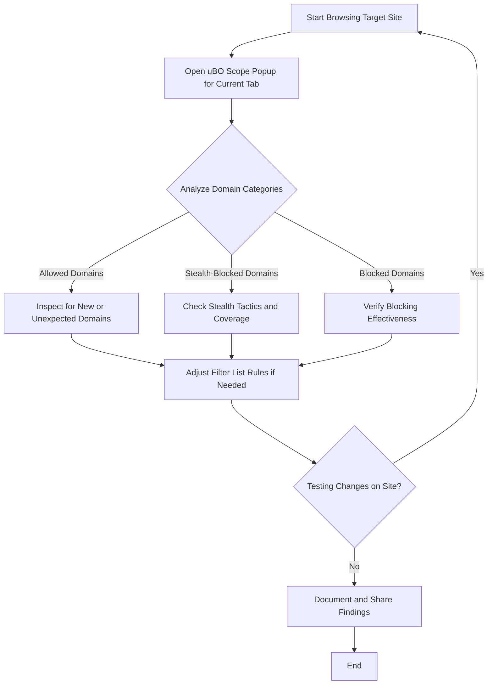

# A Guide for Filter List Maintainers

This guide is designed for filter list maintainers who use **uBO Scope** as a specialized tool to analyze network requests, evaluate tricky and borderline sites, identify stealth tactics employed by content blockers, and understand edge-case behavior critical for maintaining effective filter lists. It also addresses limitations of the tool on low-access or restricted devices and offers best practices to maximize insights from collected data.

---

## 1. Understanding the Role of uBO Scope for Filter List Maintainers

Many filter list authors face the challenge of ensuring their lists effectively block trackers and unwanted connections without breaking legitimate site functionality. uBO Scope provides deeper visibility into the browser's actual remote connections—allowed, stealth-blocked, and blocked—and highlights subtle behaviors not always evident through conventional tools.

Use uBO Scope to:

- Gain actionable insight into third-party connections during real-world browsing.
- Detect stealth-blocked network connections that indicate advanced blocking techniques.
- Evaluate new or tricky sites where blocking effects are ambiguous.
- Investigate edge cases where connection outcomes diverge from expected results.

## 2. Prerequisites

Before diving into analysis with uBO Scope, ensure:

- You have the latest version of uBO Scope installed and configured correctly. Refer to [Prerequisites & Supported Browsers](../getting-started/installation-setup/system-prerequisites) and [Initial Configuration & Permissions](../getting-started/installation-setup/first-run-config).
- Your browser supports the `webRequest` API fully (Chrome 122+, Firefox 128+, Safari 18.5+).
- You understand core terminology such as allowed, blocked, and stealth-blocked outcomes (see [Key Concepts & Terminology](../overview/architecture-concepts/core-concepts-terminology)).

## 3. Workflow: Evaluating Tricky and Edge-Case Sites

### Step 1: Initiate Real-World Browsing

Start by browsing the website under investigation in a normal user session with your current filter list enabled.

### Step 2: Open uBO Scope Popup for Active Tab

- Click the uBO Scope icon in your browser’s toolbar.
- Observe the displayed domain lists categorized into **Allowed**, **Stealth-Blocked**, and **Blocked**.

### Step 3: Analyze Domain Categories

- **Allowed Domains**: Third-party servers your browser connected to successfully.
- **Stealth-Blocked Domains**: Connections your content blocker stopped silently without disrupting page behavior.
- **Blocked Domains**: Explicitly blocked connections that failed.

Pay special attention to the **stealth-blocked** category—it often reveals nuanced blocking not counted in typical block metrics.

### Step 4: Identify Anomalies and Patterns

- Compare connection outcomes with expected behavior based on filter list rules.
- Detect unexpected allowed connections that might represent emergent trackers or missed rules.
- Note stealth-blocked domains to understand advanced blocking methods in play.

### Step 5: Evaluate Domain Count and Distribution

- Use the badge count as an initial indicator of third-party connection exposure.
- Examine detailed domain counts in the popup to differentiate between legitimate CDN usage and tracking.

### Step 6: Document Findings for Filter List Updates

- Log domains that should be further investigated or added to block lists.
- Flag stealth-blocked or allowed domains that may require test cases or filter rule improvements.

## 4. Special Tips for Handling Stealth Tactics

Content blockers increasingly utilize stealth tactics to block connections in ways that are difficult for webpages and other extensions to detect. uBO Scope reveals these stealth-blocked domains so you can:

- Confirm if stealth-blocking aligns with your list's goals.
- Detect false negatives where stealth blocking is not effective.
- Differentiate between stealth tactics and regular blocking to calibrate filter rules correctly.

## 5. Understanding Limitations on Low-Access Devices

Devices with limited developer tools or browser debugging capability pose challenges:

- uBO Scope relies on browser `webRequest` APIs. If the browser environment restricts access, data may be incomplete.
- Some network requests or connections might be made outside the scope of the `webRequest` (e.g., private APIs, native apps embedded in the browser), thus not visible.
- Badge counts or popup data might be delayed or inaccurate in constrained environments.

**Best Practice:** Always cross-validate suspicious findings with additional tools or manual testing on more permissive devices.

## 6. Making Sense of Edge-Case Results

Certain sites or content blockers cause unusual connection profiles, such as:

- Sites utilizing multiple CDNs and third-party services with shifting domains.
- Network requests redirected through anonymizing proxies or obfuscations.
- Connections that intermittently appear as stealth-blocked or allowed depending on timing and page behavior.

### How to Handle Such Cases:

- Reproduce conditions multiple times to detect patterns or intermittent stealth blocking.
- Use the domain counts alongside the exact domain names in the popup to identify recurring problematic domains.
- Consider test browsing with and without specific filter lists or rules to isolate impacts.

## 7. Practical Example

Suppose you discover a domain listed under stealth-blocked that you were not aware of. Use this workflow:

- Record the domain and its usage context.
- Review your filter list rules for coverage of that domain or related domains.
- Test whether adding explicit blocking rules changes the connection category or breaks site functionality.
- Share findings with the filter list community if the domain represents a tracker or unwanted connection.

## 8. Troubleshooting Common Issues

<AccordionGroup title="Troubleshooting uBO Scope for Filter List Maintainers">
<Accordion title="Domain Lists Not Updating in Popup">
- Ensure the active browser tab is correctly loaded and network activity has occurred.
- Confirm uBO Scope has the necessary permissions and the extension badge shows a non-zero count.
- Reload the page and reopen the popup to refresh data.
</Accordion>
<Accordion title="Unexpectedly Low or High Domain Counts">
- Verify if stealth-blocked domains are heavily impacting totals.
- Remember the badge counts distinct domains; if sites use many varying subdomains, this inflates counts.
- Cross-check with network logs or developer tools if available.
</Accordion>
<Accordion title="Inconsistent Stealth-Blocked vs Blocked Domains">
- Confirm your content blocker settings and other installed extensions for interference.
- Recognize that stealth blocking may vary based on timing or extension logic.
- Consider disabling other blockers to isolate effects.
</Accordion>
</AccordionGroup>

## 9. Best Practices and Tips

- Use uBO Scope alongside your usual filter list development tools for a comprehensive picture.
- Regularly monitor stealth-blocked domains, as they reveal innovative blocking techniques.
- Avoid relying solely on block counts—focus on distinct third-party domain connections for privacy evaluation.
- Test filter list changes on real-world sites using uBO Scope to finalize rule efficacy.

## 10. Next Steps & Further Resources

- Review [Understanding the Popup Interface](../guides/getting-started-essentials/understanding-the-popup-interface) to leverage domain categorizations effectively.
- Explore [Advanced Analysis Patterns](../guides/advanced-analysis-patterns/) for deeper use cases.
- Consult the official [uBO Scope GitHub repository](https://github.com/gorhill/uBO-Scope) for source code and updates.
- Understand the underlying [Key Concepts & Terminology](../overview/architecture-concepts/core-concepts-terminology) critical to interpreting results.

---

## Appendix: Overview of the uBO Scope Domain Categories

| Category        | Description                                                     | Use Case for Filter Maintainers                                 |
|-----------------|-----------------------------------------------------------------|----------------------------------------------------------------|
| Allowed         | Domains that the browser connected to successfully.             | Identify domains that are possibly missed by filters.          |
| Stealth-Blocked | Domains silently blocked by stealth tactics without page errors.| Detect advanced blocking; tune stealth filtering rules.         |
| Blocked         | Domains explicitly blocked by content blockers.                  | Confirm intended blocks; troubleshoot false positives/negatives.|

---

## Diagram: Typical Filter List Maintainer Workflow Using uBO Scope

---

For more comprehensive onboarding, pair this guide with [Installing and Setting Up uBO Scope](../guides/getting-started-essentials/installing-and-setup) and [Debunking Block Count Myths](../guides/advanced-analysis-patterns/debunking-block-count-myths).

---

<Tip>
Filter list maintainers: Consistently depend on domain distinctions rather than raw counts for accurate privacy assessments. uBO Scope empowers you to see beyond simple block metrics into how connections truly behave at the network layer.
</Tip>