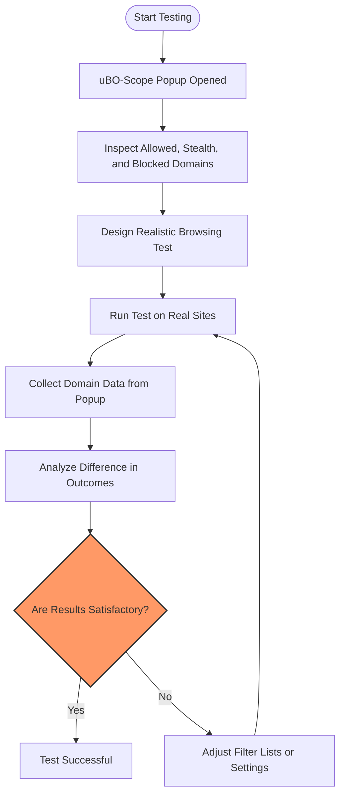

# Testing Content Blockers: Real-World Techniques

## Introduction
This guide provides a practical workflow for testing content blockers or filter lists using uBO-Scope with real-world techniques. It helps you understand how to interpret the outcomes — especially `stealth-blocked` and `blocked` connections — and what is realistically detectable through browser APIs. You will learn how to design sound tests that reflect actual browsing conditions, avoiding misleading scenarios common in artificial ad blocker tests.

### Why Use uBO-Scope for Testing Content Blockers?
uBO-Scope exposes all attempted and successful connections to remote servers, categorized clearly by their outcome:
- **Allowed:** Connections not blocked by your content blocker.
- **Blocked:** Connections actively blocked and resulting in network errors.
- **Stealth-blocked:** Connections redirected or handled stealthily by the content blocker, invisible to typical blocker detection.

This fine-grained insight lets you evaluate blockers based on actual network behavior rather than just raw counts or synthetic test assumptions.

---

## Prerequisites
- Install uBO-Scope on a supported browser: Chrome 122+, Firefox 128+, or Safari 18.5+.
- Ensure necessary permissions are granted, especially access to `webRequest` API.
- Have a content blocker or filter list enabled (e.g., uBlock Origin) for comparison.
- Familiarity with opening and interpreting uBO-Scope's popup interface ([Guide to the Popup Interface](https://github.com/gorhill/uBO-Scope/blob/main/docs/guides/getting-started-essentials/understanding-the-popup-interface.md)).

---

## Expected Outcome
By following this guide, you will be able to:
- Accurately interpret legitimate block and stealth-block signals from your content blocker.
- Recognize the limitations of browser APIs in detecting certain block types.
- Build confidence in your test methodology by focusing on realistic, representative network behaviors.
- Debunk common myths stemming from artificial test pages.

---

## Step-by-Step Testing Workflow

### 1. Open uBO-Scope Popup to Inspect Active Tab Connections
- Click the uBO-Scope icon in your browser toolbar.
- The popup displays data for the current tab, including the hostname and a summary count of connected domains.
- Domains are grouped under:
  - *not blocked* (allowed)
  - *stealth-blocked*
  - *blocked*

---

### 2. Understand What Each Outcome Represents
- **Allowed:** These are domains from which resources have been successfully fetched. A higher count indicates more third-party exposure.
- **Blocked:** These connections were actively prevented, usually resulting in errors. Domains here reflect what the filter list explicitly stops.
- **Stealth-blocked:** These represent redirections or other techniques your content blocker uses to silently block requests without raising errors or alerts.

> <Tip>
> Remember, `stealth-blocked` domains are invisible to ordinary page scripts, which is why synthetic ‘ad blocker tests’ may fail to detect them.
> </Tip>

---

### 3. Design Tests That Reflect Real-World Browsing
- Use websites you regularly visit or known popular sites for your test.
- Avoid artificial test pages that make uncommon or fabricated network requests.
- Look for natural traffic patterns—CDNs, advertising providers, analytics servers.

> <Warning>
> Artificial test pages can exaggerate block counts or miss stealth-block outcomes as they use unrealistic domains and requests.
> </Warning>

---

### 4. Analyze uBO-Scope's Domain Lists
- Review the domains listed under each section. For example:
  ```
  Stealth-blocked domains might include trackers your filter list redirects.
  Blocked domains correspond to hard blocks resulting in failed requests.
  Allowed domains usually show essential or permitted third-party services.
  ```
- Use the domain counts shown to gauge the volume and diversity of third-party connections.

---

### 5. Verify Your Filter List Behavior
- Apply different filter lists or content blockers and compare the domain counts.
- Lower allowed domain counts usually indicate stronger privacy protection.
- Stealth-blocked may vary significantly by blocking strategy.

> <Check>
> The badge on the toolbar icon represents the number of distinct allowed third-party domains. Use this as a quick privacy exposure indicator.
> </Check>

---

### 6. Refresh and Repeat Under Different Conditions
- Refresh the page to see updated connection data.
- Test with disabled/enabled content blockers.
- Compare results across browsers to identify discrepancies related to API support.

---

## Interpretation Best Practices

- Focus on **unique** third-party domains contacted, not just raw blocking counts.
- Recognize stealth blocking as a legitimate blocking mode invisible in common network logs.
- Understand browser API limitations: some requests may not appear if not exposed to `webRequest` API.
- Combine popup insights with the toolbar badge for a holistic view.

> <Info>
> For more about interpreting the popup data, see the guide: [Understanding the Popup Interface](https://github.com/gorhill/uBO-Scope/blob/main/docs/guides/getting-started-essentials/understanding-the-popup-interface.md).
> </Info>

---

## Common Pitfalls & Troubleshooting

<AccordionGroup title="Common Questions & Issues">
<Accordion title="Why do some blocked requests not show up?">
Blocked requests may not show if the browser does not report them via the `webRequest` API or if the blocker silently redirects the request (stealth blocking).
</Accordion>

<Accordion title="What does stealth blocking actually mean?">
Stealth blocking occurs when a content blocker intercepts requests and prevents them without network errors or visible failures, often by redirecting or substituting requests to hide blocking from detection.
</Accordion>

<Accordion title="Why does the badge count differ from blocked counts?">
The badge shows distinct allowed third-party domains contacted, which directly relates to privacy exposure. Block counts only measure how many requests were stopped and can be misleading.
</Accordion>

<Accordion title="How to confirm uBO-Scope is tracking correctly?">
Use the Quick Validation Checklist and inspect network connections via the popup interface, ensuring domain groups populate as you navigate pages.
</Accordion>
</AccordionGroup>

<Tip>
Test under realistic browsing conditions and with multiple pages; this reveals authentic blocking patterns that artificial tests cannot replicate.
</Tip>

---

## Practical Example Scenario

Imagine you want to evaluate if a new filter list is effectively blocking trackers on a popular news website:

1. Open the website with uBO-Scope enabled and your current filter.
2. Open the uBO-Scope popup and record the number of allowed, stealth, and blocked domains.
3. Switch to the new filter list, reload the page.
4. Compare the popup results:
   - Has the number of allowed domains decreased?
   - Are new domains appearing under stealth or blocked?
5. Use this data to decide if the new list better protects privacy while not excessively blocking essential content.

This real-world testing avoids misleading conclusions that come from relying only on block counts or synthetic test sites.

---

## Next Steps & Related Documentation

- Explore the [Understanding the Popup Interface](https://github.com/gorhill/uBO-Scope/blob/main/docs/guides/getting-started-essentials/understanding-the-popup-interface.md) to deepen your insight into connection data.
- Review [Debunking Block Count Myths](https://github.com/gorhill/uBO-Scope/blob/main/docs/guides/advanced-analysis-patterns/debunking-block-count-myths.md) for further clarity on interpreting results.
- See [How uBO Scope Integrates with Your Browser](https://github.com/gorhill/uBO-Scope/blob/main/docs/overview/feature-overview-integration/integration-browser-systems.md) for background on API limitations.
- For filter list maintainers, check out the [Filter List Maintainers Guide](https://github.com/gorhill/uBO-Scope/blob/main/docs/guides/advanced-analysis-patterns/filter-list-maintainers-guide.md).

---

## Additional Resources
- Official GitHub repository: [https://github.com/gorhill/uBO-Scope](https://github.com/gorhill/uBO-Scope)
- Public Suffix List (used for domain parsing): [https://publicsuffix.org/](https://publicsuffix.org/)

---

## Summary Diagram of Content Blocker Test Workflow



This workflow ensures that your testing is grounded in genuine browsing conditions, yielding reliable insights.
