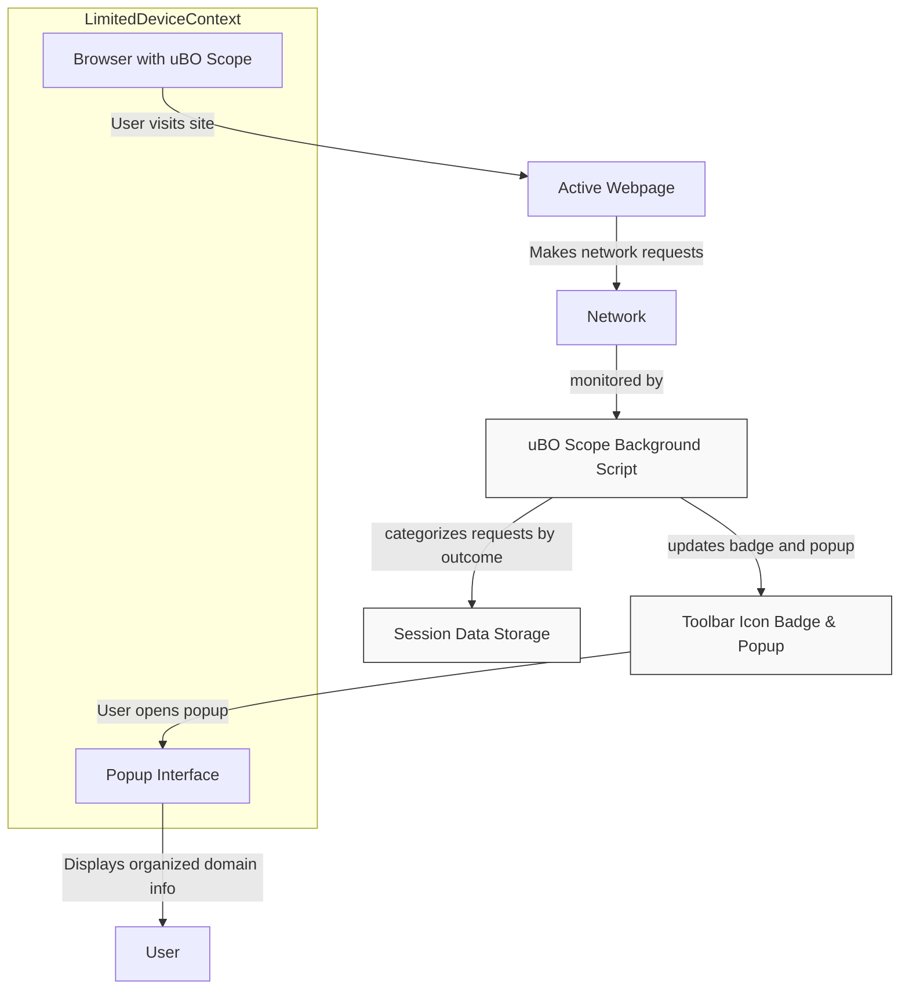

# Using uBO Scope on Devices With Limited Tools

## Overview

This guide empowers users to effectively utilize uBO Scope’s popup interface to analyze network connections on devices where full browser developer tools are not accessible. This includes mobile platforms, managed enterprise systems, or restricted environments where conventional inspection and debugging tools are limited or unavailable.

uBO Scope’s lightweight design makes it an ideal solution for privacy researchers, filter list maintainers, and power users aiming to audit or monitor remote connections without relying on complex tooling.

---

## 1. Understanding the Context

- **Why Limited Tools?** Many devices, especially mobile or managed corporate systems, restrict access to developer consoles or advanced network inspection tools.
- **What uBO Scope Provides?** It delivers clear, distilled information on outgoing network requests directly through a simple popup panel and toolbar badge.
- **Core Value:** Enables auditing and analysis of third-party connections and blocking outcomes in a portable, easy-to-use interface.

### Expected Outcome

By the end of this guide, you will confidently interpret uBO Scope’s popup data on restricted devices, troubleshoot common limitations, and leverage key insights for privacy or filtering enhancements.

---

## 2. Preparing to Use uBO Scope on Limited Devices

### Prerequisites

1. Installation of uBO Scope in a supported browser on your device (Chrome 122+, Firefox 128+, Safari 18.5+).
2. Basic familiarity with how to open the browser extension popup (e.g., clicking/tapping the toolbar icon).
3. Access to websites where you want to monitor outbound connections.

<Tip>
If you have not yet installed uBO Scope, please refer to the [Install and Configure uBO Scope](https://documentation-url/guides/getting-started-workflows/install-configure-extension) guide first.
</Tip>

### Key Limitation Awareness

- On some mobile browsers, extension capabilities and permissions may be partially restricted. uBO Scope relies on the browser's `webRequest` API, and without it, data accuracy and completeness can be compromised.
- The popup interface shows data for the active tab only and relies on the browser reporting network requests in real-time.

---

## 3. Accessing and Navigating uBO Scope's Popup Interface

### Step 1: Open the Popup Panel

- Tap or click the uBO Scope icon in your browser's toolbar.
- The popup panel will load, showing information about the active tab’s network activity.

### Step 2: Interpreting the Popup Panel Sections

The popup consists of several key components that summarize network connections:

- **Hostname Header:** Displays the current webpage’s hostname and domain.
- **Domains Connected Summary:** Shows the total number of distinct third-party domains allowed.
- **Outcome Sections:**
   - **Not Blocked:** Domains where connections have succeeded.
   - **Stealth-Blocked:** Domains where requests were redirected stealthily by content blockers.
   - **Blocked:** Domains where connection attempts were explicitly blocked.

Each domain is listed with a count reflecting how many requests were made.

### Step 3: Sorting and Reviewing Domains

- Domains in each section are displayed alphabetically with their respective counts.
- Use this to spot surprising third parties or unexpected connections on the current page.

---

## 4. Practical Usage Scenarios on Limited Devices

### Scenario 1: Privacy Audit on Mobile Browser

1. Navigate to a website you want to audit.
2. Open the uBO Scope popup.
3. Review domains under **Not Blocked** to identify all third-party servers actually contacted.
4. Check **Stealth-Blocked** and **Blocked** domains to understand what your content blocker or DNS filtering is affecting.
5. Use this information to decide if additional blocking rules or list modifications are necessary.

### Scenario 2: Filter List Maintenance Without Developer Tools

1. On a managed device, visit pages affected by filter updates.
2. Use the popup to enumerate connected domains.
3. Identify domains that are unexpectedly allowed or stealth-blocked.
4. Export or note suspicious domains for further batch processing or rule development on a full development environment.

<Tip>
While the popup does not support direct export, manually noting domains or screenshots can serve as lightweight data collection methods.
</Tip>

---

## 5. Troubleshooting Common Limitations

| Issue | Cause | Solution |
| --- | --- | --- |
| No data or popup remains empty | Browser lacks `webRequest` support on device or limited permissions | Verify browser extension permissions. On some mobile browsers, full network event reporting isn’t feasible. Consider desktop environment for detailed monitoring. |
| Badge count is zero despite active browsing | Network requests filtered outside browser scope or caching suppresses events | Reload the page to regenerate network requests. Disable other conflicting extensions. |
| Incomplete or inconsistent domain counts | Stealth blocking or redirects may obscure exact counts | Understand stealth-blocked domains as indirect blocks; compare with other tools where possible. |

<Tip>
Periodic browser and extension updates ensure access to the latest API capabilities, improving uBO Scope accuracy.
</Tip>

---

## 6. Best Practices for Using uBO Scope on Limited Tools

- **Use alongside minimal configuration:** Avoid complex filter rules on limited devices that may mask network activity.
- **Interpret with context:** Remember that a low badge count means fewer connections, which often implies better privacy.
- **Combine with occasional desktop checks:** When possible, supplement mobile or managed device audits with desktop sessions having full developer tools.

---

## 7. Next Steps & Additional Resources

- Explore [Reveal and Review Remote Connections](https://documentation-url/guides/getting-started-workflows/reveal-remote-connections) for detailed popup interpretation workflows.
- Read [Interpreting the Badge Count and Results](https://documentation-url/guides/getting-started-workflows/interpreting-badge-count) to deepen understanding of the toolbar badge’s meaning.
- Consult [Troubleshooting Common Installation Issues](https://documentation-url/getting-started/getting-first-results/troubleshooting-common-issues) if data capture seems faulty.

---

## 8. Summary Diagram of Data Flow on Limited Tools

This diagram illustrates how uBO Scope captures and presents network data even on constrained devices where extension APIs may be limited.

---

## Callouts

<Info>
Using uBO Scope on devices with limited tools maximizes visibility into third-party connections without complex setup.
</Info>

<Warning>
Data completeness depends heavily on browser support and permissions; full desktop environments remain the most reliable for thorough network analysis.
</Warning>

<Tip>
Regularly update your browser and extension to mitigate API limitations and improve data fidelity.
</Tip>

---

For any issues or feature requests related to limited device use, consider engaging with the community via the official GitHub repository at [https://github.com/gorhill/uBO-Scope](https://github.com/gorhill/uBO-Scope).