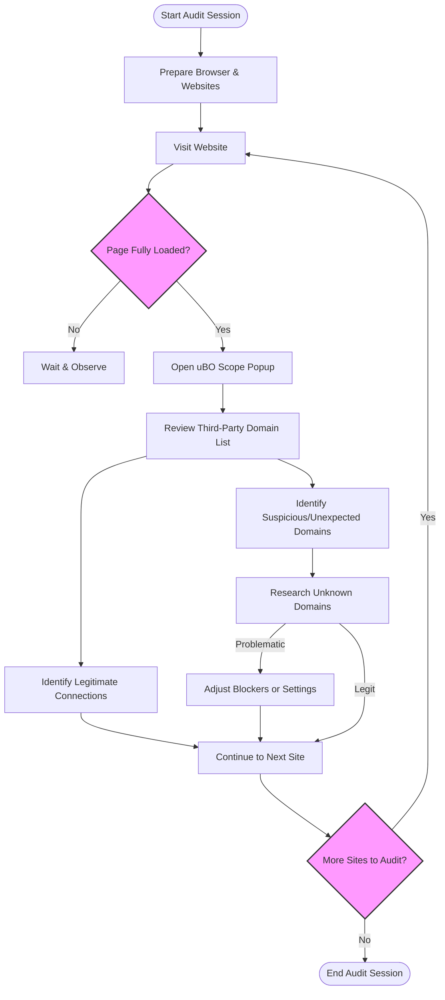

# Using uBO Scope for Personal Privacy Audits

## Overview
This guide helps you harness uBO Scope to conduct regular personal audits of your browsing activity, revealing how many and which third-party servers your visited websites connect to. By understanding the difference between legitimate connections and unexpected or suspicious third parties, you will sharpen your privacy awareness and control online exposure.

Auditing your browsing this way empowers you to identify patterns, detect surprises, and make informed decisions about content blockers or browsing habits to reduce privacy risks.

---

## Prerequisites
- **uBO Scope installed and active** in your supported browser (Chromium, Firefox, or Safari).
- Familiarity with the **popup UI** of uBO Scope, including basic interpretation of allowed, blocked, and stealth-blocked domains.
- Active internet connection to visit websites for audit.

## Expected Outcome
- You will be able to identify third-party servers contacted during typical browsing sessions.
- You will distinguish between expected, legitimate third parties (like CDNs or trusted services) and suspicious or excessive connections.
- Equipped with actionable insights, you will enhance your privacy by adjusting browsing behavior or blocker settings.

## Time Estimate
About 15-30 minutes per audit session, depending on how many websites you visit and analyze.

## Difficulty Level
Beginner to Intermediate — requires no technical skills but benefits from steady pattern recognition and thoughtful analysis.

---

## Step-by-Step Privacy Audit with uBO Scope

### Step 1: Prepare for Your Audit Session
- Open your browser with uBO Scope installed.
- Optionally clear browsing data for a clean slate (or use a private window).
- Choose a set of typical websites you want to audit, such as your regular news sources, favorite shopping sites, or social platforms.

### Step 2: Visit Each Website with uBO Scope Active
- Load the first website.
- Wait for the page to fully render to allow all network requests to complete.

### Step 3: Open the uBO Scope Popup Interface
- Click the uBO Scope toolbar icon.
- Review the **domain connection summary** displayed at the top, indicating the count of distinct third-party domains contacted.
- Scroll through the listed domains in the "not blocked", "stealth-blocked", and "blocked" sections.

### Step 4: Analyze the Domain List
- Identify well-known legitimate providers (e.g., well-known CDNs like `cloudflare.net` or analytics platforms you trust).
- Look for unexpected or unfamiliar domains that could behave as trackers or unwanted data recipients.
- Note the number of allowed domains as it reflects your true exposure.

### Step 5: Repeat for Other Sites
- Close the current tab or open a fresh tab and repeat Steps 2-4 for other audit sites.
- Observe trends: Are some domains common across your visited sites? Are there anomalies?

### Step 6: Document and Act on Findings
- Keep notes of suspicious domains that appear frequently but serve no recognized purpose.
- Consider enhancing your content blocker filters or browsing practices to limit exposure.
- Revisit this audit regularly to track changes over time or after adjusting settings.

---

## Example Scenarios

### Scenario 1: Auditing a News Website
- Visit a major news media website.
- In the uBO Scope popup, you see 12 distinct domains connected.
- Majority are known CDNs and advertisement servers.
- Detect 2 domains that look suspicious or unrelated.
- Research these domains online and, if deemed tracking or unnecessary, add them to your blocker list.

### Scenario 2: Checking an Online Shopping Site
- Visit a favorite e-commerce site.
- uBO Scope reports 8 connected third-party domains.
- Several relate to payment gateways or shipping services — legitimate for your shopping.
- A few relate to ad trackers or analytics not desired.
- Adjust your blocker or privacy settings accordingly.

---

## Tips & Best Practices

- **Regular audits** help catch new or changing third-party connections.
- Use uBO Scope alongside your content blocker to see what slips through or is stealthily blocked.
- Understand that not all third parties are bad; some (CDNs, payment processing) are necessary.
- Keep an eye on the "stealth-blocked" list as they represent requests blocked silently without raising page errors.
- Avoid relying on block count badges alone; focus on the count of allowed domains to measure true exposure.

---

## Troubleshooting Common Audit Issues

<AccordionGroup title="Troubleshooting Privacy Audits">  
  <Accordion title="No Data Displayed in Popup">
    <ul>
      <li>Verify that uBO Scope is enabled and permissions are granted.</li>
      <li>Refresh the page and wait until fully loaded.</li>
      <li>Restart your browser if issue persists.</li>
      <li>Check for conflicts with other extensions that might interfere with webRequest APIs.</li>
    </ul>
  </Accordion>  
  <Accordion title="Unexpectedly High Number of Domains">
    <ul>
      <li>Consider the website’s actual complexity (some sites load many resources).</li>
      <li>Confirm uBO Scope is correctly installed and updated.</li>
      <li>Review if some background tabs or extensions are generating additional network calls.</li>
      <li>Use private browsing mode to reduce cookie/session influence.</li>
    </ul>
  </Accordion>  
  <Accordion title="Domain Names are Punycode or Hard to Read">
    <ul>
      <li>uBO Scope uses Unicode conversion to display internationalized domains.</li>
      <li>If names still look odd, visit known punycode-to-Unicode converters online to better recognize them.</li>
      <li>Be cautious with unusual international domains as some trackers use special TLDs.</li>
    </ul>
  </Accordion>  
</AccordionGroup>

---

## Next Steps & Related Content

- For foundational understanding, review [Understanding the Popup UI](/guides/getting-started-essentials/interpreting-popup-ui).
- Improve efficiency with [Power Tips for Filter List Maintainers](/guides/advanced-analysis-usecases/filter-maintainer-tips) to better leverage blocking techniques.
- Use [Mythbusting Guidelines](/guides/advanced-analysis-usecases/mythbusting-guidelines) to avoid common misconceptions about blocker performance.
- Revisit installation and first use setup via [Setting Up and Installing uBO Scope](/guides/getting-started-essentials/first-use-setup).

---

## Additional Resources

- Official uBO Scope repository and source code: [GitHub](https://github.com/gorhill/uBO-Scope)
- Public Suffix List details used to determine effective domains: [publicsuffix.org](https://publicsuffix.org/)

---

## Summary
Conducting personal privacy audits with uBO Scope allows you to uncover your true network exposure to third parties across your daily browsing. By visiting your routine websites and analyzing the popup’s domain connection lists, you gain clarity on which connections are legitimate and which may compromise your privacy. Regular reviews and informed response empower stronger browsing privacy.

---

