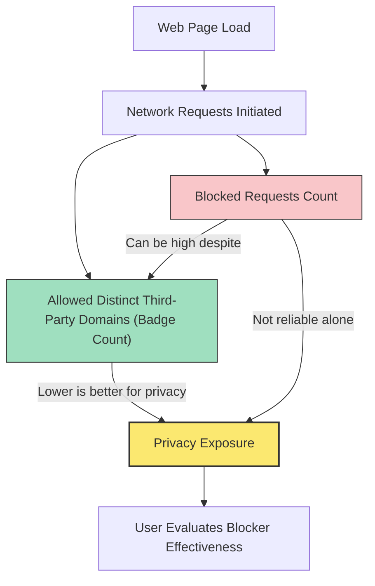

# Interpreting Results and Debunking Blocker Myths

Unlock the full value of uBO Scope by understanding how to interpret its results accurately and avoid common misconceptions surrounding content blocking effectiveness. This guide walks you through practical case studies highlighting why higher block counts do not necessarily translate to better protection, clarifies the meaning behind the extension's badge counts, and explains the nuances of third-party server tracking.

---

## 1. Understanding What uBO Scope Shows

uBO Scope exposes all attempted and successful network connections made by web pages to third-party remote servers. It reports three categories of connection outcomes:

- **Allowed**: Connections that succeeded and were not blocked.
- **Blocked**: Connections that were prevented by content blockers or network errors.
- **Stealth-Blocked**: Connections that were redirected, often silently, to evade detection by web pages.

### What the Toolbar Badge Represents

The toolbar badge displays the **count of distinct third-party domains that successfully loaded resources** for the active browser tab. This number reflects the true exposure footprint of the page — a **lower number indicates fewer third-party connections and typically better privacy**.

<Tip>
Understanding that the badge count reports allowed distinct third-party domains is critical: a higher badge count means more connections, which is generally less desirable from a privacy perspective.
</Tip>

## 2. Common Misinterpretations and Why They Occur

### Myth: Higher Block Counts Mean Better Protection

Many users assume that content blockers showing a higher number of blocked requests are superior. However, uBO Scope reveals the opposite can be true:

- A higher block count often accompanies a **higher number of allowed third-party servers**, increasing the privacy risk.
- This happens because some blockers allow more connections before blocking others, inflating the block count without reducing the distinct allowed domains.

### Case Study

Imagine two blockers:

| Content Blocker | Block Count | Allowed Distinct Domains (Badge Count) |
|-----------------|-------------|----------------------------------------|
| Blocker A       | 150         | 30                                     |
| Blocker B       | 200         | 45                                     |

While Blocker B blocks more requests overall, it allows connections from **more distinct third-party servers**, implying greater exposure. In this example, **Blocker A offers stronger privacy despite fewer blocked requests**.

### Myth: Ad Blocker Test Websites Accurately Rank Content Blockers

These test sites typically craft artificial network requests that do not resemble real-world page activity. Because many content blockers function stealthily, avoiding detection, these tests often yield misleading or invalid results.

<Warning>
Do not rely on "ad blocker test" webpages to assess the effectiveness of your content blocker. uBO Scope provides a more realistic, transparent view of actual third-party connection activity.
</Warning>

## 3. How to Read the Popup Interface Critically

When you open the uBO Scope popup, you see a structured breakdown of connections per active tab:

- **Not Blocked**: Genuine allowed connections that loaded resources successfully.
- **Stealth-Blocked**: Redirected connections that were intercepted silently.
- **Blocked**: Explicitly blocked connections.

Together, these allow you to analyze the balance between what is allowed and what is blocked.

<Steps>
<Step title="Open uBO Scope Popup">
Click the extension's toolbar icon to display the popup with connection details.
</Step>
<Step title="Review the Badge Count">
Look at the badge count to see the total number of distinct third-party domains allowed on this page.
</Step>
<Step title="Analyze the Allowed Section">
Examine the domains listed here as these represent active connections.
</Step>
<Step title="Consider Stealth and Blocked Sections">
Understanding stealth-blocked versus blocked helps recognize subtle ways requests may fail or be redirected.
</Step>
</Steps>

## 4. Practical Tips for Accurate Interpretation

- **Focus on allowed distinct domains**, not just block counts, for privacy impact.
- **Use uBO Scope alongside your blocker** to verify actual network behavior.
- **Remember SSL-protected requests or browser-invisible requests may not be logged.**
- **Regularly check the popup after visiting different sites** to observe changes in third-party connection behavior.

## 5. Real-World Scenarios

### Scenario 1: Evaluating a New Content Blocker

Before switching, install uBO Scope and browse a few sites. Note the badge counts and compare allowed domains with your current blocker.

- If the new blocker shows higher block counts but also higher allowed domains, reconsider switching.
- Review the popup data to see which third-party domains remain allowed.

### Scenario 2: Privacy-Conscious Browsing

Keep uBO Scope active during your typical browsing sessions.

- Use the badge to understand which pages connect to many third parties.
- Investigate unexpected domains in the popup and adjust your blocker settings accordingly.

## 6. Troubleshooting & Common Pain Points

<AccordionGroup title="Troubleshooting uBO Scope Interpretation">
<Accordion title="Why does the block count sometimes seem inconsistent?">
Block count varies because some allowed requests may be redirected stealthily or handled by DNS filters outside the extension’s scope. uBO Scope focuses on the meaningful third-party distinct domains count, which is a better privacy indicator.
</Accordion>
<Accordion title="I see third-party domains in allowed section but my blocker shows high blocking—is this a conflict?">
uBO Scope reports actual network requests visible to the browser. Other blockers may block later or differently. Compare overall allowed domain counts to evaluate actual exposure.
</Accordion>
<Accordion title="Can uBO Scope detect all blocked requests?">
Requests filtered at the DNS level or by proxies invisible to the browser's webRequest API will not be reported here.
</Accordion>
</AccordionGroup>

## 7. Next Steps & Further Reading

After mastering result interpretation and debunking myths with this guide, expand your expertise by exploring:

- [Getting Started: Monitoring Connections](/guides/core-workflows/getting-started-monitoring) to learn live usage.
- [Understanding Connection and Domain Counts](/guides/core-workflows/understanding-domain-counts) for deeper insight into how counts reflect privacy.
- [Using uBO Scope for Filter List Maintenance](/guides/advanced-guides/using-for-filter-maintenance) to optimize content blocker filters.

Visit the [official GitHub repository](https://github.com/gorhill/uBO-Scope) for source insights and community discussions.

---

## Summary Diagram: How Block Counts vs. Allowed Domains Impact Privacy

---

<Info>
This guide focuses exclusively on interpreting the results shown by the uBO Scope extension. For installation, setup, and detailed core concepts, please consult the corresponding documentation pages in the Getting Started and Overview sections.
</Info>
