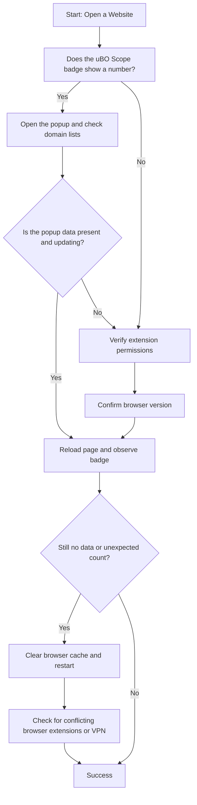

# Troubleshooting: Missing Connections or Unexpected Results

## Overview

This guide helps you diagnose and resolve common problems that may cause uBO Scope to show missing request data, inaccurate badge counts, or unexpected results in the popup interface. By following these practical steps, you will ensure uBO Scope is correctly reporting your browser’s network connections and understand the inherent limitations of browser APIs.

## Prerequisites

- Have uBO Scope installed and configured according to the [Installing uBO Scope](https://github.com/gorhill/uBO-Scope) guide.
- Confirm that you have granted all necessary permissions (e.g., `activeTab`, `webRequest`) requested during installation.
- Use a supported browser version (e.g., Chrome 122+, Firefox 128+, Safari 18.5+).
- Familiarity with interpreting the toolbar badge and popup interface (see [Understanding and Interpreting the Badge Count](../using-ubo-scope/interpreting-badge) and [Analyzing Remote Connections on Active Tabs](../using-ubo-scope/analyzing-tab-activity)).

## Symptoms You May Encounter

- Toolbar badge count does not update or shows zero despite visiting sites.
- Popup interface shows 'NO DATA' or empty domain lists.
- Domain counts seem too low or inconsistent with expected connections.
- Connections appear missing or blocked domains are not displayed.

## Step-by-Step Troubleshooting

### 1. Verify Extension Permissions

Ensure uBO Scope has the required permissions enabled:

- **Check browser permissions:** Go to your browser’s extensions or add-ons page.
- Verify uBO Scope has access to the current tab (`activeTab`) and is allowed to monitor network requests (`webRequest`, host permissions for `http://*/*` and `https://*/*`).

<Tip>
Permissions are vital. Without them, uBO Scope cannot observe network events, leading to empty or stale data.
</Tip>

### 2. Confirm Browser Compatibility

uBO Scope requires browser versions that fully support the `webRequest` API for capturing network activity.

- Use Chrome 122+, Firefox 128+, or Safari 18.5+.
- Older versions might limit visibility of certain network requests.

### 3. Refresh & Revisit Pages

Network data is captured per active tab session.

- Reload the webpage or open a new tab to trigger fresh network activity.
- After reloading, click the uBO Scope toolbar icon to open the popup and check that domain counts update.

### 4. Understand Browser & API Limitations

Some connections are made outside the reach of `webRequest` API and will not be reported. This is an inherent limitation:

- Requests initiated by browser components (not by web pages) are invisible.
- Some browser APIs or features (e.g., HTTP/3, service workers) may obscure or bypass reporting.
- WebSocket connections may be partially visible depending on browser support.

<Note>
Missing connections do not indicate a fault in uBO Scope but reflect limits imposed by browser APIs.
</Note>

### 5. Inspect Popup Interface for Data Updates

- Open the popup interface and observe domain sections:
  - **Not blocked:** Domains that successfully connected.
  - **Stealth-blocked:** Domains detected as redirected or intercepted stealthily.
  - **Blocked:** Domains where network requests have resulted in errors or blocking.

If these sections remain empty or do not update, it may indicate network data is not recorded for the current tab.

### 6. Clear Session Data and Restart

uBO Scope stores request data per browsing session. If old or corrupted data persists:

- Clear browser cache and restart the browser.
- Optionally, uninstall and reinstall uBO Scope to reset permissions and data.

### 7. Check for Conflicting Extensions or Privacy Settings

- Other extensions may interfere with `webRequest` API or modify network requests, influencing uBO Scope's data.
- Strict privacy modes or VPNs can block or modify requests, impacting what uBO Scope observes.

### 8. Review Logs and Debug Information (Advanced)

If comfortable with developer tools:

- Monitor console logs for errors related to uBO Scope.
- Validate that messages are successfully passed between background scripts and popup.

## Common Pitfalls

- Expecting uBO Scope to capture *all* network traffic including non-HTTP(S) protocols.
- Misinterpreting low badge counts as failures; a lower number reflects fewer distinct third-party connections, often better for privacy.
- Using synthetic or test websites that generate unrealistic network requests which may confuse extension results.

## Best Practices for Accurate Reporting

- Always test on real-world websites rather than test pages designed for block counting.
- Confirm uBO Scope icon shows a badge for the active tab before checking details.
- Keep your browser and the extension up to date to benefit from latest API enhancements.

## Troubleshooting Flowchart

## Additional Tips

- If you encounter persistent issues, consult the [Quick Validation & Troubleshooting](../../getting-started/first-run-experience/quick-validation-and-troubleshooting) guide for more rapid checks.
- Remember uBO Scope relies on the browser `webRequest` API; any browser changes affecting it may impact uBO Scope's data.

## When to Seek Further Help

- If after following these steps the toolbar badge is still not updating or consistently missing requests.
- Unexpected or incorrect domain classifications persist despite real network activity.
- Suspected bugs or browser incompatibility issues.

In such cases, consider opening an issue on the [uBO Scope GitHub repository issues page](https://github.com/gorhill/uBO-Scope/issues) with detailed information about your environment and symptoms.

---

## Summary

This guide equips you to troubleshoot and resolve common problems with missing or inaccurate network connection data in uBO Scope. Through stepwise verification of permissions, browser support, data refresh cycles, and awareness of inherent API limitations, you can restore reliable observation and understand the scope’s behavior.

---

## References

- [Understanding and Interpreting the Badge Count](../using-ubo-scope/interpreting-badge)
- [Analyzing Remote Connections on Active Tabs](../using-ubo-scope/analyzing-tab-activity)
- [Quick Validation & Troubleshooting](../../getting-started/first-run-experience/quick-validation-and-troubleshooting)
- [Installing uBO Scope](../../guides/getting-started/installing-extension)
- [GitHub Repository](https://github.com/gorhill/uBO-Scope)

---

## Appendix: How uBO Scope Detects Connections

For users interested in how uBO Scope processes data internally:

- The extension listens to browser `webRequest` API events for outgoing network requests.
- Requests are categorized as **allowed**, **stealth-blocked** (redirected or intercepted without full blocking), or **blocked** (requests that ended with errors).
- The toolbar badge shows a live count of distinct third-party domains from which connections were allowed.
- Network data is stored per tab session and displayed in the popup UI.

These mechanisms rely heavily on browser support and correct permissions, central to accurate measurements.

<Tip>
Recognition of these mechanics helps set realistic expectations regarding observed data completeness.
</Tip>
