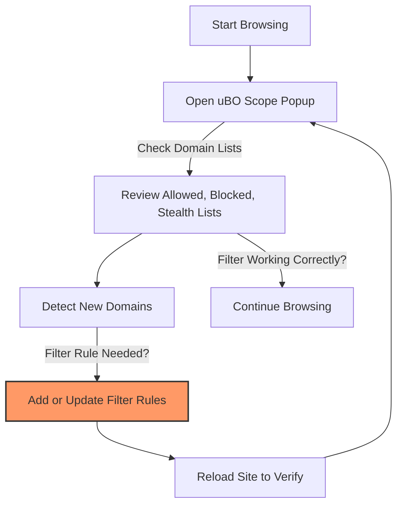

# Using uBO Scope for Filter List Maintenance

uBO Scope is not only a tool for general privacy-conscious users but also a powerful ally for filter list maintainers—especially when typical browser developer tools are limited or unavailable. This guide shows you how to leverage uBO Scope as a verification and optimization tool to maintain high-quality filter lists.

---

## 1. Purpose and Workflow Overview

### What This Guide Helps You Accomplish
This guide walks filter list maintainers through practical techniques to use uBO Scope effectively for verifying filter performance in real-world conditions, tracking emergence of new domains, and optimizing filter lists for privacy and efficiency.

### Prerequisites
- uBO Scope must be installed and functioning in your browser (see [Installing uBO Scope](/getting-started/installation-and-setup/installing-ubo-scope)).
- Basic familiarity with filter lists and their role in content blocking.
- Access to the uBO Scope popup interface to view domain interaction data.

### Expected Outcomes
By following this guide, you will be able to:
- Identify which third-party domains are allowed, stealth-blocked, or blocked by your list.
- Detect new domains making network requests that may require inclusion or adjustment in your filter list.
- Analyze domain connection patterns to optimize your filters for better privacy and reduced server contacts.

### Difficulty Level
Intermediate — assumes general experience with content blockers and maintaining filter lists.

---

## 2. Step-by-Step Guide to Using uBO Scope for Filter List Maintenance

### Step 1: Open uBO Scope's Popup to Monitor Network Requests
- Visit the webpage under scrutiny in your supported browser.
- Click the uBO Scope toolbar icon to open the popup UI.
- Observe the summary of domains third parties connected with, categorized as 'not blocked', 'stealth-blocked', and 'blocked'.

#### What to Look For:
- **Allowed domains**: These are connections your current filters permit. Scrutinize for domains that might warrant blocking.
- **Blocked domains**: Confirm these are domains your filter list correctly prevents from connecting.
- **Stealth-blocked domains**: These usually indicate redirects or indirect attempts not fully blocked by standard detection — pay close attention here for edge cases.

### Step 2: Track New and Emerging Domains
- During regular browsing or testing sessions, use uBO Scope to check domain connections.
- Log or note any unfamiliar domains appearing frequently in the allowed or stealth-blocked lists.
- Compare these with your current filter list to identify gaps or missed rules.

#### Tip:
Maintain a separate list or spreadsheet where you record these new domains, their frequency, and behavior (allowed, blocked, stealth-blocked) to prioritize filtering decisions.

### Step 3: Verify Effectiveness of Your Filters
- Use uBO Scope’s real-time domain list to validate that your filter list blocks intended domains and permits necessary domains without false positives.
- Reload webpages and observe the badge count updating to reflect the number of distinct third-party domains connected.
- Use this feedback loop to fine-tune individual filter rules.

### Step 4: Optimize for Privacy and Minimal Server Contact
- Aim for a **low badge count** indicating fewer distinct third-party connections.
- Identify domains that frequently appear as allowed but pose privacy risks or are unnecessary.
- Modify your filter list to block or stealth-block these domains and verify changes immediately using uBO Scope.

#### Best Practice:
Regularly review the stealth-blocked category, as it can indicate suboptimal filtering where redirects evade full blocking.

### Step 5: Work Around Platform Limitations
- On devices or browsers with limited or no developer tools (e.g., some mobile browsers, Safari), uBO Scope acts as your primary verification instrument.
- Use it as a standalone network connection monitor to identify unseen third-party requests.

---

## 3. Practical Examples for Filter List Maintainers

### Example: Identifying a New Third-Party Domain
Suppose while testing a social media webpage, you notice `track.examplecdn.com` in the Allowed list on uBO Scope but this domain is absent from your filter list.

**Action:** Add a blocking rule for `||examplecdn.com^` to your filter list.

**Verification:** Reload the page, open uBO Scope popup, and confirm `examplecdn.com` has moved to Blocked or Stealth-Blocked.

### Example: Optimizing Filters by Removing False Positives
If your filter list blocks a necessary CDN domain causing page breakage, you may see it show under Blocked in uBO Scope but the page fails to load assets.

**Action:** Whitelist or adjust filters for that domain.

**Verification:** Reload and confirm the domain moves to Allowed, with expected page behavior restored.

---

## 4. Tips, Best Practices, and Troubleshooting

### Tips and Best Practices
- **Use the badge count as a privacy metric:** A lower number signifies fewer data leaks and better privacy.
- **Regularly review stealth-blocked domains:** These are often overlooked connections that can bypass or undermine filters.
- **Combine uBO Scope insights with manual testing:** Ensure your filter list does not impair essential functionality.
- **Leverage uBO Scope on restricted platforms:** On iOS or Safari, where developer tools are sparse, rely on uBO Scope to surface hidden network activity.

### Common Issues and How to Solve Them
- **No data shown in popup:** Refresh the page and re-open the popup. Ensure uBO Scope is enabled and has necessary permissions.
- **Badge does not update:** Confirm the extension is pinned or active on the toolbar. Restart the browser if needed.
- **Unexpected domains not listed:** Check if the browser and uBO Scope support WebRequest API fully on your platform.

---

## 5. Next Steps & Additional Resources
- Review [Getting Started: Monitoring Connections](/guides/core-workflows/getting-started-monitoring) for foundational usage.
- Explore [Understanding Connection and Domain Counts](/guides/core-workflows/understanding-domain-counts) to deepen your interpretation skills.
- Consult [Interpreting Results and Debunking Blocker Myths](/guides/advanced-guides/debunking-blocker-myths) to reinforce filter validation.
- Visit the [GitHub repository](https://github.com/gorhill/uBO-Scope) for source access and community support.

---

## Appendix: How uBO Scope Categorizes Domains

| Category       | Meaning                                                                                      |
|----------------|----------------------------------------------------------------------------------------------|
| **Allowed**    | Connections to third-party domains permitted by current filters and blocker settings.        |
| **Blocked**    | Connections actively blocked by your filter list or content blocker.                         |
| **Stealth-Blocked** | Redirected or blocked connections at the network level, often bypassing usual filters; useful for spotting evasions. |

---

## Visual Workflow

---

This guide offers a practical approach for filter list maintainers to harness uBO Scope’s reporting and bolster their rule sets with timely, accurate insights.

<Check>
Always ensure your uBO Scope extension is updated and you understand your browser’s support for the webRequest API for the most reliable monitoring results.
</Check>

<Info>
Use the categorized domain information actively in an iterative refinement loop to strengthen privacy protection and reduce unnecessary network exposure.
</Info>
