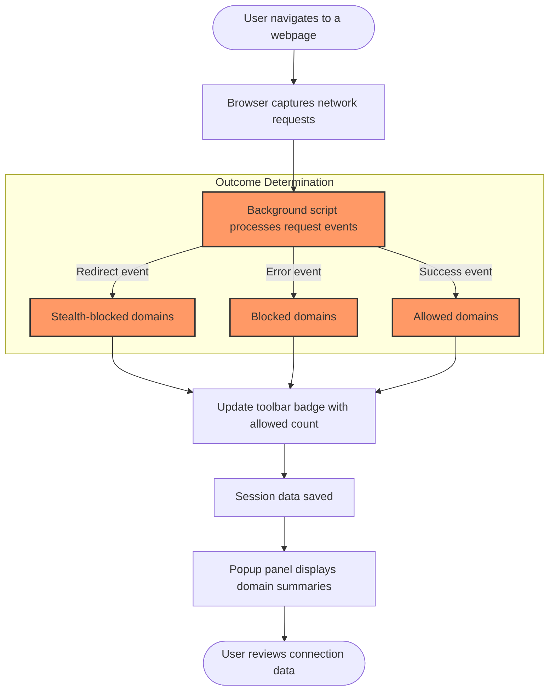

# Detecting Stealth and Blocked Connections: Deep Dive

## Overview

This guide empowers you to explore advanced scenarios where browser extensions or DNS-level blocking cause network requests to become stealth-blocked or outright blocked. Using uBO Scope's detailed connection outcomes, you'll learn how to analyze these nuanced cases, understand their causes, and apply insights to refine your privacy setup.

This documentation targets privacy enthusiasts, technical users, and filter list maintainers who want to trace stealthy network connections and blocked requests beyond surface-level counts.

---

## 1. Understanding Stealth and Blocked Connections

### What Are Stealth Connections?

Stealth connections are network requests that do not complete normally yet do not explicitly show as blocked errors. These often occur when user agents, extensions, or DNS-level tools silently disrupt requests, resulting in connections that are redirected or inhibited without a visible error.

### What Are Blocked Connections?

Blocked connections are those which fail with an observable error event, typically caused by content blockers, extension rules, or security policies. uBO Scope captures these errors precisely as network errors in its reporting.

### Why This Matters

Identifying stealth vs. blocked connections reveals if a content blocker or DNS-based filter is silently interfering or explicitly blocking requests. This level of insight helps:

- Understand true privacy exposure
- Debug broken site resources
- Optimize filter lists and blocking strategies

Refer to the [Key Concepts and Terminology](/overview/architecture-and-concepts/core-terminology) page for definitions and mappings.

---

## 2. Prerequisites

Before diving in, ensure you have the following:

- **uBO Scope installed and enabled** in your supported browser (Chromium 122+, Firefox 128+, Safari 18.5+).
- Basic familiarity with the uBO Scope popup panel and toolbar badge.
- Access to websites where you want to analyze request blocking behavior.
- Optional: Content blocking extensions or DNS-based filters active to observe stealth/blocked request effects.

For installation or setup help, see:

- [Install uBO Scope](/getting-started/installation-basics/extension-installation)
- [Launching uBO Scope Popup](/getting-started/first-run-and-configuration/starting-extension)

---

## 3. Workflow: Analyzing Stealth and Blocked Requests

Follow these steps to investigate stealth and blocked connection scenarios:

<Steps>
  <Step title="Open uBO Scope Popup Panel">
    Click the uBO Scope toolbar icon to open the popup panel showing connection summaries for the active browser tab.
  </Step>

  <Step title="Understand Outcome Sections">
    Examine the three key sections in the popup panel:
    
    - **Not Blocked:** Domains requested that completed successfully.
    - **Stealth-Blocked:** Domains with redirects or subtle blocking/interference.
    - **Blocked:** Domains with explicit error failures.
    
    The counts next to each domain indicate the number of requests.
  </Step>

  <Step title="Test with Real Webpages">
    Browse to websites where you have known blocking (e.g., with content blockers enabled or DNS filters active).
    Observe how the connection domains populate each section.
  </Step>

  <Step title="Trace Stealth Connections">
    If domains appear under the stealth-blocked section: 
    
    - Recognize these as connections possibly subjected to silent redirects or interruptions.
    - Use this insight to infer possible DNS-blocking or extension stealth techniques.
  </Step>

  <Step title="Correlate Blocked Domains">
    For domains listed under blocked:
    
    - Confirm these requests failed with errors.
    - Deduce that the blocking is explicit, likely from client-side extensions or stricter DNS policies.
  </Step>

  <Step title="Leverage Badge Count Insights">
    Observe the badge count on the toolbar icon, representing the number of unique allowed third-party domains.
    
    - Lower counts indicate fewer successful connections.
    - Splashy changes in badge count after enabling filters can suggest effectiveness of blocking.
  </Step>

  <Step title="Refine Analysis with Filter Lists">
    Use results to adjust content blockers or DNS filters based on which domains appear stealth or blocked.
    
    - Validate changes via subsequent browsing.
    - Repeat the cycle to optimize privacy effectively.
  </Step>
</Steps>

---

## 4. Real-World Scenario Examples

### Scenario 1: DNS-Level Blocking

You use a DNS filter to block certain trackers. In uBO Scope:

- The blocked section may remain empty because the network API sees redirection or failing connections without explicit errors.
- The stealth-blocked section will list the affected domains.

This signals a silent DNS-based intervention.

### Scenario 2: Extension-Based Content Blocking

With extensions like uBlock Origin enabled:

- Blocked section displays domains explicitly blocked with network error events.
- Stealth-blocked might include cases where requests are redirected rather than fully blocked.

This distinction clarifies how precisely your blocking tools operate.

### Scenario 3: Combination of Blockers

A mix of DNS and extension filters can cause domains to appear in both stealth and blocked categories, showing a layered blocking approach.

Use this understanding to fine-tune your setups.

---

## 5. Practical Tips & Best Practices

- Regularly monitor the popup panel during browsing sessions to catch stealth blocking that might otherwise go unnoticed.
- Use uBO Scope in conjunction with your content blocker to assess true third-party connection exposure.
- Don’t rely on only block counts from content blockers; trust uBO Scope’s domain-based insights.
- Test on various sites to recognize patterns common to stealth-blocking domains and blocked domains.
- If frequently seeing stealth blocking on a domain critical to a site's functionality, consider whitelist exceptions.

---

## 6. Troubleshooting Common Issues

### No Data in Popup Panel

- Ensure uBO Scope is granted necessary permissions (`webRequest`, `activeTab`, and storage).
- Confirm browsing activity is generating network requests.
- Reload the tab or browser.
- Consult [Troubleshooting Setup Issues](/getting-started/setup-support/troubleshooting-setup).

### Unexpected Absence of Stealth or Blocked Domains

- Some browsers or setups may not report network errors or redirects via `webRequest` API—limit of browser capabilities.
- DNS filters that operate below the browser layer may sometimes not reflect errors visibly.

### Badge Count Not Updating

- Check the active tab for network activity.
- Reload extension or browser if necessary.
- See [Badge Counts: What They Mean and Why They Matter](/guides/getting-started-essentials/understanding-badge-logic).

---

## 7. Next Steps & Related Content

- Dive deeper on interpreting the popup panel with [Interpreting the Popup Panel: Connection Summaries](/guides/getting-started-essentials/core-workflow-interpreting-popup).
- Understand how badge counts reflect true privacy status in [Badge Counts Explained](/guides/getting-started-essentials/understanding-badge-logic).
- Further explore blocking myths in [Mythbusting: Block Counts vs. Real Protection](/guides/advanced-insight-analysis/mythbusting-block-counts).
- Use uBO Scope for filter list validation with [Validating Filter Lists](/guides/advanced-insight-analysis/filter-list-validation).
- Review architecture and core terms for full context:
  - [System Architecture Overview](/overview/architecture-and-concepts/system-architecture)
  - [Core Terminology](/overview/architecture-and-concepts/core-terminology)

---

## 8. Diagram: Network Request Outcomes Flow in uBO Scope

---

## 9. Additional Resources

- GitHub Repository: [https://github.com/gorhill/uBO-Scope](https://github.com/gorhill/uBO-Scope)
- Supported Browsers & Compatibility: [/overview/feature-overview-usage/supported-browsers]
- Installation Workflows: [/guides/getting-started-essentials/installation-workflow]

---

<Tip>
Use uBO Scope's stealth-blocked section to detect blocking behaviors that other tools might hide. It provides a unique window into silent interference, helping you maintain a tighter grip on your browsing privacy.
</Tip>

<Note>
Stealth blocking often results from DNS filtering or networking layer interference which extensions alone cannot reveal. Combine network-based blockers and uBO Scope for comprehensive insight.
</Note>

<Warning>
If you observe consistent stealth blocking on critical domains, it may cause site breakage or degraded experience. Consider selectively allowing such domains depending on your privacy needs.
</Warning>
