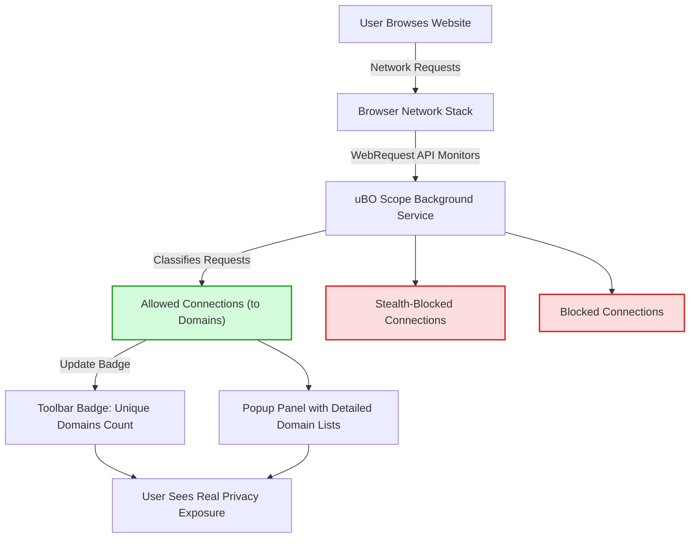

# Mythbusting: Block Counts vs. Real Protection

A guide to using uBO Scope to dispel common misconceptions about ad blockers and online privacy measurement. This page helps you leverage uBO Scope effectively by understanding why relying on block counts is misleading and how to assess real privacy protection by analyzing which remote servers actually received your browser’s requests.

---

## 1. Understanding the Misconception: Block Counts

### What Users Expect vs. Reality
Many users assume that a higher number of blocked connections means better privacy protection. It feels intuitive that blocking *more* network requests equates to more effective content blocking. This guide challenges that assumption by focusing on what uBO Scope reveals:

- The **badge count** on uBO Scope’s toolbar icon reports the number of unique third-party remote servers that *were contacted* — that is, connections that succeeded or were at least attempted.
- A **higher block count** from a content blocker can sometimes misrepresent protection quality if it leads to more distinct third-party servers actually being contacted.

### Why Block Counts Are Misleading
- Block counts measure how many requests were blocked, not how many third-party servers your browser contacted.
- Some blockers with high block counts may still allow connections to a larger number of distinct remote servers, increasing actual privacy exposure.
- "Ad blocker test" sites often make unrealistic network requests that don't reflect real-world browsing, giving a false sense of reliability.

<Tip>
Block counts are a quantity of blocked *attempts*, not a measure of *privacy impact*. uBO Scope helps shift your focus to real connections made, which are what truly matter.
</Tip>

---

## 2. How uBO Scope Reflects Real Privacy Exposure

uBO Scope tracks **all remote server connections** from your browser via the `webRequest` API, including:

- **Allowed connections**: Third-party servers that received requests.
- **Blocked connections**: Requests that were blocked by content blockers.
- **Stealth-blocked connections**: Requests hidden or silently blocked to avoid detection.

This division helps you see the *actual* exposure instead of just raw block counts.

---

## 3. Using uBO Scope to Debunk Misconceptions

### Step-by-Step User Flow

<Steps>
<Step title="Install and Launch uBO Scope">
Follow the installation guides for your browser (Chrome, Firefox, Safari) and launch the extension to see the toolbar icon and popup panel.
</Step>
<Step title="Browse Normally">
Visit websites as you normally would. uBO Scope listens to all outgoing network connections.
</Step>
<Step title="Open the Popup Panel">
Click the uBO Scope icon. The popup panel shows a summary of distinct third-party domains contacted by the active tab.
</Step>
<Step title="Interpret Connections vs. Block Counts">
Observe the count of domains contacted (badge number) vs. blocked connection lists in the popup to get the true picture of privacy exposure.
</Step>
</Steps>

### Practical Scenario
If you use an ad blocker that shows 500 block counts but uBO Scope indicates 40 distinct third-party domains contacted, your privacy exposure relates to those 40 domains — not the 500 blocks — because those are the servers actually reached.

---

## 4. Best Practices for Privacy Assessment

- **Focus on the uBO Scope badge count:** A lower badge number means fewer distinct third-party servers contacted, hence stronger privacy.
- **Use the popup panel details:** Review the allowed, stealth-blocked, and blocked sections to understand what is really happening.
- **Beware of misleading metrics:** Don’t trust web-based ad blocker tests; rely on real network connection monitoring.
- **Compare block counts sensibly:** Two blockers reporting different block counts may not reflect the actual difference in privacy protection.

<Tip>
Consistently check uBO Scope during your browsing sessions to track the domains your browser connects to and fine-tune your content blocker rules accordingly.
</Tip>

---

## 5. Troubleshooting Common Confusions

<AccordionGroup title="Common Questions and Issues">
<Accordion title="Why does uBO Scope show domains even when my blocker reports high blocks?">
Some blockers may block many requests from fewer domains but allow connections to additional domains stealthily, increasing actual privacy exposure despite high block counts.
</Accordion>
<Accordion title="What does stealth-blocked mean?">
Stealth-blocked requests are those silently blocked or redirected in a way to avoid webpage breakage or detection. These do not reach the server but are hidden by the content blocker.
</Accordion>
<Accordion title="Could uBO Scope miss some network requests?">
uBO Scope relies on the browser's webRequest API, which covers nearly all ordinary web requests except those made outside it, such as by some low-level browser components or external processes.
</Accordion>
<Accordion title="Why should I avoid 'ad blocker test' webpages?">
These pages simulate unrealistic network requests for benchmark testing that do not represent real browsing behavior, often misleading users about the effectiveness of their blockers.
</Accordion>
</AccordionGroup>

---

## 6. Visualizing the Concept

This diagram illustrates how uBO Scope tracks all network requests, classifies outcomes, and presents actual exposure to the user.

---

## 7. Next Steps

- Visit the [Popup Panel and Badge Explained](/overview/feature-overview-usage/popover-and-badge) page to deepen your understanding of interface elements.
- Learn about the [Key Concepts and Terminology](/overview/architecture-and-concepts/core-terminology) to grasp allowed, blocked, and stealth connection outcomes.
- Explore [Validating Filter Lists with uBO Scope](/guides/advanced-insight-analysis/filter-list-validation) for advanced usage.
- Continue with [Detecting Stealth and Blocked Connections: Deep Dive](/guides/advanced-insight-analysis/identifying-stealth-requests) for expert-level insights.

---

## Additional Resources

- Official source code and updates are available at the [uBO Scope GitHub repository](https://github.com/gorhill/uBO-Scope).
- Browser-specific installation guides are provided in [Installing and Enabling uBO Scope](/guides/getting-started-essentials/installation-workflow).

---

## Summary
This guide empowers users to correctly assess the effectiveness of content blockers using uBO Scope, focusing on real connections instead of misleading block counts. By shifting the lens to actual third-party domains contacted, privacy-conscious users gain accurate insight into genuine network exposure.

---

<Check>
Remember: The goal is a lower toolbar badge count indicating fewer unique third-party connections — the true measure of privacy online.
</Check>
