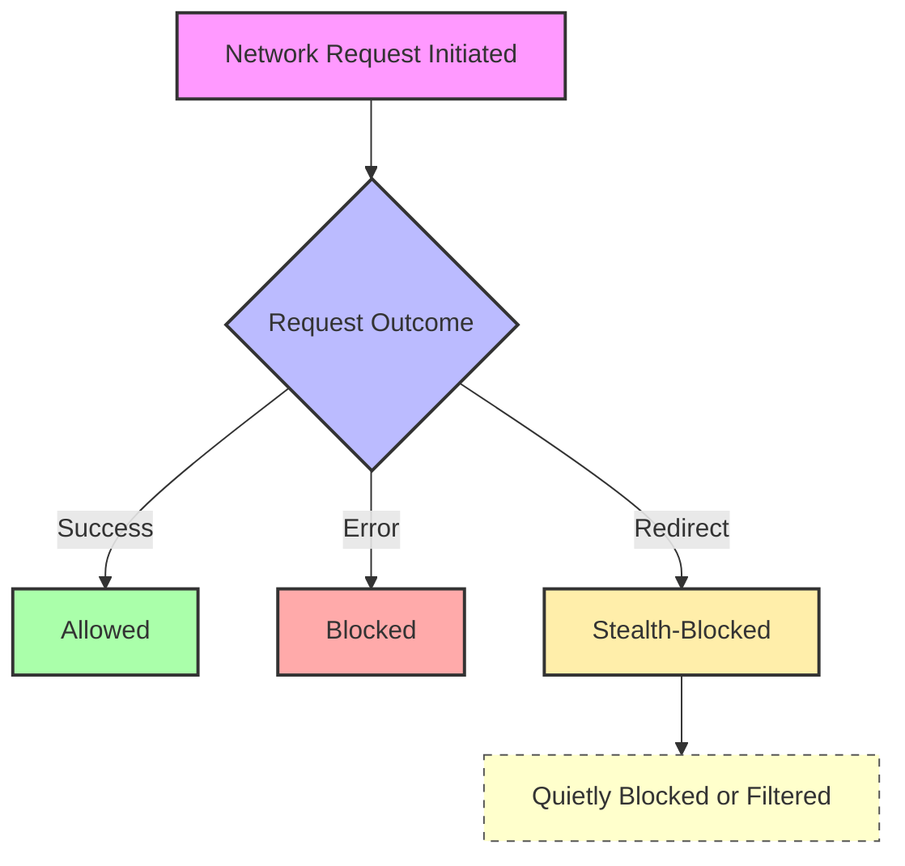

# Understanding Stealth Blocking and Tricky Network Requests

## Overview
This guide dives deep into the notions of overt and stealth blocking as surfaced by **uBO Scope**. Users will learn how the extension reveals network requests that typical content blockers may let slip unnoticed, why this visibility matters, and how to interpret cases of network activity that seem tricky or ambiguous. Empower your browsing privacy by harnessing these insights for better protection and troubleshooting.

---

## What Is Stealth Blocking?

Stealth blocking is a sophisticated filtering technique where a content blocker prevents network requests without leaving obvious traces in usual browser APIs or metrics. Unlike overt blocking—where requests are explicitly denied and visible through error events—stealth blocking quietly intercepts connections, often presenting them as successful or redirect events at the browser level.

### Why Stealth Blocking Matters

Many modern content blockers use stealth blocking to:

- Avoid detection by webpages that try to identify blockers.
- Minimize webpage breakage by not triggering outright errors.
- Evade simplistic metrics like block counts that inaccurately assess blocking effectiveness.

**uBO Scope** exposes stealth blocking by categorizing connection outcomes distinctly so you see the true count of remote servers contacted or blocked.

---

## How uBO Scope Categorizes Network Requests

uBO Scope divides network request outcomes into three main categories, which are vital to grasp:

| Category       | Description                                                                                   | Outcome in uBO Scope Popup               |
|----------------|-----------------------------------------------------------------------------------------------|-----------------------------------------|
| **Allowed**    | Requests that completed successfully, with no blocking applied.                               | Listed under "not blocked"              |
| **Blocked**    | Requests explicitly blocked by the browser or content blocker, yielding error events.         | Listed under "blocked"                  |
| **Stealth-Blocked** | Requests that were blocked quietly, often signaled by redirects or hidden filters without an error. | Listed under "stealth-blocked"          |

This nuanced categorization reveals the true blocking landscape, beyond what typical icon badges or block counts show.

---

## Typical User Flow: Interpreting Stealth Blocking

<Steps>
<Step title="Open uBO Scope Popup on an Active Tab">
Click the uBO Scope toolbar icon to open the popup showing the current tab’s connection summary.
</Step>
<Step title="Examine the Domain Lists">
Review the lists of domains under "not blocked," "stealth-blocked," and "blocked."

- Domains in "stealth-blocked" are those where connections were quietly intercepted.
- "Not blocked" indicates permitted network connections.
- "Blocked" shows explicit denials.
</Step>
<Step title="Interpret Counts and Domains">
Notice the count of domains next to each network category. High stealth-blocked domain counts mean many connections are blocked without apparent errors.

This helps identify content blocker stealth effectiveness or gaps.
</Step>
<Step title="Use Information for Troubleshooting or Filter List Evaluation">
If you observe unexpected stealth-blocked domains, consider:
- Checking your filter lists or blocker settings.
- Identifying websites that try to bypass overt blocking.
</Step>
</Steps>

---

## Real-World Scenarios Highlighting Stealth Blocking

### Scenario 1: A Privacy-Conscious User's Discovery

Emma visits a news site. The badge count shows 12 distinct domains contacted, but the popup reveals 5 stealth-blocked domains. This means her content blocker is quietly blocking some third-party trackers which never show errors but would have gone unnoticed otherwise. Emma uses this insight to confirm effective privacy protection.

### Scenario 2: Filter List Maintainer Validation

Raj is updating a filter list. Using uBO Scope, he observes stealth-blocked domains on test pages. This reveals hidden network requests that standard logs missed, allowing Raj to improve coverage without impacting site functionality.

### Scenario 3: Unexpected Website Behavior Investigation

Alex notices a website is partially broken. uBO Scope shows multiple stealth-blocked third parties that the site depends on for features. Alex disables stealth blocking filters selectively to restore functionality, then reports findings.

---

## Best Practices for Working with Stealth Blocking Data

- Always compare stealth-blocked domains with your list of trusted third parties.
- Use stealth blocking insights to verify if your content blocker avoids detection methods.
- Do not rely solely on toolbar badge counts; consult the popup for full transparency.
- Combine uBO Scope observations with filter list documentation for in-depth analysis.

---

## Troubleshooting Common Issues Related to Stealth Blocking

### 1. No Stealth-Blocked Domains Showing When Expected

- **Cause:** Your content blocker might not be using stealth blocking or the browser version lacks reporting.
- **Solution:** Confirm your blocker settings and browser compatibility (Chromium 122+, Firefox 128+, Safari 18.5+).

### 2. Stealth-Blocked Domains Appear Despite Disabling Filters

- **Cause:** Other extensions or network layers perform stealth blocking.
- **Solution:** Temporarily disable other blockers, monitor changes, and adjust your expectations accordingly.

### 3. Confusing Redirects Treated as Stealth-Blocked

- **Clarification:** Some legitimate network redirects appear as stealth-blocked. Focus on domain patterns rather than isolated redirect entries.

---

## Summary Diagram: Network Request Outcomes as Categorized by uBO Scope

---

## Next Steps

- Explore the [Reading the Popup Guide](/guides/getting-started-essentials/reading-popup) to deepen your understanding of uBO Scope's UI.
- Use the [Analyzing Webpage Activity](/guides/getting-started-essentials/browsing-analysis) guide to practice spotting suspicious network requests.
- Consult the [Filter List Maintainer Tips](/guides/advanced-insights-patterns/list-maintainer-tips) for advanced stealth blocking handling.
- Refer to [Troubleshooting Common Issues](/getting-started/first-use-and-troubleshooting/troubleshooting) for resolving any interface or reporting concerns.

<Tip>
Stealth blocking reveals vital hidden activity often missed by standard blockers. Leverage this transparency to enhance your privacy awareness and filter effectiveness.
</Tip>

<Note>
Stealth-blocked requests do not mean your browser is insecure; they reflect advanced blocking strategies that balance privacy with functional web experience.
</Note>