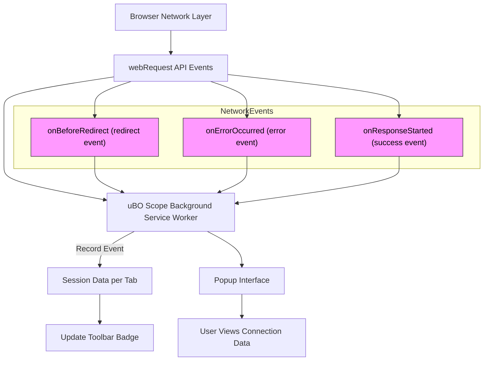

# Analyzing Stealth and Blocked Requests

## Overview

This guide helps you understand how uBO Scope identifies and categorizes stealth-blocked and directly blocked network requests in your browser tabs. It explains the differences between stealth blocking and observable blocking, illuminating how the extension leverages the browser's network events to deliver a nuanced view of the third-party connections your browser makes — whether allowed, stealth-blocked, or outright blocked.

By mastering this page, you'll be equipped to interpret these nuanced connection outcomes in the uBO Scope popup interface and better assess the real-world impact of your content blockers from a privacy and security standpoint.

---

## What You Will Learn

- The distinction between stealth-blocking and blocked network requests
- How uBO Scope tracks and records connection outcomes
- How stealth blocking is detected despite its subtle, less obvious nature
- Interpreting counts and domain-level summaries of stealth and blocked connections

## Prerequisites

- uBO Scope installed and enabled in your browser
- Familiarity with the uBO Scope popup interface (see 'Exploring the Popup Interface')
- Basic understanding of browser network requests and content blocking concepts

## Expected Outcome

You will confidently distinguish between stealth and blocked network requests as tracked by uBO Scope, enabling you to interpret network request data accurately and avoid misconceptions about content blocker effectiveness.

## Time Estimate

Approximately 15 minutes to study and understand the concepts with practical examples.

## Difficulty Level

Intermediate — assumes familiarity with browser networking and privacy tools.

---

# Understanding Stealth vs. Blocked Requests

## 1. Connection Outcome Categories

uBO Scope classifies network requests into three primary outcome groups per tab:

- **Allowed (Not Blocked):** Connections made successfully without interference.
- **Stealth Blocked:** Network requests for which the browser’s network API indicates a redirect or similar action masking the blocking.
- **Blocked:** Requests directly failing with network errors reported via the browser’s webRequest API.

### Why This Matters

The badge on the toolbar shows the count of distinct third-party domains contacted successfully (Allowed). Studying stealth and blocked counts provides deeper insight into the blocking behavior and helps identify requests silently suppressed (stealth) versus observable failures (blocked).

## 2. What is Stealth Blocking?

Stealth blocking is a technique where content blockers prevent network requests without generating explicit error signals visible to the webpage or through usual browser APIs. Instead, these requests appear as redirects or quietly altered network events that evade detection by the page.

### How uBO Scope Detects Stealth Blocking

uBO Scope leverages the `webRequest` API's `onBeforeRedirect` event:

- When a request is redirected to an internal or non-network URL, it is flagged as stealth-blocked.
- This captures attempts by blockers to obscure their activity by redirecting or substituting requests invisibly.

### Key Characteristics of Stealth Blocking

- Invisible to the webpage and often the browser UI.
- Not reflected as standard network errors.
- Detected only because uBO Scope monitors browser network events comprehensively.

## 3. Understanding Directly Blocked Requests

Blocked requests are those shown by the browser as failed network operations:

- Captured by `onErrorOccurred` events from the `webRequest` API.
- Indicate explicit blocking or failures in the network layer.
- These are observable and report a definite failure.

Direct blocks usually correspond to conventional blocking strategies where the connection does not complete successfully.

---

# How uBO Scope Tracks Request Outcomes

## 1. Recording the Outcome

Each network request observed by uBO Scope is processed by the background service worker, which:

- Extracts `tabId`, `url`, `type`, and `event` (e.g., 'redirect', 'error', 'success') for each network request.
- Identifies the hostname and derives its domain using a public suffix list.
- Updates tab-specific details, incrementing counters for domains under categories Allowed, Stealth, or Blocked.

## 2. Session Data Management

uBO Scope stores this data per browser tab session, preserving:

- Domains & hostnames for allowed connections
- Domains & hostnames for stealth-blocked connections
- Domains & hostnames for directly blocked connections

The extension updates the user interface and badge counts based on this data.

---

# Using uBO Scope to Analyze Stealth and Blocked Requests

## Step 1: Open uBO Scope Popup

Click the uBO Scope toolbar icon to view the popup display showing:

- The hostname and domain of the active tab.
- Counts of connected domains, divided into **Not Blocked**, **Stealth-Blocked**, and **Blocked** categories.
- Lists of domains with the number of attempted connections per category.

## Step 2: Interpret Domain Counts

- **Not Blocked Section** shows all third-party domains your browser connected to successfully.
- **Stealth-Blocked Section** lists domains where requests were silently blocked or redirected.
- **Blocked Section** catalogs domains with directly rejected requests.

Typically, legitimate third-party domains (like CDN providers) appear under Not Blocked.
Domains in Stealth or Blocked may represent trackers or unwanted resources.

## Step 3: Investigate Specific Domains

Look for:

- Domains appearing only in the Blocked list: these are explicitly blocked connections you can verify.
- Domains in the Stealth-Blocked list: these requests were suppressed quietly, without visible network error.

## Step 4: Correlate Badge Count

The browser action badge number reflects the count of distinct domains in the Allowed (Not Blocked) category per tab.

Lower numbers can indicate fewer third-party domains contacted, implying better privacy exposure.

---

# Practical Tips and Best Practices

- **Avoid judging blockers solely by block counts.** A higher block count does not necessarily mean better blocking—it could mean more requests allowed before blocking.
- **Use stealth-block visibility to identify indirect or subtle tracking attempts.**
- **Refresh the tab after enabling uBO Scope to ensure the data is accurate and reflects current blocking.
- **Watch for domains with large stealth or blocked counts as candidates for blocking lists or whitelisting.

---

# Common Pitfalls and Troubleshooting

<AccordionGroup title="Troubleshooting Stealth and Blocked Request Analysis">
<Accordion title="Why do some domains appear in Stealth-Blocked but no browser errors are visible?">
Stealth blocking often uses redirects or replaces requests internally. The browser and webpage won't show errors, but uBO Scope detects these via network event monitoring, revealing the silent blocking.
</Accordion>
<Accordion title="My popup shows no data or 'NO DATA' for the current tab">

- Ensure uBO Scope has permission to access the active tab.
- Reload the tab to refresh network request tracking.
- Confirm your browser supports the required `webRequest` events.
- Check for conflicting extensions that might interfere with network logging.

</Accordion>
<Accordion title="Why does the toolbar badge number not correspond to blocked request counts?">

The badge count only reflects the number of distinct domains your browser successfully connected to (Allowed). Blocked and stealth-blocked domain counts are separate and not represented in this badge.

</Accordion>
</AccordionGroup>

---

# Technical Data Flow Overview

The following diagram illustrates how uBO Scope monitors, categorizes, and reports network request outcomes:

---

# Next Steps & Related Documentation

- **Explore the popup interface in detail:** [Exploring the Popup Interface](/guides/getting-started/exploring-popup)
- **Monitor third-party connections effectively:** [Monitoring Third-party Connections](/guides/practical-use-cases/monitoring-3rd-party-connections)
- **Understand core terminology and concepts:** [Core Concepts & Terminology](/overview/core-architecture-concepts/core-concepts-and-terminology)
- **Compare blockers using uBO Scope data:** [Comparing Content Blockers with uBO Scope](/guides/practical-use-cases/compare-blockers-effectiveness)
- **Troubleshoot setup and data issues:** [Troubleshooting Common Setup Issues](/getting-started/first-run-usage/troubleshooting-install)

---

<Info>
For detailed information about domain extraction and public suffix handling used in categorizing hosts, consult the source code and the embedded public suffix list maintained by uBO Scope.
</Info>

<Check>
Always ensure you reload tabs or restart the browser after significant changes to blocker settings for accurate stealth/blocked request reporting.
</Check>

---

## Source and Reference Code

The core tracking mechanisms reside in `js/background.js`, which listens to `webRequest` events and updates the session storage accordingly. The popup rendering logic is in `js/popup.js`.

Explore the project source:

- [background.js on GitHub](https://github.com/gorhill/uBO-Scope/blob/main/js/background.js)
- [popup.js on GitHub](https://github.com/gorhill/uBO-Scope/blob/main/js/popup.js)

---

Your enhanced understanding of stealth and blocked requests empowers you to make informed decisions about privacy protections and can help you validate content blocker performance effectively.

