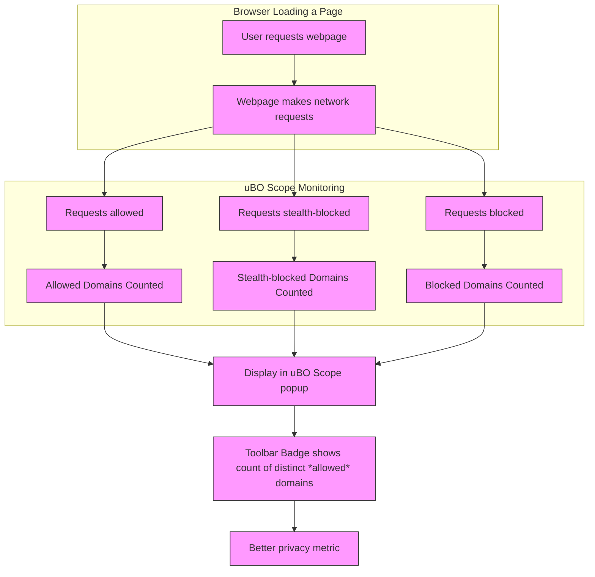

# Debunking Block Count Myths

## Overview

This guide clarifies why the count of blocked network requests (block count) is often a misleading metric when evaluating the effectiveness of content blockers. Rather than focusing on raw block counts, uBO Scope emphasizes the more meaningful metric of distinct third-party remote servers contacted during webpage loading. You will learn the common misconceptions, why they occur, and how to use uBO Scope to see the true impact of content blocking on your browser's network exposure.

---

## Why Block Count is a Misleading Metric

### The Myth: "Higher Block Count Means Better Blocking"

It is a common belief that the higher the number shown on a content blocker's badge icon (block count), the more effective the blocker is. However, this assumption is flawed:

- A high block count may mean a browser made more network requests before blocking them, indicating more third-party servers were contacted in the first place.
- The core privacy and security benefit comes from *reducing the number of distinct third-party remote servers your browser loads content from*, not just blocking individual requests.
- Content blockers with stealth techniques or smarter filtering may show fewer blocked request counts but still achieve better privacy by limiting server exposure.

### The Reality: Distinct Third-Party Remote Servers Matter

uBO Scope reveals the *number of distinct third-party domains that are actually contacted*, which is a better indicator of network exposure and content blocker effectiveness:

- Each distinct domain contacted represents a potential privacy risk or tracking vector.
- Lower counts correspond to fewer external entities being connected to, showcasing better content blocking or privacy.
- Tracking distinct servers also avoids the confusion caused by counting multiple blocked attempts from the same domain.

## How uBO Scope Demonstrates This

### Viewing Real Network Exposure

uBO Scope captures network connections regardless of any content blocker installed. It categorizes requests into:

- **Allowed**: Requests that completed successfully.
- **Stealth-blocked**: Requests that were redirected or stealthily blocked.
- **Blocked**: Requests that failed or were actively blocked.

This categorization helps visualize network exposure beyond mere block count.

### Practical Steps to See the Truth:

1. **Open uBO Scope popup on any webpage**: Click the extension's toolbar icon.
2. **Observe the domain count**: The badge and summary show the count of third-party remote servers contacted.
3. **Compare with your content blocker's block count**: You will notice how a higher block count does not necessarily reduce distinct third-party servers.
4. **Analyze the lists of allowed, stealth, and blocked connections** for better insight.

## Common Misconceptions Debunked

### 1. "Block Counts Show Everything"

Block counts only reflect the number of requests *blocked*, not the number of distinct servers the browser connects to. Many blocked requests can be from the same few domains.

### 2. "Ad Blocker Test Pages Give Reliable Results"

Ad blocker test pages generate artificial and exaggerated requests to trick blockers or show inflated statistics:

- These pages do not reflect real-world browsing behavior.
- uBO Scope shows these tests as outliers and encourages measuring network exposure on actual webpages.

### 3. "More Blocks Means Less Privacy Risk"

Sometimes, a blocker with a high number of blocks still allows connections to *more* distinct third parties, increasing the privacy risk.

## Using uBO Scope to Understand Network Exposure

### Step-by-Step Instructions to Explore Block Count Myths

1. **Navigate to a website you normally visit.**

2. **Open uBO Scope popup** by clicking the toolbar icon.

3. **Check the count displayed** at the top, showing how many distinct third-party domains were contacted.

4. **Examine the lists under "not blocked", "stealth-blocked", and "blocked"**.

5. **Note that many blocked requests may originate from few domains, while allowed connections may reach several distinct domains.**

6. **Compare the extension badge count against your traditional content blocker's block count.** Often, uBO Scope shows fewer distinct third parties exposed even if block counts differ.

7. **Use this data to better evaluate the real privacy impact of your content blockers.**

## Best Practices and Tips

- Use uBO Scope’s domain count as your privacy benchmark, not just block counts.
- Always check network exposure on real-world websites rather than synthetic ad blocker test pages.
- Recognize that a stealthy content blocker may show fewer blocked requests but still reduce third-party exposure more effectively.
- Leverage uBO Scope’s detailed popup interface to inspect which domains are contacted and whether requests are blocked or allowed.

## Troubleshooting and Common Pitfalls

### Issue: "Extension shows fewer blocked requests but more domains contacted"

- This indicates that some content blockers let through requests from more distinct third parties even if total number of blocked requests is high.
- Use this insight to reconsider which blocker better aligns with your privacy goals.

### Issue: "Ad block test pages show misleading results"

- Avoid relying on ad block test pages to assess your blocker.
- Test on real websites with typical browsing to get accurate network exposure data.

## Next Steps

- Explore the [Interpreting the Icon Badge Count](/guides/core-usage/interpreting-badge-count) guide to understand badge meaning in detail.
- Learn to [Monitor Network Connections on Any Page](/guides/core-usage/monitoring-network-connections) for hands-on usage.
- Review the [Target Audience & Use Cases](/overview/introduction-core-value/target-audience-use-cases) page to see how professionals use uBO Scope.

---

## References

- See full [Value Proposition and Main Benefits](/overview/introduction-core-value/value-proposition-main-benefits) for deeper understanding of why distinct third-party counts matter.
- Learn core [Concepts & Terminology](/overview/how-it-works-architecture/core-concepts-terminology) about request outcomes and domain distinctions.
- For troubleshooting issues related to block counts or unexpected data, refer to [Troubleshooting Common Issues](/getting-started/getting-aware/troubleshooting).

---

For further details or source code, visit the uBO Scope repository at [https://github.com/gorhill/uBO-Scope](https://github.com/gorhill/uBO-Scope).

---

## Illustrative Diagram: Understanding uBO Scope’s Domain Counting

This flow illustrates how uBO Scope categorizes network requests and focuses the badge count on distinct allowed third-party domains — highlighting privacy exposure instead of raw block counts.
