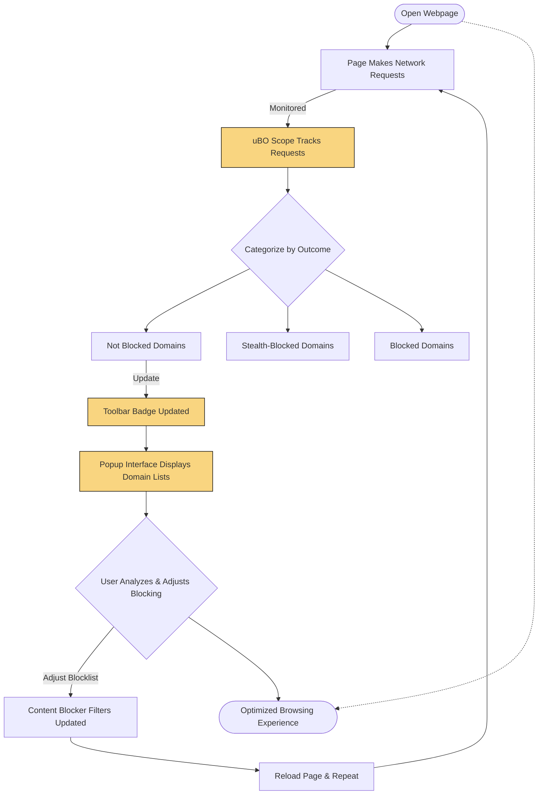

# Optimizing Browsing for Minimum Exposure

Maximize your online privacy with uBO Scope by minimizing your exposure to third-party servers while maintaining full web functionality. This guide delivers practical advice on using uBO Scope’s badge counts and popup insights to craft a privacy-centric browsing workflow.

---

## 1. Understanding the Goal

When you browse the web, your browser contacts numerous third-party remote servers beyond the site you’re visiting. Each additional third-party connection expands your privacy exposure. uBO Scope helps you see these connections clearly so you can make informed decisions about blocking or allowing them.

**Objective:** Reduce your distinct third-party connections to a minimum without breaking the websites you trust.

---

## 2. Prerequisites

Before starting:

- Install uBO Scope on a supported browser (Chromium, Firefox, Safari). Refer to [Installing uBO Scope](/getting-started/setup-and-installation/installing-extension).
- Complete first launch activation and grant permissions as described in [First Launch and Configuration](/getting-started/first-run-usage/first-launch-activation).
- Familiarize yourself with the toolbar badge and popup interface through [Exploring the Popup Interface](/guides/getting-started/exploring-popup).

---

## 3. Reading the Toolbar Badge and Popup Interface

### What the Badge Shows

- The toolbar badge displays the **number of distinct third-party remote domains** your browser contacted for the current tab.
- Lower badge numbers indicate fewer unique connections, which generally corresponds to lower privacy exposure.

### Using the Popup Interface

Open the popup from the toolbar icon to see a categorized list of domains:

- **Not Blocked:** Domains successfully contacted.
- **Stealth-Blocked:** Domains where the request was stealthily blocked or redirected.
- **Blocked:** Domains where requests were explicitly blocked.

Each domain includes a count representing how many requests belonged to that domain.

<Tip>
Focus first on the **Not Blocked** list to identify third parties your browser actually connected to. These represent your current exposure.
</Tip>

---

## 4. Step-by-Step Optimization Workflow

<Steps>
<Step title="Monitor Your Starting Exposure">
Begin by browsing a site you frequently visit. Click the uBO Scope icon and note the badge count and domains listed in each section of the popup.

**Outcome:** Knowing your baseline exposure helps you spot improvements.
</Step>

<Step title="Analyze the Not Blocked Domains">
Review the 'Not Blocked' list carefully:

- Identify domains that seem related to essential services (e.g., content delivery networks, analytics your trusted sites rely on).
- Flag unfamiliar or unnecessary third parties for further investigation or blocking.

**Outcome:** Separate indispensable from optional third parties.
</Step>

<Step title="Check Blocked and Stealth-Blocked Lists">
Examine the 'Blocked' and 'Stealth-Blocked' lists to understand which third parties your current blocking setup prevents.

- Stealth-blocked domains may not be obvious in your regular blocker’s interface but still contribute to reduced exposure.
- Take note of any blocked domains that cause site issues; you may adjust blocking rules accordingly.

**Outcome:** Validate the effectiveness of your current filters.
</Step>

<Step title="Adjust Blocking Rules Incrementally">
Based on your analysis:

- Use your content blocker to block additional suspicious domains you identified.
- Gradually reload the webpage and observe how the badge count changes.
- Watch for site breakage. If functionality breaks, undo or whitelist selectively.

**Outcome:** Balance privacy with usability through incremental blocking.
</Step>

<Step title="Repeat and Refine">
Repeat browsing various sites, especially those with high third-party traffic.

- Check badge counts and popup domain lists each time.
- Refine blocking rules to achieve minimal exposure without impairing site experience.

**Outcome:** Develop a customized, effective privacy profile.
</Step>

<Step title="Integrate Findings into Your Privacy Routine">
Make monitoring third-party exposure with uBO Scope a regular practice.

- Routinely check badge counts and popup domain lists when visiting new or updated websites.
- Keep your blocking rules updated based on your findings.

**Outcome:** Ongoing, adaptive protection of your browsing privacy.
</Step>
</Steps>

---

## 5. Practical Tips and Best Practices

- **Expect Some Third-party Connections:** Many websites rely on a handful of third-party services (e.g., CDNs like cloudflare.net or google.com) which are often necessary for content delivery and smooth user experience.

- **Beware of Overblocking:** Blocking too many third parties can cause websites to break or display incorrectly. Use uBO Scope to identify suspicious domains rather than blocking aggressively by default.

- **Use Domain Counts to Prioritize:** Large request counts from a domain indicate a bigger footprint; prioritize evaluating those domains first.

- **Leverage Stealth-blocked Info:** Domains stealth-blocked indicate blockers working silently to protect you; understanding these helps gauge your blocker’s effectiveness beyond just blocked counts.

- **Combine with Content Blockers:** uBO Scope complements content blockers but does not itself block traffic. Use both in tandem.

- **Trust but Verify:** Some third parties are legitimate and trustworthy. If in doubt, research the domain before blocking.

---

## 6. Common Pitfalls and Troubleshooting

<AccordionGroup title="Common Issues While Optimizing">
<Accordion title="Badge Not Updating or Showing No Data">

This often indicates installation or permission issues.

- Confirm uBO Scope is properly installed.
- Ensure it has permission to read webRequest events.
- See [Troubleshooting Common Setup Issues](/getting-started/first-run-usage/troubleshooting-install).

</Accordion>
<Accordion title="Popup Shows High Number Despite Blocking">

Some sites use many essential third-party services. Not all exposure can be eliminated without breaking site functionality.

- Review domain list carefully to identify truly unwanted third parties.
- Consider blocking selectively.

</Accordion>
<Accordion title="Blocking Causes Site Breakage">

Certain third parties are needed for site operation.

- Whitelist domains causing breakage.
- Use incremental adjustments.

</Accordion>
</AccordionGroup>

---

## 7. Integrating uBO Scope into a Broader Privacy Workflow

uBO Scope excels when combined with a strategic approach to privacy:

- Use uBO Scope to audit exposure periodically.
- Combine with a blocking extension like uBlock Origin or other filters.
- Review connection outcomes during suspicious browsing sessions.
- Educate yourself on stealth-blocking and third-party risks through [Analyzing Stealth and Blocked Requests](/guides/advanced-insights/analyzing-stealth-blocking).

Your browsing privacy improves continuously as you understand the real exposure measured by uBO Scope rather than relying on unpredictable block counts.

---

## 8. Additional Resources

- [What is uBO Scope?](/overview/product-introduction/what-is-ubo-scope)
- [Exploring the Popup Interface](/guides/getting-started/exploring-popup)
- [Monitoring Third-party Connections](/guides/practical-use-cases/monitoring-3rd-party-connections)
- [First Launch and Configuration](/getting-started/first-run-usage/first-launch-activation)
- [Troubleshooting Common Setup Issues](/getting-started/first-run-usage/troubleshooting-install)
- [Analyzing Stealth and Blocked Requests](/guides/advanced-insights/analyzing-stealth-blocking)

---

Optimize your browsing to enjoy a safer, leaner, and privacy-conscious web experience using uBO Scope insights.

---

### Example Scenario

Imagine visiting a news website and noticing a badge count of 15 distinct third-party domains. Opening the popup shows several CDN providers like `cloudflare.net` under 'Not Blocked' (which you deem essential), but some unknown advertising domains also appear there. You add those ad-related domains to your content blocker's filter to block them and reload the page. The badge count drops to 10, indicating reduced exposure. However, now a part of the website's comments section fails to load—checking the popup again highlights that a legitimate commenting platform domain is blocked. You whitelist that domain and restore full site functionality with an exposure count of 12, a good balance between privacy and usability.

This illustrates how uBO Scope guides informed blocking decisions.

---

### Summary Diagram: Simplified uBO Scope Workflow

