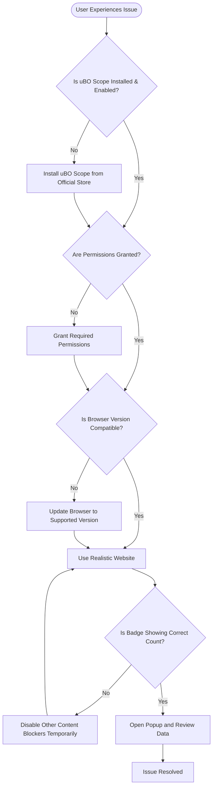

# Troubleshooting and Common Questions

This guide addresses frequently asked questions and common issues users may encounter when using uBO Scope. It provides actionable troubleshooting steps and clarifies platform-specific limitations and differences. Whether some network requests do not appear, or information varies between browsers, this guide helps you understand what to expect and how to resolve common challenges.

---

## 1. Why Am I Not Seeing All Network Requests?

uBO Scope relies on your browser’s `webRequest` API to capture and report network requests. However, some network connections may not be visible due to platform or API limitations.

### Common Reasons
- **Browser API Limitations:** Not all browsers expose every type of network request via `webRequest`. For example, some WebSocket connections or requests made by browser extensions may be invisible.
- **Request Context Restrictions:** Only requests associated with tabs and windows your browser can access will be tracked. Background or service worker requests may be excluded.
- **Stealth Blocking:** Some blocked requests are "stealth-blocked" by content blockers, meaning they are canceled before being reported; uBO Scope marks these separately.

### Troubleshooting Checklist
- Ensure you have installed uBO Scope from the official store matching your browser (Chrome, Firefox, Safari).
- Check that the extension has the necessary permissions, especially access to `webRequest` and host permissions for URLs you are testing.
- Visit standard, realistic websites with many third-party connections, not fabricated ad blocker test pages, since those can have misleading behaviors.

<Tip>
To verify uBO Scope is capturing network requests accurately, use the [Quick Validation Steps](/getting-started/installation-and-setup/quick-validation) guide.
</Tip>

---

## 2. Why Do I See Different Outcomes Across Browsers?

Some discrepancies in the reported connections can occur because different browsers implement their extensions APIs and network internals differently.

### Platform-Specific Differences
- **Chromium (Chrome, Edge):** Uses a service worker background script; captures most `webRequest` events with minimal lag.
- **Firefox:** Uses a background script model with its own API quirks; minimum version 128 required for full compatibility.
- **Safari:** Requires Safari 18.5 or later; some WebSocket requests or non-HTTP(s) protocols may not be fully reported.

### User Impact
- Differences in timing and API event firing can lead to some requests showing as "stealth-blocked" or "allowed" differently.
- Manifest permissions and host permissions must match your active websites for full visibility.

---

## 3. Why Does the Badge Count Change Unexpectedly?

The toolbar badge reflects the number of *distinct third-party domains* connected to from the active tab.

### Possible Causes for Badge Count Variation
- Navigating or refreshing the page resets the connection counts.
- Some connections may occur asynchronously or delayed, so the badge updates after a short delay.
- Domains counted exclude the first-party domain of the page; only third-party connections count.

<Tip>
If the badge disappears or stays empty on pages you expect connections, confirm that uBO Scope has permission for those sites and that no conflicting extensions are interfering.
</Tip>

---

## 4. Why Are Some Domains Marked as Stealth-Blocked?

**Stealth-blocked** domains represent requests canceled before they could be fully processed or reported, typically due to stealth or advanced blocking techniques by content blockers.

- These requests never reached a remote server.
- uBO Scope categorizes these separately to give clear insight into requests silently blocked from the page.

Understanding stealth-blocked requests helps evaluate the effectiveness of content blockers beyond what block counts alone reveal.

---

## 5. How to Troubleshoot Common Issues

<AccordionGroup title="Common Troubleshooting Steps">
<Accordion title="Extension Does Not Show Badge or Popup">
- Confirm the extension is installed and enabled.
- Refresh the page or open a page with network connections.
- Verify browser version compatibility and minimum version requirements:
  - Chrome ≥ 122
  - Firefox ≥ 128
  - Safari ≥ 18.5
- Check for denied permissions or blocked APIs in browser settings.
</Accordion>
<Accordion title="Unexpectedly Low or No Domain Counts">
- Confirm you are using real websites, not synthetic ad blocker test pages.
- Disable other content blockers temporarily to see if they interfere.
- Restart the browser to clear cached state.
- Check network connection and firewall settings.
</Accordion>
<Accordion title="Popup Shows No Data or Partial Data">
- Ensure the popup is triggered from the active tab with network activity.
- Allow time for the extension to process network requests (updates batch every second).
- Check the console (browser developer tools) for errors in the extension.
- Reinstall the extension if corrupted data persists.
</Accordion>
<Accordion title="Badge Count or Popup Data is Out of Sync after Navigation">
- Wait a few moments after navigation; connection data updates asynchronously.
- Open a new tab and return to refresh the connection context.
- Clear session data by closing the tab and reopening.
</Accordion>
</AccordionGroup>

---

## 6. Best Practices for Effective Use

- Use uBO Scope alongside verified content blockers for privacy monitoring.
- Avoid using artificial test sites; test with carefully selected real-world websites.
- Interpret badge counts as distinct remote third-party domains, not just total blocked requests.
- Use the popup to evaluate what connections are allowed, stealth-blocked, or blocked.

---

## 7. Frequently Asked Questions

<AccordionGroup title="FAQ">
<Accordion title="Does uBO Scope work with all content blockers?">
Yes. Since it relies on the browser’s `webRequest` API, it reports network requests regardless of the content blocker or DNS server blocking in effect.
</Accordion>
<Accordion title="Can uBO Scope report requests made by browser extensions?">
No. Requests made outside the scope of the browser's `webRequest` API or background processes are not visible.
</Accordion>
<Accordion title="Is the extension compatible with mobile browsers?">
Currently, uBO Scope targets desktop browsers supporting the necessary extension APIs (Chrome, Firefox, Safari) and is not designed for mobile environments.
</Accordion>
<Accordion title="Why doesn’t a higher block count mean better blocking?">
uBO Scope helps debunk this myth by focusing on the number of distinct allowed third-party domains, not just block counts. A high block count may still allow connections to many domains, diluting privacy protection.
</Accordion>
</AccordionGroup>

---

## 8. Where to Go Next

- Review the [Understanding the Popup and Badge](/guides/getting-started-essentials/understanding-the-popup) guide to better interpret the data 
- Use the [Quick Validation Steps](/getting-started/installation-and-setup/quick-validation) to verify your setup
- Explore [Installation and Setup](/getting-started/installation-and-setup/installation) if you need to reinstall or update
- Consider the [Debunking Adblock Test Myths](/guides/practical-analysis-workflows/debunk-adblock-test-myths) guide for deeper insights into browser privacy testing

---

## Additional Resources

- GitHub Repository: [https://github.com/gorhill/uBO-Scope](https://github.com/gorhill/uBO-Scope)
- Browser API Details: Refer to your browser’s webRequest API documentation for any platform-specific constraints.

---

### Summary Diagram of Troubleshooting Workflow

---

<Tip>
Having patience with asynchronous updates and understanding browser API limitations will help you maximize the value of uBO Scope.
</Tip>

