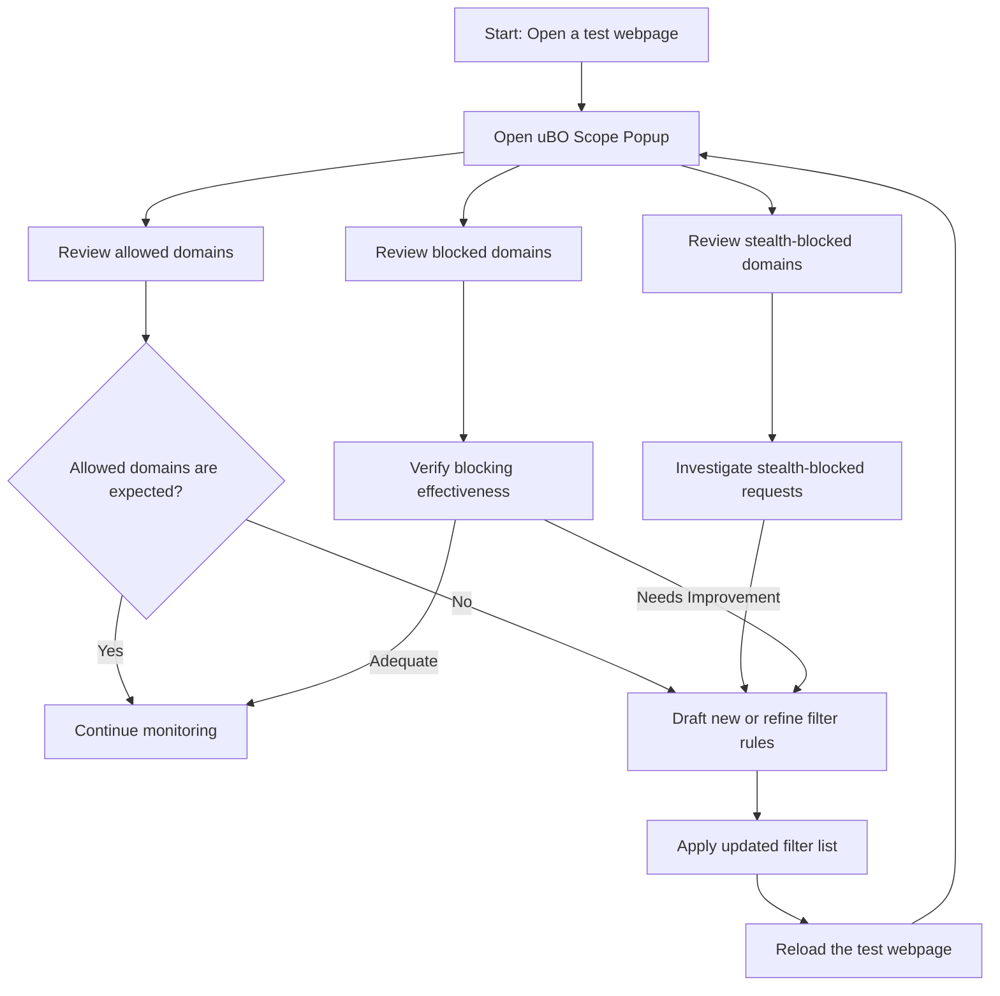

# Analyzing Filter Lists and Improving Blocking Rules

uBO Scope shines as an invaluable tool for filter list maintainers by providing deep visibility into the real-world efficacy of blocking rules. This guide walks you through a practical workflow to use uBO Scope for observing what connections are currently allowed, detecting stealth or missed network requests, and refining your filter lists accordingly. 

---

## 1. Understanding the Task

Filter list maintainers aim to craft concise, accurate rules that block unwanted network requests while avoiding false positives that can break websites. uBO Scope assists in this by revealing network connections categorized as _allowed_, _blocked_, or _stealth-blocked_, offering direct insights into which third-party domains evade blocking.

### What This Guide Helps You Do
- Observe which domains and hostnames are _allowed_ through your current filter rules
- Identify _stealthy_ or unexpectedly _missed_ requests that bypass filters
- Analyze connection patterns to improve and tighten blocking rules
- Use the popup UI and badge counts for quick diagnostics

### Prerequisites
- uBO Scope extension installed and configured (see Installation guides)
- Basic familiarity with writing filter rules and domains
- Access to sites or browsing scenarios where the filter list is applied

### Expected Outcome
- Clear list of allowed, blocked, and stealth-blocked domains
- Ability to identify missing rules or weaknesses in filter lists
- Practical steps for refining rules to improve blocking coverage

### Time Estimate
20–40 minutes depending on the complexity of analysis and rule refinement

### Difficulty Level
Intermediate to Advanced

---

## 2. Step-by-Step Instructions

### Step 1: Open the uBO Scope Popup on Your Test Webpage
- Navigate to a webpage where your filter list is active.
- Click the uBO Scope toolbar icon to open the popup panel.
- Observe the domain counts in three categories:
  - **Allowed:** Requests that passed through without blocking
  - **Blocked:** Requests successfully blocked by filter rules
  - **Stealth Blocked:** Requests hidden or blocked silently without detection by some blockers

### Step 2: Review the Domain Lists for Unexpected Allowed Connections
- Focus first on the **allowed** section for any third-party domains.
- Identify any allowed domains that should ideally be blocked in your use case.
- Note domains that appear frequently or seem suspicious.

### Step 3: Investigate Stealth-Blocked and Blocked Domains
- The **stealth-blocked** list exposes requests that may be silently blocked elsewhere; verify if your filter rules are anticipated to block those.
- The **blocked** section confirms what your rules currently stop.
- Determine if stealth-blocked requests require explicit rules.

### Step 4: Capture Hostname and Domain Details
- Use the displayed domain and subdomain information to understand hierarchical relationships.
- Domains in uBO Scope reflect registrable domains per the Public Suffix List (PSL), enabling precise rule targeting.

### Step 5: Draft or Refine Filter Rules
- Based on your observations, write new filter rules targeting domains still allowed but intended for blocking.
- Ensure rules are specific enough to avoid breaking legitimate resources.
- Example filter syntax snippet:
  ```
  ||example-tracker.com^      # Block entire domain
  ||sub.example-adnetwork.net^  # Block specific subdomain
  example.com##.annoying-popup # Cosmetic filter to block element
  ```

### Step 6: Test Your Revised Filters
- Apply the new or updated filters to your filter list.
- Reload the test page and observe changes in uBO Scope's popup.
- Confirm that previously allowed unwanted domains move to blocked or stealth-blocked.
- Watch the toolbar badge count decrease as expected.

### Step 7: Iterate and Document
- Repeat observations under varied browsing scenarios.
- Document findings and filter rules added for transparency.
- Share improvements with the community if applicable.

---

## 3. Practical Tips and Best Practices

- **Start with high-traffic pages:** Analyze popular sites that heavily influence overall exposure.
- **Prioritize domains by request count:** Domains with high request frequency may have outsized privacy impact.
- **Use domain grouping:** Focus on registrable domains from the Public Suffix List to avoid over-blocking.
- **Beware of false positives:** Test your filters thoroughly to avoid site breakage.
- **Combine blocking and cosmetic filters wisely:** Sometimes blocking requests can break functionality; cosmetic rules might be safer.
- **Leverage stealth-blocked insights:** Identify hidden requests that escape normal blocking, often indicating new tracking methods.
- **Record changes systematically:** Maintain version control for filter list updates.

---

## 4. Common Pitfalls and Troubleshooting

### Pitfall: Seeing Unexpected Allowed Domains Despite Filters
- **Cause:** Filters may be too specific or miss new subdomains.
- **Solution:** Broaden domain match, double-check filter syntax, and observe again.

### Pitfall: Stealth-Blocked Domains Not Showing Expected Block
- **Cause:** Some blockers silently block requests without informing uBO Scope.
- **Solution:** Verify if stealth blocking is intended or false positives; adjust filter rules accordingly.

### Troubleshooting Tips
- Refresh the webpage to ensure latest requests are captured.
- Clear browser cache or test in a private window to avoid outdated data.
- Confirm uBO Scope has proper permissions and is active.
- Consult the badge count for quick indication of filtering impact.

---

## 5. Examples

### Example Scenario: Blocking a New Tracker
- **Observation:** In the allowed section you notice `tracker.analytics-example.com` appearing repeatedly.
- **Action:** Add filter `||analytics-example.com^` to block the entire domain.
- **Result:** After reloading, the domain moves to the blocked list, and the badge count decreases.

### Example Filter Rule Set
```plaintext
||ads.example.com^               # block ads domain
||track.example.net/path^        # block specific path
||cdn.badtracker.example^        # block tracker CDN
example.com##div.popover-ad     # cosmetic blocking of popup ads
```

---

## 6. Next Steps & Additional Resources

- Explore the **Understanding the Popup Panel and Connection Lists** guide to master interpreting popup data.
- Review the **Interpreting Badge Counts and What They Mean for Privacy** guide for badge insights.
- Learn advanced troubleshooting with **Troubleshooting Installation & Setup**.
- Share your improved filter lists with the community to contribute.

---

## References
- [uBO Scope GitHub Repository](https://github.com/gorhill/uBO-Scope)
- [Public Suffix List](https://publicsuffix.org/list/)
- Related Documentation:
  - [Understanding the Popup Panel and Connection Lists](/guides/analyzing-network-connections/understanding-popup-ui)
  - [Interpreting Badge Counts and What They Mean for Privacy](/guides/analyzing-network-connections/interpreting-badge-counts)
  - [Troubleshooting Installation & Setup](/getting-started/first-run-success/troubleshooting-setup-issues)
  - [Debunking Block Counter and Ad Block Test Myths](/guides/advanced-practices/debunking-myths)

---

# Diagram: Filter List Maintainers Workflow with uBO Scope


---

<Tip>
For filter list maintainers, consistently using uBO Scope during filter refinement sessions ensures your rules effectively reduce unwanted connections while maintaining website functionality. Focus on domains in the "allowed" and "stealth-blocked" lists to spot gaps or silent blockers.
</Tip>

<Warning>
Avoid over-blocking by frequently testing your filter rules on various sites and considering legitimate third-party services that should remain accessible to prevent site breakage.
</Warning>

<Note>
uBO Scope leverages the Public Suffix List internally to accurately group domains, allowing precise filtering and domain-based observations.
</Note>
