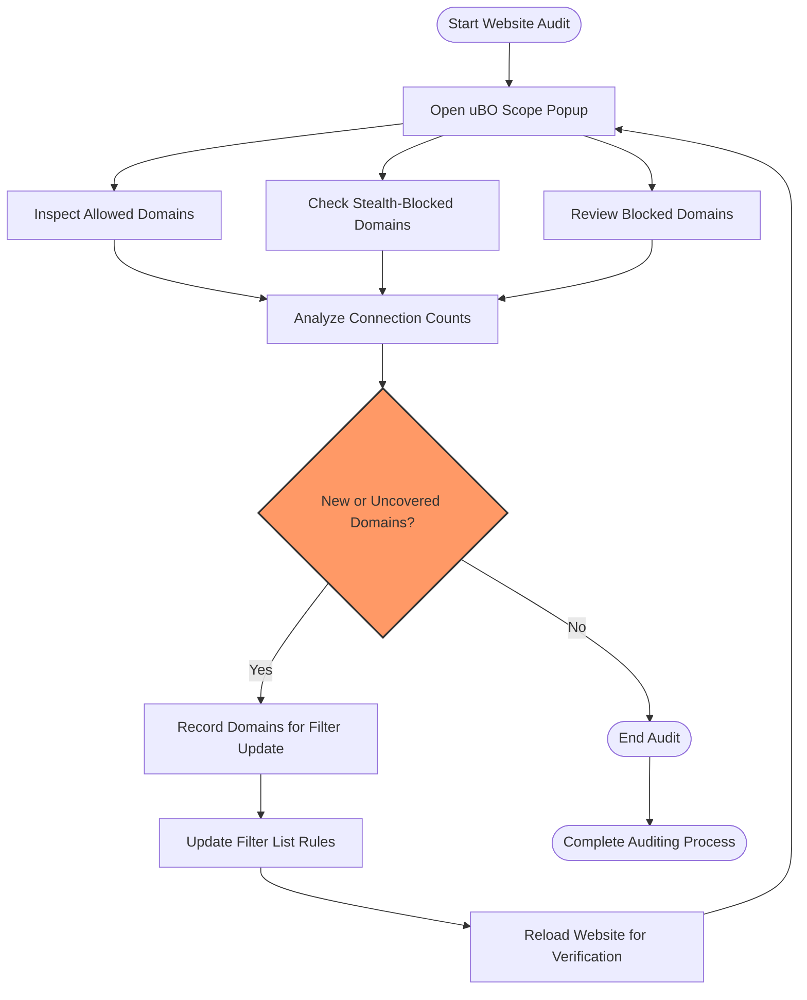

# Using uBO Scope as a Filter List Maintainer

uBO Scope is not just a privacy auditing tool for end users—it offers essential insights for filter list maintainers who need to evaluate and maintain high-quality blocklists. By leveraging uBO Scope's detailed network connection outcomes, maintainers can audit how websites behave in different contexts and identify stealth connections that evade traditional browser debugging tools. This guide helps filter list maintainers get the most out of uBO Scope to improve filter accuracy, monitor changes, and validate blocking effectiveness.

---

## 1. Overview and Value for Filter List Maintainers

Filter list maintainers require precise data about the network requests that websites make, including those blocked, allowed, or stealth-blocked by content blockers. uBO Scope provides this detailed per-tab network request data aggregated into distinct third-party domains, distinguished by their outcome:

- **Allowed:** Requests that succeeded and were not blocked.
- **Stealth-blocked:** Requests blocked in a way invisible to the website but detectable by uBO Scope.
- **Blocked:** Requests blocked outright and reported as errors.

Maintainers can use this outcome-based tracking to:

- Audit websites to discover new third-party domains not yet covered by filter lists.
- Detect stealth connections that might otherwise evade blocking.
- Validate the real-world effect of their filters on active browsing sessions.
- Maintain clean filter lists by verifying domains are still active or problematic.

---

## 2. Prerequisites

Before beginning:

- Install uBO Scope on your browser. Follow the [Installing uBO Scope](https://github.com/gorhill/uBO-Scope#installing-ubo-scope) guide.
- Understand basic network request behaviors and browser content blocking.
- Have access to websites you want to audit or maintain filters for.

---

## 3. Workflow: Auditing Websites with uBO Scope

<u>Goal:</u> Identify all third-party remote servers connected by a webpage, classify their blocking outcome, and extract actionable insights for filter list updates.

<Steps>
<Step title="Open uBO Scope Popup on the target site">
Navigate to the website you want to analyze. Click on the uBO Scope toolbar icon to open the popup panel, which displays the connection outcomes for the current tab.

Expected result: The popup shows the site headline, followed by categorized domains: allowed, stealth-blocked, and blocked.
</Step>

<Step title="Inspect 'Allowed' Domains">
Review domains listed under the 'not blocked' section. These are third-party connections allowed by filtering rules.

Consider:
- Legitimate services like CDNs or analytics platforms.
- Potentially unwanted or new domains not covered by filters.

Expected result: A clear domain list with counts indicating how many requests succeeded.
</Step>

<Step title="Examine 'Stealth-Blocked' Domains">
Focus on stealth-blocked domains, which indicate connections attempted but blocked invisibly to websites (e.g., stealth blocking, non-standard blocking methods).

Tips:
- These domains might be stealth trackers or elements not caught by conventional blocking.
- Investigate these domains to enhance filter list coverage.

Expected result: Domains here reveal stealth connections that evade regular detection.
</Step>

<Step title="Review 'Blocked' Domains">
These domains are blocked with errors reported (e.g., network failures flagged by the browser).

Usage:
- Validate that your filter list is actively blocking known malicious or unwanted domains.
- Identify potentially irrelevant or obsolete entries by cross-checking domain activity.

Expected result: Confirmation of effective blocking and identification of questionable domains.
</Step>

<Step title="Analyze Domain Activity Counts">
Look at the numerical counts next to each domain to gauge activity level. Multiple connections to the same domain can indicate heavier reliance or more severe tracking.

Use this information to prioritize domains for filter updates.

Expected result: Prioritized and quantified insight into domain behaviors.
</Step>

<Step title="Spot Undetected or New Domains">
Compare the domain lists against your existing filter rules and known threat lists.

Action points:
- Identify new domains to add.
- Detect false negatives or stealthy connections.

Expected result: Expanded and more robust filter list foundation.
</Step>

<Step title="Export or Record Findings">
Manually note or leverage browser tools to document domains and their outcomes for further filter list refinement.

Consider keeping session data for historical comparison.

Expected result: Concrete data-driven input for filter list maintenance.
</Step>
</Steps>

---

## 4. Practical Tips and Best Practices

- **Use uBO Scope on Different Devices and Browsers:** Especially on devices with limited developer tools, uBO Scope’s ability to reveal stealth connections can compensate for gaps in native tools.
- **Reload Pages After Filter List Updates:** To capture fresh data reflecting recent filter changes.
- **Watch for Large Numbers of Domains:** High third-party counts can indicate heavy tracking or potential over-blocking, guiding filter adjustments.
- **Prioritize Domains by Counts and Outcome:** Domains with repeated requests or in the stealth-blocked category are prime candidates for filter review.
- **Regularly Clear Sessions:** To avoid outdated or stale connection data impacting analysis.

---

## 5. Common Pitfalls and Troubleshooting

- **Missing Data on Popup:** Ensure uBO Scope is properly installed with required permissions and that the webpage is fully loaded.
- **Stealth Connections Not Visible:** Some stealth blocking methods may evade even uBO Scope’s tracking if network requests do not surface via browser APIs.
- **Badge Count Discrepancies:** The badge count shows distinct third-party domains allowed; a low badge count with unexpected connections could signal stealth blocking or hidden network activity.
- **Domain Grouping Cautions:** Domains are grouped by public suffix and registrable domain; some complex domain structures might group differently than expected.

Refer to [Troubleshooting Common Issues](https://github.com/gorhill/uBO-Scope#troubleshooting-common-issues) for detailed resolutions.

---

## 6. Example Scenario

Consider you maintain a filter list blocking trackers on a news website. Using uBO Scope:

- You visit the site and open the popup.
- You notice several stealth-blocked domains appear, all related to new tracking services.
- You verify these domains are absent from your current list.
- You extract these domains and add rules to your filter.
- Reload and verify the 'stealth-blocked' section shrinks or moves to 'blocked'.
- The badge count decreases, indicating fewer allowed third-party domains.

This process maintains accuracy and improves blocking effectiveness.

---

## 7. Next Steps & Related Documentation

- Explore [Interpreting the Popup Panel](../analyzing-connections/interpreting-popup-stats) to deepen your understanding of popup data.
- Review [Understanding the Toolbar Badge Count](../analyzing-connections/understanding-badge-count) to leverage badge indicators for real-time feedback.
- Use [Your First uBO Scope Session](../getting-started/your-first-session) for onboarding and practical exploration.
- Dive into the [Architecture & Data Flow](../../overview-tab/architecture-concepts-group/architecture-dataflow) documentation to understand internal mechanisms, aiding debugging and advanced uses.

---

## 8. Summary Diagram: Filter List Maintainer Workflow

---

<u>By following this guide, filter list maintainers can use uBO Scope as an actionable auditing tool to refine filters, uncover stealthy trackers, and maintain filters aligned with real-world web behaviors.</u>

---

# Appendix: Quick Commands & Tips

- **Open Popup:** Click the uBO Scope icon in your browser toolbar.
- **Refresh Data:** Reload the current tab to capture new network events.
- **Clear Session Data:** Restart browser or clear extension storage to start fresh.
- **Domain Inspection:** Hover or click on domains in the popup to study repeated connections and correlate with filter rules.

---

For detailed exploration of underlying technology and advanced use, consult the source code in the [`js/background.js`](https://github.com/gorhill/uBO-Scope/blob/main/js/background.js) and [`js/popup.js`](https://github.com/gorhill/uBO-Scope/blob/main/js/popup.js).

---