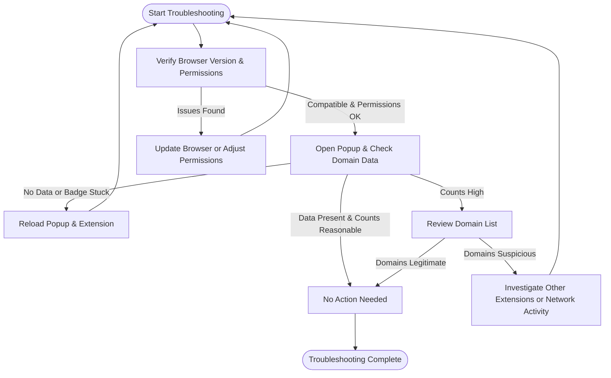

# Troubleshooting & Performance Tips

This guide provides practical, step-by-step troubleshooting solutions and performance tips tailored for uBO Scope users. It addresses common problems such as unexpectedly high connection counts, badge inconsistencies, and offers guidance on optimizing performance while understanding inherent platform limitations.

---

## 1. Understanding Common Issues

### 1.1 Unexpectedly High Connection Counts

- **What It Looks Like:**
  - The toolbar badge count displays a surprisingly large number of distinct third-party domains.
  - The popup lists many allowed domains that seem suspicious or excessive.

- **Possible Causes:**
  - Some websites load content from a wide array of legitimate third-party providers like multiple Content Delivery Networks (CDNs), analytics, or ads.
  - Browser or extension interactions causing duplicate or stealth connections.
  - Background network activities unrelated to your active tab.

### 1.2 Badge Count Inconsistencies

- **What It Looks Like:**
  - The badge count does not update or reflects zero despite visible network activity.
  - Counts appear lower or higher compared to your expectations.

- **Possible Causes:**
  - Browser permissions or extension restrictions limiting access to `webRequest` API events.
  - Network requests made outside the `webRequest` API's reach (e.g., prefetching, very early or behind-the-scenes requests).
  - Content blockers or privacy tools interfering with reporting.

### 1.3 Performance Concerns

- **What It Looks Like:**
  - Popups are slow to load or update.
  - Browser responsiveness decreases with heavy network activity.

- **Possible Causes:**
  - High volume of network requests leading to large data processing.
  - Limitations in browser event handling for large-scale network events.

---

## 2. Step-by-Step Troubleshooting

### 2.1 Verifying Extension and Browser Permissions

1. **Check Browser Version Compatibility:**
   - Ensure you are running a supported browser version.
     - Chromium 122+, Firefox 128+, Safari 18.5+
   - Unsupported browsers or outdated versions can block vital APIs.

2. **Confirm Permissions Granted:**
   - Verify that uBO Scope has the required permissions:
     - Access to host URLs (`http://*/*`, `https://*/*`, and WebSocket variants).
     - `webRequest` API permission.
     - ActiveTab and storage access.

3. **Reinstall or Refresh Extension:**
   - Remove and reinstall uBO Scope from the official store for your browser.
   - Restart the browser to apply updates fully.

<Tip>
If you use other content blockers or privacy tools, verify that they are not preventing uBO Scope from accessing network requests.
</Tip>

### 2.2 Diagnosing Badge Count and Data Refresh Issues

1. **Open uBO Scope Popup:**
   - Click the toolbar badge to open the popup.
   - Verify that the domain data populates under the Allowed, Stealth-blocked, and Blocked sections.

2. **Test on Multiple Tabs:**
   - Visit different websites and observe badge count changes.
   - If counts do not update, try manually refreshing the popup.

3. **Check for Network Request Data Receiving:**
   - uBO Scope listens to browser `webRequest` events such as `onBeforeRedirect`, `onErrorOccurred`, and `onResponseStarted`.
   - If the extension cannot receive these events, data will not be accurate.

4. **Verify Session Data Integrity:**
   - Tab-specific data is saved in browser session storage.
   - Closing tabs or browser crashes may clear data, temporarily affecting counts.

### 2.3 Investigating High Domain Counts

1. **Review Domain Breakdown in the Popup:**
   - Look for domains in the Allowed section that you don’t recognize.
   - Use domain lookup tools to verify whether these are legitimate third parties.

2. **Compare with Other Privacy Tools:**
   - Use your existing content blockers to see which domains they block.
   - Check if stealth-blocked domains are in between to understand what uBO Scope detects versus what your blockers allow.

3. **Filter Out Non-Webpage Requests:**
   - Recognize that some requests come from extensions or browser components.
   - These can inflate counts but are generally expected.

<Tip>
Remember that not all third-party connections are harmful. A high count can reflect modern web architecture relying on multiple services.
</Tip>

### 2.4 Optimizing Performance

1. **Limit Open Tabs When Monitoring:**
   - Close tabs you are not actively investigating.
   - This reduces the number of simultaneous network events tracked.

2. **Use uBO Scope for Focused Sessions:**
   - Avoid leaving the popup open on heavy websites for prolonged periods.
   - Reloading the page with the popup open will re-collect session data.

3. **Clear Browser and Extension Cache:**
   - Regularly clear browser cache and storage data if you notice sluggishness.

---

## 3. Understanding Platform & Detection Limits

- uBO Scope relies on the browser's `webRequest` API, which has inherent limitations:
  - **Invisible Requests:** Some network traffic, such as those originating from service workers or certain prefetch activities, may not be reported.
  - **Content Blocker Interference:** Some content blockers stealthily intercept requests, causing discrepancies between actual network activity and reported data.
  - **Browser-Specific API Behavior:** Different browsers may vary in reporting detail or support for the required API events.

<Tip>
When you notice discrepancies or unexpectedly low counts, consider these platform limitations. uBO Scope reports as accurately as the browser allows but cannot report what the browser itself cannot observe.
</Tip>

---

## 4. Practical Examples

### Example 1: Badge Showing Zero Despite Network Activity

- You visit a website known to load multiple known third-party resources.
- The badge shows zero connections.

**Action:**
- Verify browser version and permissions (Section 2.1).
- Disable other privacy tools and test.
- Reinstall uBO Scope.

### Example 2: Unexpectedly High Allowed Domains Count

- The badge shows 40+, but you only expect a few third parties.

**Action:**
- Open popup and review domain list.
- Use WHOIS or domain checking tools to identify unexpected domains.
- Consider if the website uses many legitimate providers (CDNs, analytics).

---

## 5. Troubleshooting Checklist

| Symptom                     | Action to Take                                | Expected Result                          |
|-----------------------------|----------------------------------------------|-----------------------------------------|
| Badge count not updating     | Check permissions and browser compatibility | Badge updates correctly on navigation  |
| Popup shows no data          | Reload popup, verify network permissions      | Popup populates domain data               |
| High domain count suspicious | Review domain list, check other blockers      | Clear understanding of legitimate domains|
| Popup slow or unresponsive   | Limit open tabs, clear cache                   | Popup performance improves                |

---

## 6. Additional Tips & Best Practices

- Regularly update uBO Scope and your browser to benefit from latest fixes.
- Combine uBO Scope with your preferred content blockers to get a comprehensive view.
- Use uBO Scope to validate if your blocker is stealthy and effective by comparing allowed vs stealth-blocked domains.
- Restart the browser periodically if you experience inconsistent behavior.

---

## 7. What to Do If Problems Persist

- Visit official uBO Scope repository issues page to report bugs.
- Provide detailed environment information (browser version, other extensions, steps to reproduce).
- Consult related guides for deeper understanding:
  - [Installing and Activating uBO Scope](https://example.com/guides/getting-started-essentials/installing-activating-ubo-scope)
  - [Interpreting Connection Insights](https://example.com/guides/getting-started-essentials/interpreting-connection-insights)
  - [Troubleshooting Installation & Setup Issues](https://example.com/getting-started/first-run-validation/troubleshooting-setup)

---

## 8. Summary Diagram: Troubleshooting Workflow

---

By following these precise steps and understanding platform limitations, you will reliably detect third-party connection activity and maintain optimal performance with uBO Scope.

---

# References
- [WebExtension Permissions](https://developer.mozilla.org/en-US/docs/Mozilla/Add-ons/WebExtensions/manifest.json/permissions)
- [Browser Compatibility for WebRequest API](https://developer.mozilla.org/en-US/docs/Mozilla/Add-ons/WebExtensions/API/webRequest)
- uBO Scope Source Repository: [https://github.com/gorhill/uBO-Scope](https://github.com/gorhill/uBO-Scope)

---

For ongoing technical support and community discussions, refer to the official GitHub repository and uBlock Origin forums.