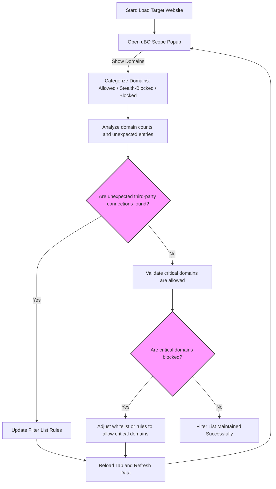

# Using uBO Scope as a Filter List Maintainer

## Workflow Overview

### Task Description
This guide equips filter list maintainers and advanced privacy users with a specialized workflow using uBO Scope to gain deep visibility into third-party network connections. You will learn how to interpret raw network request outcomes, detect stealthy or hidden requests, and identify connections that traditional content blockers often miss. This enables more precise filter list updates and validation—even on devices or browsers with limited built-in tools.

### Prerequisites
- uBO Scope installed and active on your browser (Chromium, Firefox, or Safari).
- Basic familiarity with third-party network requests and content blocking principles.
- Access to the uBO Scope popup interface to view connection summaries.

### Expected Outcome
- Ability to confidently interpret allowed, blocked, and stealth-blocked domains in uBO Scope.
- Skill to detect stealthy requests that bypass normal blocking mechanisms.
- Enhanced understanding of request outcomes to inform filter list tuning.

### Time Estimate
Approximately 15–30 minutes to learn and apply the workflow.

### Difficulty Level
Intermediate to Advanced — requires understanding of network requests and content blocking concepts.

---

## Step-by-Step Guide to Using uBO Scope for Filter List Maintenance

### Step 1: Open the uBO Scope Popup for the Target Tab
1. Navigate to the website you intend to analyze.
2. Click the uBO Scope icon in your browser toolbar.
3. The popup displays the network connection summary for that active tab.

**Expected Result:**
- The popup shows three sections labeled 'not blocked', 'stealth-blocked', and 'blocked'.
- The 'domains connected' summary indicates the count of distinct allowed third-party domains.

### Step 2: Understand the Outcome Categories
- **Not Blocked:** Domains where network connections succeeded.
- **Stealth-Blocked:** Domains with connections intercepted or redirected stealthily by content blockers, often to avoid detection by web pages.
- **Blocked:** Domains with connection attempts entirely blocked or failed.

**Tip:** Pay special attention to the 'stealth-blocked' section for requests that traditional block count metrics may miss.

### Step 3: Analyze Domains with Unexpected Outcomes
Review each domain listed under the three categories:
- Look for domains allowed but unexpected based on your filter lists.
- Note any domains appearing in the stealth-blocked list, which may indicate stealthy filtering at play.
- Check if critical third-party domains are unexpectedly blocked, which could cause website issues.

### Step 4: Drill Down by Domain Count and Hostnames
- Each domain is accompanied by a count indicating the number of connections.
- Use these counts to prioritize domains making frequent requests.
- Cross-reference with your filter lists to identify gaps or overly broad rules.

### Step 5: Spot Connections Missed by Traditional Tools
- Use uBO Scope to reveal requests even when browser debugging tools or content blocker UIs do not show them.
- Stealth-blocked domains indicate requests that could be missed by conventional monitors.

**Example:** A resource loaded over a redirect or rewiring technique might be stealth-blocked but still counted here.

### Step 6: Use Findings to Refine Filter Lists
- Add or adjust rules targeting domains or hostnames observed as allowed but unwanted.
- Validate if stealth-blocked domains match expected block behavior.
- Ensure important third parties remain allowed to reduce breakage risk.

### Step 7: Repeat and Validate
Regularly revisit the popup after filter list changes:
- Confirm that undesired domains are moved to the blocked or stealth-blocked lists.
- Ensure the count of allowed third parties decreases or remains within acceptable limits.

---

## Practical Examples

### Example 1: Identifying Undetected Third-Party Connections
Suppose a filter list maintainer notices unexpectedly high third-party requests.
- Open uBO Scope popup.
- See multiple stealth-blocked domains not listed in standard block counts.
- Add precise blocking rules targeting these stealth domains.
- Revisit the site and verify the stealth-blocked count decreases.

### Example 2: Confirming Legitimate Third Parties are Not Blocked
- On a news website, view allowed domains.
- Verify CDNs or essential analytics domains are among allowed connections.
- Avoid adding blocking rules that would interfere with these domains.

---

## Troubleshooting & Best Practices

### Common Issues
- **No data in the popup:** Make sure uBO Scope has permission to access browsing data (see installation and configuration guides).
- **Counts not updating:** Refresh the tab or reload the page to trigger new network data capture.
- **Unexpected domains appear allowed:** Investigate if the domain is whitelisted or excluded by another content blocker.

### Best Practices
- Monitor connection data during real browsing sessions, not only on ad-block test pages.
- Use uBO Scope alongside existing filter list testing tools for comprehensive coverage.
- Focus on domains with frequent connections for impactful filtering.

### Performance Considerations
- uBO Scope is lightweight but capturing extensive network data might slightly affect browser performance on very busy tabs.
- Close unused tabs or limit background activity during intensive filter checking.

### Alternative Approaches
- Combine uBO Scope usage with browser dev tools for full request/response inspection.
- Export connection data if supported by future uBO Scope updates for batch analysis.

---

## Next Steps & Related Documentation

- After mastering uBO Scope for filter list maintenance, explore [Debunking Network Blocking Myths](/guides/advanced-scenarios-best-practices/debunking-common-misconceptions) to refine your understanding of block counts.
- Review [Interpreting Connection Insights](/guides/getting-started-essentials/interpreting-connection-insights) to deepen your knowledge of outcomes.
- Consult [Installing and Activating uBO Scope](/guides/getting-started-essentials/installing-activating-ubo-scope) if setup issues arise.

---

## Visual: User Workflow Diagram

---

## Summary
By following this workflow, filter list maintainers harness uBO Scope’s detailed network request reporting to uncover stealthy or missed connections, validate block effectiveness beyond superficial metrics, and fine-tune filter rules for more efficient blocking and fewer false positives.

<Tip>
Remember, uBO Scope tracks connection outcomes irrespective of your content blocker’s UI or block counts, providing raw, trustworthy visibility into network activity essential for advanced filter list maintenance.
</Tip>

---

## Additional Resources
- [What Is uBO Scope?](/overview/intro-basics/what-is-ubo-scope) — foundational concepts.
- [Core Concepts & Terminology](/overview/intro-basics/core-concepts-terminology) — understand request outcomes fully.
- [Practical Use Cases](/overview/audience-usecases/practical-use-cases) — real-world workflows including filter list maintenance.
- [Troubleshooting & Performance Tips](/guides/advanced-scenarios-best-practices/troubleshooting-and-tips) — optimize your workflow.

---