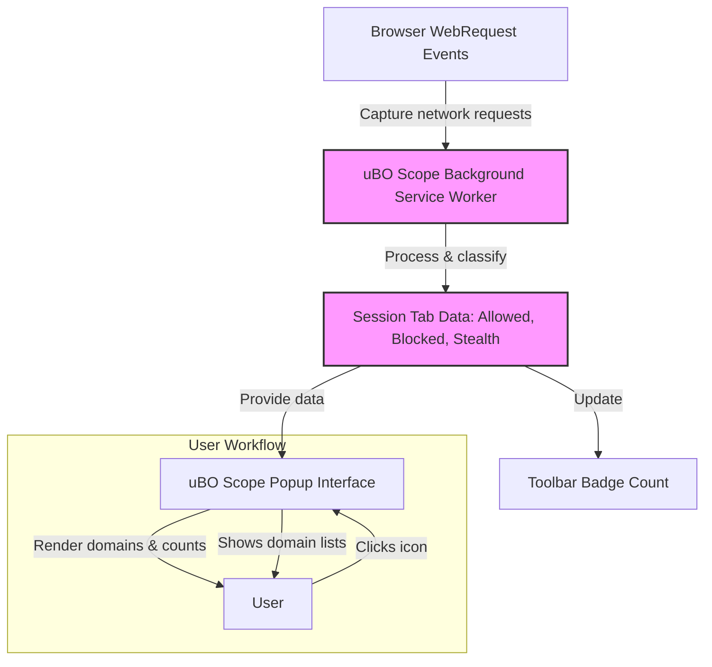

# For Filter List Maintainers: Real-World Use Cases

---

This guide walks filter list maintainers through realistic workflows with uBO Scope to identify missed connections, analyze domains that are allowed or blocked, and use the extension’s unique visibility to refine content blocking lists. It is tailored for scenarios where typical browser developer tools are unavailable, such as on constrained devices.

---

## 1. Understanding the Workflow

### Task Description
This guide helps filter list maintainers leverage uBO Scope to uncover connections that bypass existing content blockers, inspect allowed versus blocked domain lists per tab, and optimize filters by interpreting stealth blocking. You will learn to analyze third-party network activity even when conventional browser tools are inaccessible.

### Prerequisites
- Installed uBO Scope on a supported browser (Chromium v122+, Firefox v128+, Safari v18.5+).
- Basic knowledge of content blocking lists and domain filtering.
- The browser tab you want to inspect should be active and loading web content.

### Expected Outcome
- A clear understanding of which third-party domains your filter list lets through or blocks.
- Identification of stealth-blocked domains (blocked before the browser’s webRequest API observable).
- Practical insights to refine your domain filters based on real, recorded network activity.

### Time Estimate
~10-15 minutes per site inspection and analysis cycle.

### Difficulty Level
Intermediate: Requires familiarity with filter lists and content blocking concepts.

---

## 2. Step-by-Step Instructions

### Step 1: Open uBO Scope Popup for the Active Tab
- Click the uBO Scope toolbar icon to open the popup window.
- The popup shows the hostname of the active tab and lists of domains under three categories: **not blocked**, **stealth-blocked**, and **blocked**.

**Expected Result:**
- The popup updates to show a domain breakdown including counts of requests per domain category.

### Step 2: Identify Missed Connections in the Allowed List
- Review the **not blocked** section for any third-party domains that your filter list should ideally block.
- Domains here indicate active, allowed connections.

**Decision Point:**
- If unknown or suspicious domains are present, consider adding specific blocking rules targeting them.

**Verification:**
- Cross-check these domains with your existing filter list entries.

### Step 3: Examine Stealth-Blocked Domains
- The **stealth-blocked** section lists domains blocked outside the typical `webRequest` API visibility.
- These domains are often blocked by DNS-level or stealth blocking techniques.

**Value Framing:**
- Stealth blocking can prevent content blockers from fully observing or logging these requests.
- Use this insight to recognize potential blind spots in your list.

### Step 4: Analyze the Blocked Domains List
- The **blocked** section explicitly shows domains where network requests were blocked and logged by the extension.

**Practical Tip:**
- Confirm that this list aligns with your filter list’s intended blocking.

### Step 5: Use Domain Counts to Prioritize Filter Updates
- Each domain entry includes how many times connections were attempted.
- Focus on frequently occurring allowed domains to prioritize updates.

**Expected Result:**
- Clear insight into the domains most impacting privacy or performance.

### Step 6: Work Without Browser Developer Tools
- For devices where network tools are unavailable, rely exclusively on uBO Scope popup data.
- Refresh tabs or perform typical browsing to generate fresh recorded data.
- Repeat analysis steps above based on updated popup insights.

**Best Practice:**
- Regularly clear session data if possible to avoid stale information.

---

## 3. Examples & Scenario Walkthrough

### Example: Investigating a News Website
1. Open the news website with uBO Scope active.
2. Click the toolbar icon to open the popup.
3. Spot several advertising networks in the **not blocked** section.
4. Use domain counts to see which ad servers are most active.
5. Add corresponding blocking rules to your filter list.
6. Reload the site and verify the popup updates, showing those domains now in the **blocked** section.

---

## 4. Troubleshooting & Tips

### Common Issues
- **No data in popup**: Ensure you have granted all required permissions; verify the extension is active.
- **Popup not updating after navigation**: Refresh the tab or reopen the popup, as data processes asynchronously.
- **Unexpected domains in allowed list**: These may represent necessary third parties or missed blocking; verify with filter list tests.

### Best Practices
- Use uBO Scope alongside your filter list testing workflows regularly.
- Prioritize domains by connection frequency for effective filter maintenance.
- Consider stealth-blocked domains as clues to gaps not directly observable in other tools.

### Performance Considerations
- The popup displays recent tab data, making it efficient for real-time analysis.
- Avoid keeping many tabs open with high network activity simultaneously to minimize session storage overhead.

### Alternative Approaches
- Combine uBO Scope use with external filter list testing tools or browser developer tools (when available) for comprehensive analysis.

---

## 5. Next Steps & Related Content

- Refer to [Getting Started: Monitor Connections in Real Time](/guides/core-workflows/getting-started-walkthrough) to understand basic popup monitoring.
- Explore [Validating Content Blocker Effectiveness with uBO Scope](/guides/advanced-scenarios/validating-content-blockers) for deeper analysis strategies.
- For installation or permission questions, see [Installation & Setup Guides](/getting-started/installation-setup/install-extension).

Additionally, the [System Architecture Overview](/overview/architecture-feature-overview/system-architecture-overview) provides insight into how connection data flows and is processed.

---

# Appendix: Data Flow of Connection Outcomes

This diagram illustrates the capture and presentation pipeline of connection data to the user.

---

<Tip>
Maintaining clarity on allowed versus blocked domains and recognizing stealth-blocked domains empowers filter list maintainers to build more effective and privacy-respecting lists.
</Tip>

<Note>
The data shown by uBO Scope reflects network requests observable through the browser’s webRequest API; some connections invisible to this API will be represented as stealth-blocked.
</Note>

---

*This guide ensures filter list maintainers can confidently interpret and use uBO Scope data to refine filters and improve privacy tools, especially in resource-constrained environments.*
