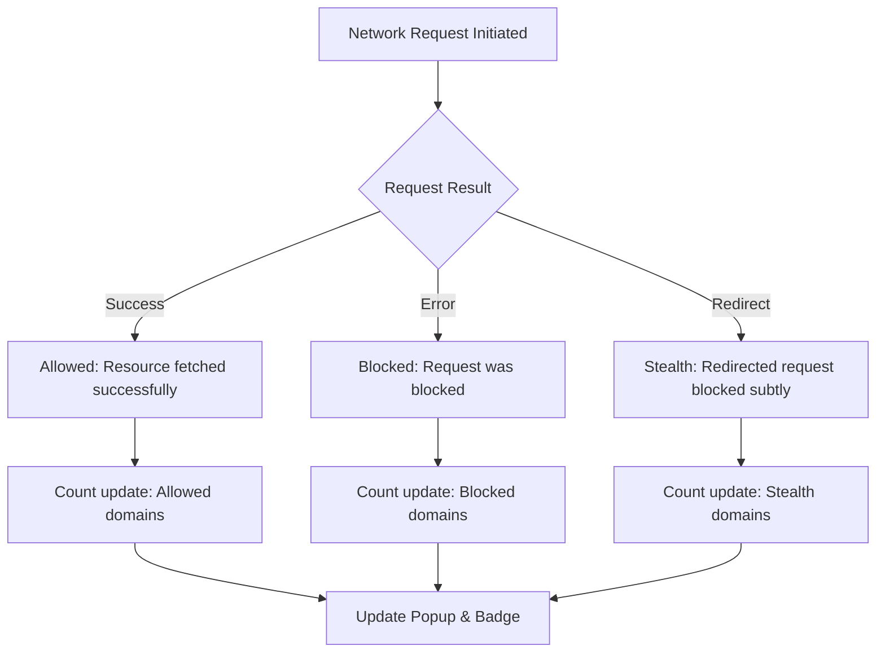

# Making Sense of Allowed, Blocked, and Stealth Connections

Understand how uBO Scope categorizes network requests to help you make informed decisions about your privacy and browsing security. This guide explains what each connection outcome means, why it matters, and how to interpret and act on this data effectively.

---

## 1. Understanding Connection Outcomes

uBO Scope classifies network requests into three distinct outcome categories you will see in the popup UI and badge counts:

| Outcome       | Description                                                                                     | Privacy Implication                          |
|---------------|-------------------------------------------------------------------------------------------------|---------------------------------------------|
| **Allowed**   | Requests that completed successfully and fetched resources from the remote server.             | Indicates active third-party connections.  |
| **Blocked**   | Requests that were explicitly blocked by a content blocker or network layer, reported as errors.| These are prevented connections, enhancing privacy. |
| **Stealth**   | Requests that were blocked stealthily, often through subtle or indirect methods such as redirects.| Indicates stealth blocking, which might be less obvious but still prevents access. |

### What You See in the UI
- The popup shows a summary count of distinct domains by outcome.
- Domains are grouped under "not blocked", "blocked", and "stealth-blocked" sections.

### Why This Matters
- A lower count of *allowed* domains generally means fewer third-party connections, improving privacy.
- Understanding *blocked* connections reveals what your content blocker prevents.
- Stealth-blocked domains help identify hidden blocking activity that some blockers use to avoid breaking websites or detection.

## 2. How uBO Scope Identifies Outcomes

- uBO Scope listens to browser network events through the `webRequest` API.
- Based on request results, it categorizes connections:
  - **Success:** Connection completed normally.
  - **Error:** Connection failed or was blocked.
  - **Redirect:** Connection was rerouted but not necessarily blocked.

- It aggregates these outcomes per domain and hostname, presenting counts per tab.

<Tip>
Understanding these outcomes helps you audit your browsing for unexpected or unnecessary third-party connections.
</Tip>

## 3. Practical Examples

### Scenario 1: Allowed Connections
You visit a news site, and the *allowed* connections include a few content delivery networks (CDNs) domains. This means your browser fetched resources from these domains without blocking.

### Scenario 2: Blocked Connections
While visiting a social media platform, your content blocker prevents connections to known trackers. These appear in the *blocked* section, telling you what was actively stopped.

### Scenario 3: Stealth Connections
Some domains do not appear in obvious block lists but are stealthily redirected or prevented. These show up under *stealth*, helping you catch subtle privacy threats.

## 4. Using This Information to Adapt Your Browsing

- **If allowed domains seem excessive or suspicious:** Consider tightening your content blocking rules or switching filter lists.
- **If stealth domains appear in large numbers:** Investigate your blocker’s settings or test with alternate blockers to understand stealth behavior.
- **If blocked domains seem low despite high traffic:** Your content blocker may be ineffective or misconfigured.

## 5. Best Practices for Interpretation

- Don’t equate high block counts with better privacy without considering the number of allowed third-party connections.
- Use the badge count as a quick privacy health check—fewer allowed third-party domains mean less exposure.
- Combine this data with knowledge about domains and services you trust.
- Regularly review your popup UI after loading new sites to see what third-party connections are active.

## 6. Common Pitfalls and Troubleshooting

<AccordionGroup title="Troubleshooting Connection Outcome Issues">
<Accordion title="Popup Shows No Data or 'NO DATA'">
- Ensure you have activated uBO Scope and that it has necessary permissions.
- Reload the page or tab to trigger data collection.
- Check for browser compatibility issues or errors in the console.
</Accordion>

<Accordion title="Badge Count Does Not Update">
- Badge updates every second after queueing network events; wait briefly.
- Confirm you are viewing an active tab with network activity.
- Verify that your browser’s `webRequest` API is supported and enabled.
</Accordion>

<Accordion title="Unexpected Low or High Allowed Domain Counts">
- Remember allowed counts reflect distinct third-party remote servers your browser communicates with.
- Some legitimate sites rely heavily on CDNs and analytics services; not all third parties indicate risk.
- Use filter list adjustments to refine blocking if necessary.
</Accordion>
</AccordionGroup>

## 7. Advanced Tips

- Combine uBO Scope with other network inspection tools to cross-validate allowed, blocked, and stealth connections.
- Keep your filter lists updated to align blocked and stealth domains effectively.
- Use uBO Scope’s data to assist filter list maintainers by reporting stealthy or missed connections.

## 8. Next Steps

- Explore the guide [Understanding the Popup UI and Badge](/guides/getting-started/understanding-the-popup) to deepen your familiarity with the UI.
- Review [Auditing Third-Party Network Requests on Any Page](/guides/core-workflows/audit-third-party-requests) to learn practical audit workflows.
- Read [Debunking 'Ad Blocker Test' Results](/guides/core-workflows/debunk-ad-blocking-myths) for insights on interpreting blocking tests.
- For filter list maintainers, check [uBO Scope for Filter List Maintainers](/guides/advanced-tips/tools-for-filter-maintainers).

---

## Summary
Understanding the distinctions between allowed, blocked, and stealth connections in uBO Scope empowers you to audit your online privacy accurately and make informed adjustments to your content blocking setup. This knowledge helps you see beyond raw block counts to the real impact on third-party connections.

---

## Visual Workflow: How Connection Outcomes Flow in uBO Scope

---

# Appendix: Terminology

| Term         | Meaning                                                                              |
|--------------|--------------------------------------------------------------------------------------|
| Domain       | The base portion of a hostname, as determined by Public Suffix List (e.g., `example.com`).|
| Hostname     | Full hostname including subdomains (e.g., `ads.example.com`).                        |
| Allowed     | Requests completed successfully.                                                     |
| Blocked     | Requests explicitly prevented by blockers.                                         |
| Stealth     | Requests blocked by indirect methods such as redirects, often stealthily.           |

<Check>
For questions or feedback on interpreting allowed, blocked, and stealth connections, please consult the [Support & Community](https://github.com/gorhill/uBO-Scope/discussions) forum.
</Check>

---

[Back to Overview](../../overview/introduction-core-concepts/what-is-ubo-scope)

---