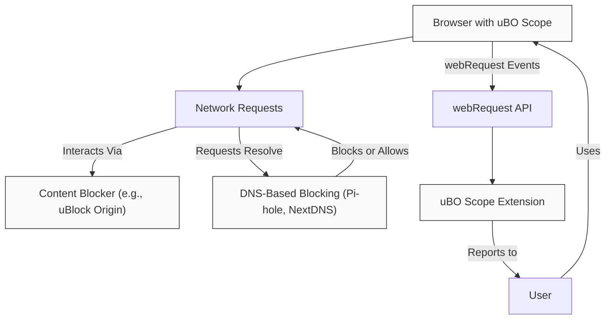

# Maximizing Privacy with uBO Scope

Explore how to leverage uBO Scope alongside other content blockers and DNS-based blocking methods to attain superior online privacy. This guide explains practical workflows for combining tools, cross-verifying network activity, and understanding the inherent constraints of the browser's webRequest API.

---

## 1. Understanding uBO Scope’s Role in Privacy

Many users combine multiple privacy-enhancing tools such as content blockers (like uBlock Origin), DNS-based ad blocking, and privacy-focused browsers. uBO Scope acts as an independent observer that reports all network connection attempts and their outcomes regardless of which blocking method is active.

- **Purpose:** Provide transparency into the actual connections webpages make, whether allowed or blocked.
- **Complementarity:** It does not block traffic but reveals which third-party remote servers are contacted.
- **Visibility across blocking techniques:** Detects network requests observed by the browser’s `webRequest` API, including those blocked at DNS or by other extensions.

<Tip>
Remember that uBO Scope focuses on *what really happens* at the network level, enabling you to verify the effectiveness of your blockers rather than replacing them.
</Tip>

## 2. Workflow Overview

### Goal
Use uBO Scope alongside content blockers and DNS-based blocking to evaluate and maximize your privacy by:

- Monitoring real network connections per webpage
- Cross-checking blocking effectiveness
- Identifying stealth-blocked (redirected or silently blocked) connections

### Prerequisites

- uBO Scope installed and enabled in your browser.
- At least one active content blocker (e.g., uBlock Origin).
- DNS blocking enabled on your system/router (optional but recommended).

### Expected Outcome

- Clear visibility on which connections are allowed, blocked, or stealth-blocked.
- Insights to refine your blocking setup.
- Awareness of the technical limitations imposed by browser APIs.

### Time Estimate

Approximately 15–30 minutes for setup validation and initial analysis.

### Difficulty Level
Intermediate—users should be familiar with installing browser extensions and basic network privacy concepts.

## 3. Step-by-Step Instructions

### Step 1: Confirm uBO Scope is Active and Collecting Data

1. Navigate to a webpage you want to analyze.
2. Click on the uBO Scope extension icon in the browser toolbar.
3. Observe the popup panel displaying:
   - The current tab’s hostname and domain.
   - The number of connected domains.
   - Categorized connection lists: **not blocked**, **stealth-blocked**, and **blocked**.

<Check>
If the popup shows 'NO DATA' or the badge count is empty, check your extension permissions and reload the page.
</Check>

### Step 2: Run Your Regular Content Blockers and DNS Blocking

- Ensure your content blocker (like uBlock Origin) is enabled and configured.
- If using DNS-based blocking (via Pi-hole, NextDNS, or router settings), ensure it is active and filtering.
- Revisit the same webpage to capture network activity under combined blocking.

### Step 3: Use uBO Scope to Cross-Verify Connections

- Open the uBO Scope popup for the page.
- Review the:
  - **Not blocked** connections: servers the browser successfully connected to.
  - **Blocked** connections: requests denied and reported by the webRequest API.
  - **Stealth-blocked**: connections redirected or blocked silently.

### Step 4: Interpret and Analyze Results

- A **lower count** of unique third-party domains in the "not blocked" list usually indicates better privacy.
- **Blocked** and **stealth-blocked** sections show the blocking action effectiveness.
- Compare these reported counts with your expectations and configurations.

<Tip>
Use this information to detect any unwanted connections bypassing your blocking setup.
</Tip>

### Step 5: Understand Limitations

- uBO Scope relies on the browser’s `webRequest` API, which:
  - Only reports on network requests the browser is aware of.
  - Cannot monitor requests made outside the browser or using technologies not exposed to the API.
- Some DNS or network-level blocks may prevent requests from reaching the browser’s webRequest API, so connections never observed by uBO Scope.

<Warning>
Do not assume zero badge count absolutely means no network connections. Some connections may be missed due to API scope or browser restrictions.
</Warning>

## 4. Practical Tips & Best Practices

- **Combine blocking methods:** Use DNS blocking, content blockers, and uBO Scope together to cover gaps.
- **Regularly audit critical websites:** Confirm no unauthorized third-party connections appear.
- **Ignore misleading block counts:** High block events do not imply better blocking.
- **Check stealth connections:** They may indicate redirects or covert tracking.
- **Keep the browser up to date:** Extension APIs evolve and can improve visibility.

## 5. Troubleshooting Common Issues

### Issue: No Data or Empty Badge
- Verify the extension has `webRequest` permission and activeTab access.
- Reload the tab and the extension.
- Confirm your browser supports the needed APIs (Chrome 122+, Firefox 128+, Safari 18.5+).

### Issue: Unexpected High Number of Allowed Connections
- Validate your DNS blocking service is correctly configured.
- Examine if the content blocker rules are active on that site.
- Consider clearing browser caches and retesting.

### Issue: Network Requests Not Showing Despite Expectation
- Some browser or extension behaviors may limit API visibility (e.g., certain WebSocket or privileged requests).
- DNS blocks apply before browser visibility, so hidden blocks can reduce uBO Scope reports.

## 6. Next Steps & Related Content

- **Analyze Third-Party Connections:** Delve into detailed interpretation of different connection types.
- **Interpreting the Badge Count:** Learn how to assess the badge number meaningfully.
- **Debunking Ad Blocker Myths:** Avoid common misconceptions impacting privacy assessments.
- **Filter List Maintainer Guide:** Use uBO Scope for deeper filter list validation.

For more advanced exploration, review the [How uBO Scope Monitors and Displays Network Activity](../../overview/system-architecture-and-data-flow/data-collection-and-display-flow) documentation for technical insights.

---

# Appendix: Key Concepts Relevant to Maximizing Privacy

| Feature                   | Description                                                                                                 |
|---------------------------|-------------------------------------------------------------------------------------------------------------|
| Allowed Connections       | Requests allowed by your blockers, appearing in the "not blocked" list.                                   |
| Blocked Connections       | Requests blocked and reported by the browser's webRequest API.                                            |
| Stealth Blocked           | Requests that underwent redirection or silent blocking detected by uBO Scope.                              |
| Badge Count               | Number of unique third-party domains contacted; lower is better for privacy.                               |
| DNS Blocking              | Network-level blocking often applied before browser request initiation and sometimes not visible to uBO Scope. |
| webRequest API            | Browser API capturing web requests, the backbone of uBO Scope's data collection capability.                 |

<Tip>
If you manage privacy settings holistically, combining browser extensions and DNS-level measures, uBO Scope acts as your network connection audit tool, revealing the real exposure level of your browsing session.
</Tip>

---

# See Also

- [What is uBO Scope?](../../overview/introduction-and-value/what-is-ubo-scope)
- [Understanding Allowed, Blocked, and Stealth Connections](../../overview/core-concepts-and-key-ideas/domain-connection-types)
- [Analyzing Third-Party Connections](../usage-patterns/analyze-third-party-connections)
- [Interpreting the Badge Count and Results](../usage-patterns/interpreting-badge-counts)
- [Troubleshooting Common Setup Issues](../../getting-started/getting-to-first-results/troubleshooting-common-setup-issues)

---

# References

- GitHub repository: [https://github.com/gorhill/uBO-Scope](https://github.com/gorhill/uBO-Scope)
- Browser prerequisites and permissions detailed in manifest files

---

# Diagram: How uBO Scope Complements Privacy Tools

---

This diagram illustrates how uBO Scope observes network activity filtered through DNS and content blockers and reports results to the user for privacy maximization.
