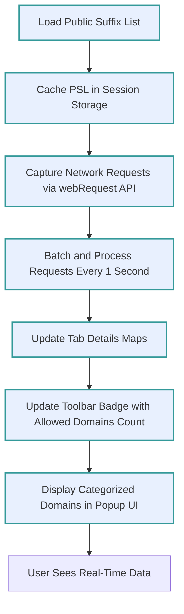

# Optimizing Performance and Data Accuracy

Optimize your experience with uBO Scope by following key recommendations to ensure accurate network request measurements, leverage the Public Suffix List (PSL) for precise domain categorization, and maintain smooth extension performance over browsing sessions.

---

## 1. Understanding the Workflow

### What This Guide Helps You Achieve
This guide enables you to:
- Obtain accurate counts of third-party network connections per tab.
- Understand how uBO Scope uses the Public Suffix List to correctly identify domain levels.
- Maintain optimal performance and data correctness over long or multiple browsing sessions.

### Prerequisites
- uBO Scope extension installed and enabled in your browser.
- A basic understanding of the popup interface and toolbar badge (see [Your First Connection Analysis: A Guided Tour](https://example.com/guides/getting-started/first-analysis-tour)).

### Expected Outcome
- Reliable, up-to-date network connection counts.
- Correct domain and hostname grouping that reflects third-party servers accurately.
- Extension performs efficiently without causing browser slowdown.

### Time Estimate
5–10 minutes to review and implement these recommendations.

### Difficulty Level
Intermediate—requires familiarity with browser extension basics and domain concepts.

---

## 2. Step-by-Step Recommendations

### Step 1: Confirm Public Suffix List (PSL) is Loaded Correctly

uBO Scope relies on an efficient JavaScript-based implementation of the PSL to parse and categorize domains precisely. The PSL is retrieved and cached in the session storage for swift access.

1. Confirm that the extension has successfully loaded the PSL by:
   - Verifying no errors in the extension background scripts (check your browser's extension console).
   - Ensuring the `publicSuffixList` entry exists in session storage.

2. When the PSL is loaded, uBO Scope can determine the "registered domain" (i.e., the organizational domain) effectively, which helps group hosts correctly under their parent domain.

> **Tip:** If you encounter missing or incorrect domain groupings, try reloading the extension or clearing session data to force PSL re-initialization.

### Step 2: Monitor Network Request Outcomes Accurately

uBO Scope categorizes network requests into three outcomes:
- **Allowed:** Requests that successfully connected.
- **Blocked:** Requests that failed or were blocked.
- **Stealth-blocked:** Requests redirected in a way that hides their true source.

How to ensure accuracy:
- Keep the browser updated for optimal `webRequest` API support.
- Avoid refresh cycles or page reloads too rapidly, as the extension batches network requests and processes them every second.
- Wait briefly after page loads to allow the extension to finish processing.

### Step 3: Understand Tab-Based Data Handling and Badge Updates

- Each browser tab maintains its own record of allowed, blocked, and stealth domains.
- The toolbar badge displays a count of distinct **allowed** third-party domains connected to in the active tab.

To optimize performance:
- Close unused tabs to free resources.
- Recognize that switching tabs triggers badge updates asynchronously, and badge counts reflect the latest processed data.

### Step 4: Manage Browsing Sessions to Maintain Data Integrity

- uBO Scope caches session data including tab details and PSL in session storage.
- Close your browser or quit the session as usual; uBO Scope saves the state to resume analysis efficiently.

For best results:
- Clear cookies or site data only if necessary, as this can affect request flows and measurement accuracy.
- If you experience stale data in the popup UI, refresh the page and allow the extension a moment to update.

---

## 3. Practical Examples

### Example: How uBO Scope Uses PSL to Categorize Domains
Given a hostname like `ads.sub.example.co.uk`, uBO Scope:
1. Uses the PSL to identify `co.uk` as a public suffix.
2. Determines the registrable domain is `example.co.uk`.
3. Groups all requests from hostnames under `example.co.uk` appropriately.

This ensures that third-party domains are not fragmented in the popup UI or badge counts.

### Viewing the Popup Data and Badge

- Allowed domains appear in the 'not blocked' section.
- Stealth-blocked domains populate the 'stealth-blocked' list.
- Blocked domains show under 'blocked' with counts indicating number of requests.

Example snippet from popup shows:

| Domain        | Request Count |
|---------------|---------------|
| googleapis.com| 5             |
| cloudflare.net| 2             |

---

## 4. Troubleshooting and Tips

<AccordionGroup title="Troubleshooting Common Issues">
<Accordion title="PSL Not Loaded or Corrupted">
If domain grouping seems unreliable:
- Reload the browser or extension.
- Clear the extension's session storage to force PSL reload.
- Verify internet connectivity to fetch the PSL from the official source.
</Accordion>
<Accordion title="Badge Count Not Updating">
- Confirm you are viewing the active tab.
- Wait up to a few seconds post page load for async update.
- Check if other extensions interfere with `webRequest` API.
- See [Troubleshooting Common Issues](https://example.com/getting-started/validation-troubleshooting/troubleshooting) for detailed steps.
</Accordion>
<Accordion title="Performance Slowdown">
- Close tabs no longer needed to reduce memory.
- Keep your browser and uBO Scope extension updated.
- Avoid having multiple instances of similar content blockers competing.
</Accordion>
</AccordionGroup>

### Best Practices
- Regularly update your browser and uBO Scope for optimal compatibility.
- Understand that network requests outside the `webRequest` API scope (like some WebSocket variants or DNS-level blocking) might not fully reflect.
- Use uBO Scope complementarily with your main content blocker for auditing purposes.

---

## 5. Next Steps and Related Content

- Learn how to interpret allowed and blocked domain lists in [Mapping Allowed and Blocked Third-Party Domains](https://example.com/guides/core-use-cases/tracking-blocked-allowed).
- Explore advanced detection of stealthy requests in [Spotting Stealth Domains and Hidden Requests](https://example.com/guides/advanced-tips/stealth-detection).
- For initial onboarding, see [Your First Connection Analysis: A Guided Tour](https://example.com/guides/getting-started/first-analysis-tour).

---

## 6. Additional Technical Insight

The extension asynchronously batches network events and processes them approximately every 1000 ms to derive accurate outcomes. The PSL implementation is based on an efficient JavaScript approach that caches and processes domains to reduce overhead while ensuring accurate domain resolution.

For full source and algorithm details, visit the [uBO Scope GitHub Repository](https://github.com/gorhill/uBO-Scope).

---

## Summary Diagram: Data Flow for Accurate and Optimized Network Request Tracking

---

# Appendix: Key Terms

| Term           | Description                                        |
|----------------|----------------------------------------------------|
| Public Suffix  | The domain suffix under which domains can be registered (e.g., `com`, `co.uk`). |
| Registered Domain | The main domain registered based on the PSL (e.g., `example.com`).        |
| Allowed        | Network requests that resulted in successful connections.               |
| Blocked        | Network requests that errored or were blocked by the browser or blocker. |
| Stealth-blocked| Redirected network requests that may evade standard blockers, invisible in normal UI. |
| Badge Count    | Number of distinct allowed third-party domains for the current tab.     |

---

For any further assistance or inquiries, please consult the [Troubleshooting Common Issues](https://example.com/getting-started/validation-troubleshooting/troubleshooting) guide or visit the main [Product Purpose & Value](https://example.com/overview/product-intro-and-value/product-purpose-value) page to deepen your understanding of uBO Scope.