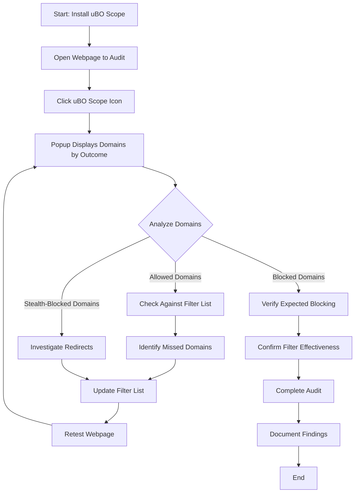

# uBO Scope for Filter List Maintainers

## Workflow Overview

### Task Description
This guide helps filter list maintainers leverage uBO Scope to audit the effectiveness of content blocking filter lists by revealing all outgoing network connections grouped by allowed, stealth-blocked, and blocked categories. It empowers maintainers to catch missed connections and verify how well their filters perform, even when browser developer tools are limited or unavailable.

### Prerequisites
- uBO Scope extension installed in a supported browser (Chrome, Firefox, Safari).
- Basic familiarity with network requests and domain/hostname concepts.
- Optional: Access to filter list source filters or blocker details for cross-checking.

### Expected Outcome
- Ability to audit network requests initiated by webpages, categorized by outcome.
- Clear insight into which domains are allowed, stealth-blocked, or blocked by the content blocker.
- Understanding of gaps or shortcomings in filter lists based on real-world connection data.

### Time Estimate
5 to 15 minutes per audit session depending on the complexity of the webpage audited.

### Difficulty Level
Intermediate — suited for users familiar with ad blocking and network request auditing.

---

## Step-by-Step Instructions

### 1. Install and Launch uBO Scope
- Install uBO Scope from the [Chrome Web Store](https://chromewebstore.google.com/detail/ubo-scope/bbdpgcaljkaaigfcomhidmneffjjjfgp) or [Firefox Add-ons](https://addons.mozilla.org/firefox/addon/ubo-scope/).
- Click the extension icon in your browser toolbar to open the uBO Scope popup.

### 2. Navigate to the Webpage You Want to Audit
- Visit the webpage where you want to audit network request filtering.
- Ensure the page is fully loaded to allow all network requests to flow.

### 3. Open uBO Scope Popup
- Click the uBO Scope icon to open the popup while focused on the active tab.
- The popup displays:
  - The hostname and domain of the page.
  - A count of distinct third-party domains connected.
  - Three categorized sections: `Allowed`, `Stealth-Blocked`, and `Blocked` domains.

### 4. Review Connections by Outcome
- **Allowed:** Domains from which network requests succeeded.
- **Stealth-Blocked:** Domains where requests were redirected or stealthily blocked.
- **Blocked:** Domains where requests failed due to blocking.

### 5. Analyze Domain Counts
- Each domain row shows the domain name and the number of requests to it.
- Identify domains with unexpected allowed connections that may indicate missed filters.
- Note stealth-blocked domains that could reveal indirect or redirected requests.

### 6. Validate Against Filter Lists
- Cross-reference domains seen in the popup with your filter lists to spot gaps.
- Investigate allowed domains that should be blocked or stealth-blocked domains that may require filter adjustment.

### 7. Repeat Audit Across Pages
- Test other webpages with different sets of filters active.
- Observe changes in domain counts and categories to understand filter efficacy.

### 8. Save Results
- Record or screenshot popup data for your audit logs.
- Consider sharing key findings with your filter list community.

---

## Practical Tips & Advanced Workflow

- **Using uBO Scope Without Developer Tools:** Many devices or browsers restrict deep developer tools access; uBO Scope works independently to reveal network request outcomes in a simplified interface.
- **Interpreting Stealth-Blocked Connections:** These often indicate redirect-based blocking or content caught by stealth mechanisms—valuable for finding indirect connections missed by filters.
- **Badge Count Usage:** The badge on the browser toolbar shows the number of distinct allowed third-party domains, a proxy to assessing real-world privacy risk.
- **Upcoming Features:** Future uBO Scope versions plan to include more granular request details beneficial for filter maintenance.

---

## Examples & Scenarios

### Example 1: Discovering a Missed Third-Party Tracker

1. Visit a news website.
2. Open uBO Scope popup.
3. Notice an allowed domain like `tracking.example.com` with multiple requests.
4. Cross-check your filter list - domain absent.
5. Add a blocking filter for `tracking.example.com` and retest.

### Example 2: Understanding Stealth Blocking

1. Visit a social media page.
2. Observe stealth-blocked domains, such as `redirect.ads.com`.
3. Recognize the blocker redirects tracking requests stealthily to prevent detection.
4. This validates your filters are effectively blocking indirect trackers.

---

## Troubleshooting & Best Practices

<AccordionGroup title="Common Troubleshooting Scenarios">
<Accordion title="No Data in Popup">
- Ensure the active tab is fully loaded.
- Confirm uBO Scope has required permissions (`webRequest`, `activeTab`, `storage`).
- Reinstall the extension if issues persist.
</Accordion>
<Accordion title="Badge Count Not Updating">
- Confirm network activity on the page.
- Refresh the page and popup.
- Check for conflicting extensions that may block uBO Scope’s monitoring.
</Accordion>
<Accordion title="Unexpected Allowed Domains">
- Verify whether domains are essential CDNs or real trackers.
- Cross-check with filter lists and add missing filters.
</Accordion>
</AccordionGroup>

<Tip>
Filter list maintainers should audit multiple types of webpages to identify domain patterns missed by filters, using uBO Scope’s categorized domains to guide enhancements.
</Tip>

<Warning>
uBO Scope relies on the browser’s `webRequest` API. Connections made outside this scope (e.g., non-browser network activity) will not be reported.
</Warning>

---

## Next Steps & Related Documentation

- Visit **[Understanding the Popup UI and Badge](/guides/getting-started/understanding-the-popup)** to deepen your understanding of what each UI element means.
- Explore **[Making Sense of Allowed, Blocked, and Stealth Connections](/guides/advanced-tips/interpreting-request-details)** to master interpreting connection outcomes.
- Use **[Auditing Third-Party Network Requests on Any Page](/guides/core-workflows/audit-third-party-requests)** to expand your workflow for general users.
- Consult **[Installing and Setting Up uBO Scope](/guides/getting-started/install-and-setup)** for hands-on installation help.

Stay updated for upcoming features that will enhance audits with detailed request metadata, further empowering filter list maintainers.

---

## Illustrative Workflow Diagram

---

## Summary
This page focuses exclusively on leveraging uBO Scope’s popup interface and categorization to help filter list maintainers audit the success of their content blockers by revealing all outgoing allowed, stealth-blocked, and blocked network domains. It emphasizes practical workflows, tips for interpretation, and troubleshooting to enable effective filter refinement without reliance on complex browser tooling.
