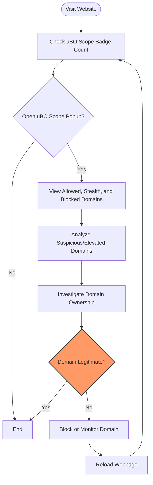

# Diagnosing Unexpected Third-party Connections

Discover how to identify potential privacy leaks on web pages using uBO Scope. This guide equips you with practical skills to observe network requests, identify suspicious or elevated third-party server connections, and take informed action to protect your privacy.

---

## Workflow Overview

**What This Guide Helps You Accomplish:**
- Understand how to use uBO Scope to detect unexpected or suspicious third-party connections made by websites you visit.
- Learn to interpret network request outcomes displayed in uBO Scope’s popup interface.
- Take practical steps when excessive or unknown connections are detected.

**Prerequisites:**
- uBO Scope extension installed and active in a supported browser (Chromium 122+, Firefox 128+, Safari 18.5+).
- Basic knowledge of how to open and use the uBO Scope popup interface.
- Familiarity with the concept of third-party domains as explained in related core concepts documentation.

**Expected Outcome:**
- Ability to spot privacy leaks by analyzing third-party connections on any web page.
- Confidence in distinguishing benign from suspicious network activities.
- Knowledge of effective follow-up actions such as blocking or investigating domains further.

**Time Estimate:** Approximately 10-15 minutes to perform initial diagnostics on a single website.

**Difficulty Level:** Intermediate (some comfort with network domains and privacy concepts recommended)

---

## Step-by-Step Instructions

### 1. Open the Target Website and Check the Badge Count

- **Action:** Visit the web page you want to analyze.
- **Expected Result:** The uBO Scope icon badge updates to show the count of distinct third-party domains connected.
- **Tip:** A lower badge count indicates fewer third-party connections which is generally better for privacy.

### 2. Open the uBO Scope Popup Interface

- **Action:** Click the uBO Scope toolbar icon to open the popup.
- **Expected Result:** The popup shows three lists of domains:
  - **Not Blocked:** Domains to which the page connected successfully.
  - **Stealth Blocked:** Domains where stealth blocking was applied (redirects).
  - **Blocked:** Domains blocked due to errors or blocking rules.

### 3. Review Domains in Each List

- **Action:** Examine domains in each category. Pay special attention to:
  - Domains not recognized or unrelated to the site you are visiting.
  - High counts of certain domains which may indicate repeated or persistent connections.
- **Expected Result:** Identification of domains that may represent unexpected third-party services.

### 4. Analyze Suspicious or Elevated Counts

- **Action:** When spotting unexpected or numerous third-party domains:
  - Use a domain lookup tool or search engine to investigate the domain’s ownership and purpose.
  - Cross-reference with known CDN providers or legitimate service domains.
- **Expected Result:** Confirm whether the connection is expected or potentially a privacy concern.

### 5. Take Action Based on Findings

- **If benign:** No immediate action needed.
- **If suspicious:** Use your browser’s content-blocking tools or uBlock Origin filter lists to block or monitor the domain.
- **Expected Result:** Improved privacy by reducing unintended remote server connections.

### 6. Reload the Webpage and Verify Changes

- **Action:** Reload the webpage to see if your blocking actions are effective.
- **Expected Result:** The badge count should reflect fewer allowed connections; blocked domains should remain listed under the blocked section.

---

## Practical Example

Imagine visiting an online news site and noticing 15 distinct third-party connections.

- You open the uBO Scope popup and find multiple domains starting with strange or unfamiliar names under "Not Blocked".
- One domain repeats many times, suggesting a tracking or analytics service.
- You research this domain and confirm it is associated with an advertising network.
- You add this domain to your uBlock Origin filter list to block it.
- Reloading the page shows the badge count dropping to 9, with the suspicious domain now listed under "Blocked".

You have successfully diagnosed and reduced an unexpected third-party connection, enhancing your privacy.

---

## Troubleshooting & Tips

### Common Issues

- **No Data in Popup:** Ensure permissions are granted and the page has loaded fully.
- **Unexpectedly High Badge Count:** Some webpages legitimately load many third-party services; compare with multiple sites.
- **Popup Not Updating:** Reload the webpage or restart the browser extension.

### Best Practices

- Regularly monitor third-party domains on sites you visit frequently.
- Familiarize yourself with common CDN domains (e.g., cloudflare.net, amazonaws.com) to avoid false alarms.
- Use domain research tools to verify unknown domains before blocking.

### Performance Considerations

uBO Scope processes network requests asynchronously; slight delays in popup updates are normal.

---

## Next Steps & Related Documentation

- Explore the **[Using uBO Scope for the First Time](/getting-started/first-use-configuration/using-the-extension)** guide for foundational usage.
- Learn about the **[Meaning of the Badge Count](/guides/getting-started-usage/interpreting-badge-count)** to better interpret connection numbers.
- Deepen knowledge on **[Key Concepts & Terminology](/overview/product-architecture-insight/core-concepts)** to understand allowed, stealth, and blocked outcomes.
- For advanced users, review the **[Architecture Diagram](/overview/product-architecture-insight/architecture-diagram)** to see uBO Scope’s inner workings.

For source code and ongoing development, visit the project on [GitHub](https://github.com/gorhill/uBO-Scope).

---

## Summary

By following this guide, you will confidently diagnose unexpected third-party connections, enhancing your understanding of privacy risks on the web and empowering you to take control of your browsing footprint with uBO Scope.


---

<Info>
Remember, not every third-party connection is harmful; some are essential services like CDNs or analytics integral to website functionality. Use uBO Scope as a transparency tool to make informed decisions.
</Info>

---

### Visual Overview of User Flow


---

### Code Snippet: Understanding Domain Categorization in Popup
```javascript
// Rendering domain lists in popup.js
const allowedSorted = Array.from(data.allowed.domains).toSorted();
const stealthSorted = Array.from(data.stealth.domains).toSorted();
const blockedSorted = Array.from(data.blocked.domains).toSorted();

// Example: Rendering allowed domains
for (const [domain, count] of allowedSorted) {
  console.log(`${domain} connected ${count} times`);
}
```

This illustrates how uBO Scope groups domain data in the UI for user review.

---

For more, please consult the related pages and the comprehensive [uBO Scope repository documentation](https://github.com/gorhill/uBO-Scope).
